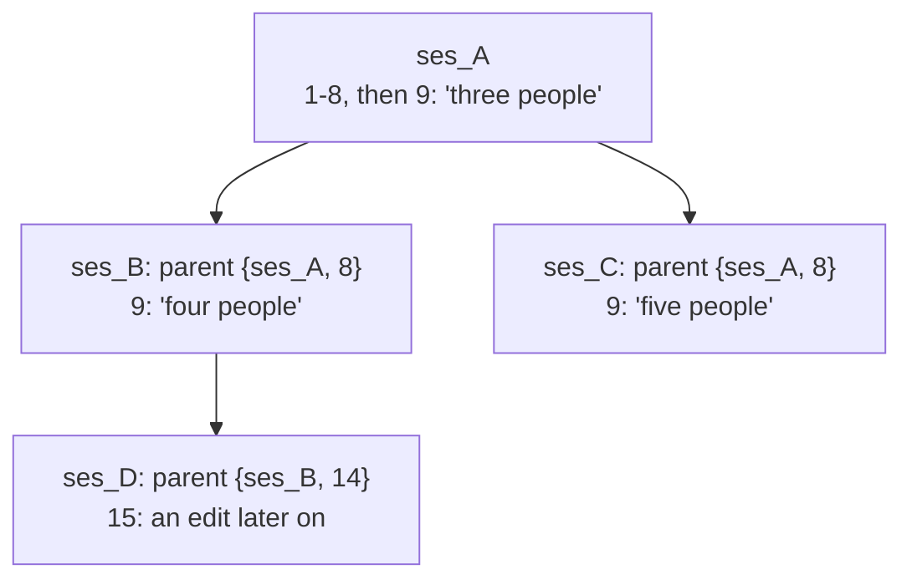

# Editing a message: asking again from a point in the conversation

A person who reads an answer and sees that their question was put badly
can ask it again from that point: the client sends the edited message,
the conversation runs on from there, and the original stays as it was.
The client then shows both versions on that message, "1 / 2", and lets
the person move between them. Each version is a session of its own, a
fork of the session it was edited in, so every version keeps its own
log, budget and files. This page is the contract a client follows.
Everything here is on the wire of `/v1`, and `api/openapi.yaml` states
the same routes under `forkSession` and `listSessions`.

## Sending an edited message

One call forks the session just before the message and sends the
edited text in its place:

```http
POST /v1/sessions/ses_A/fork
{"before_seq": 9,
 "title": "Trip budget",
 "message": {"content": [{"type": "text", "text": "Plan it for four people, not three."}]}}
```

| Member | |
|---|---|
| `before_seq` | the `seq` of the message the person edits |
| `message` | the edited message, as the payload of a `user.message` on `POST /v1/sessions/{id}/events`: `content` and `attachments`, with the same limits |
| `title` | the new session's title; pass the session's own title so the versions read as one conversation. `""` gives none, and leaving it out gives the continuation title, "Trip budget (continued)" |
| `attended` | as on a create: set it when your client shows the agent's questions |

The answer is `201` with the new session. It holds the events before
the message, copied with their ids, and the edited message after them;
a runner starts its turn at once, so stream the new session as you
would after a send. Without `message`, the new session waits idle for
its first message, as a fork at a turn boundary does.

Which messages can be edited: a message the person sent that started a
turn, which is any message sent while the session was idle. The session's
first message is one, and editing it starts the new session with
nothing copied: its `parent.seq` is `0`. A message sent while the agent
was working joined that turn and started none, so it is not a point a
conversation can be asked again from; neither is a trigger's message,
an answer of the agent, or any other event. Each is `invalid_fork_point`.

### Keeping a file of the original message

A file the person attached to the original message is kept by naming
its blob, without sending the bytes again:

```json
{"before_seq": 9,
 "message": {
   "content": [{"type": "text", "text": "Plan it for four people, not three."}],
   "attachments": [
     {"name": "prices.csv", "blob": "sha256:9f86d081884c7d659a2feaa0c55ad015a3bf4f1b2b0b822cd15d6c15b0f00a08"},
     {"name": "dates.txt", "data": "MTItMTQgTWF5Cg=="}]}}
```

`blob` is the digest the original message's attachment names, and the
file keeps that message's media type and size; give no `media_type`
beside it. A new file is sent as `data`, as on a send. An image is a
content block, which travels in the message itself: send the block as
the original event holds it. A file with both `data` and `blob`, with
neither, or a `blob` no message of the session attached is
`invalid_request`.

### When the call is refused

| Answer | |
|---|---|
| `invalid_fork_point` (422) | `before_seq` names no message a person sent that started a turn |
| `invalid_request` (400) | `before_seq` beside `at_seq`; a message holding nothing; a file as above |
| `forbidden` (403) | the installation refused the new session, or refused the message, as it would refuse a create or a send; `details.reason` says why where it may |
| `not_found` (404) | the caller may not read the session |

A refused call creates nothing: there is no new session to clean up, and
the original conversation is unchanged.

## Drawing the versions

A session made by a fork names where it came from:

| Field | |
|---|---|
| `parent` | `{session_id, seq}`: the session it was forked from, and how many of its events were copied |
| `root` | the session at the top of its tree of forks; absent on a session no fork made, whose tree is keyed by its own `id` |

Read every session of a conversation in one call, with the session's
`root`, or its `id` where it has none:

```http
GET /v1/sessions?root=ses_A
```

The versions of a message are found from that list. For a message at
`k + 1` in a session, its versions are that message and the first
message of each session whose `parent` is that session with `seq` `k`,
and of their own forks with the same `seq`. In this tree the message
after 8 has three versions, in `ses_A`, `ses_B` and `ses_C`:



Copied events keep their ids, so an event shared by two versions has
the same id in both, and a new one has an id of its own. Read the list
again after a fork is made; nothing else changes it. Deleting one
version deletes that session alone: the others keep their events, and
`root` and `parent` go on naming the session that was deleted.

## Listing conversations

A list of conversations shows one entry per tree:

```http
GET /v1/sessions?group=tree
```

Each item is the newest session of its tree among those the list keeps,
with `tree`:

```json
{"items": [
  {"id": "ses_B", "title": "Trip budget", "root": "ses_A", "parent": {"session_id": "ses_A", "seq": 8},
   "tree": {"root": "ses_A", "sessions": 3}}],
 "next_cursor": "..."}
```

`tree.root` keys the conversation, and `tree.sessions` counts the
versions the list keeps. Opening an entry opens its newest version. A
new fork moves its conversation to the head of the list. `root`,
`parent` and `group` combine with each other and with the list's other
filters; `parent=ses_A` lists the sessions forked from `ses_A`.

## What a version costs

Each version has its own budget. `budget.spent_cost_usd_micro` is the
spend of the whole log, the copied events included, so a version's
header shows what the conversation cost. `budget.carried_cost_usd_micro`
is the part that was copied; a version's own cost is
`spent_cost_usd_micro - carried_cost_usd_micro`, and that is what its
budget holds it to. Nothing is charged twice: the copied requests were
paid for once, in the session they were sent from.

A version's first request sends the conversation before the edit again.
Every session of a tree sends one prompt cache key, its root's, so where
the provider caches a request's prefix and the version runs on the same
model within the cache's lifetime, that prefix is read from what the
original session cached, at the cache's read rate, and only the rest is
paid at the input rate.
