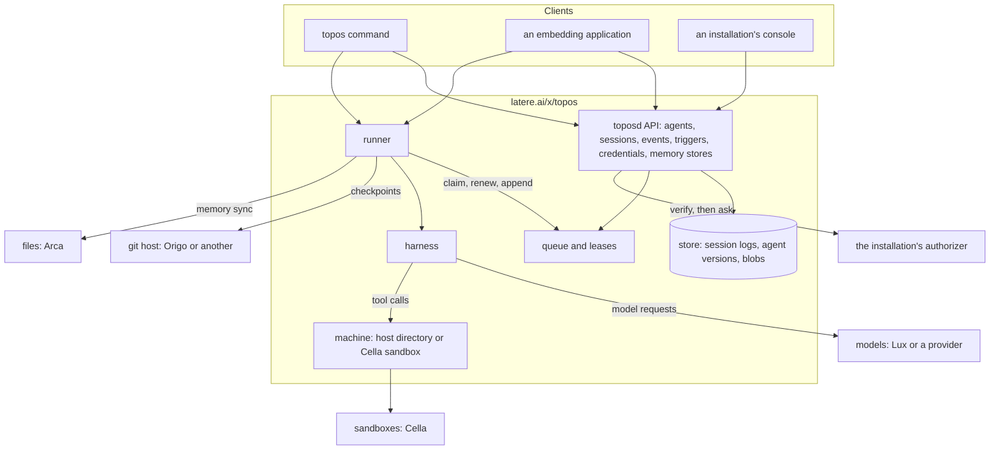
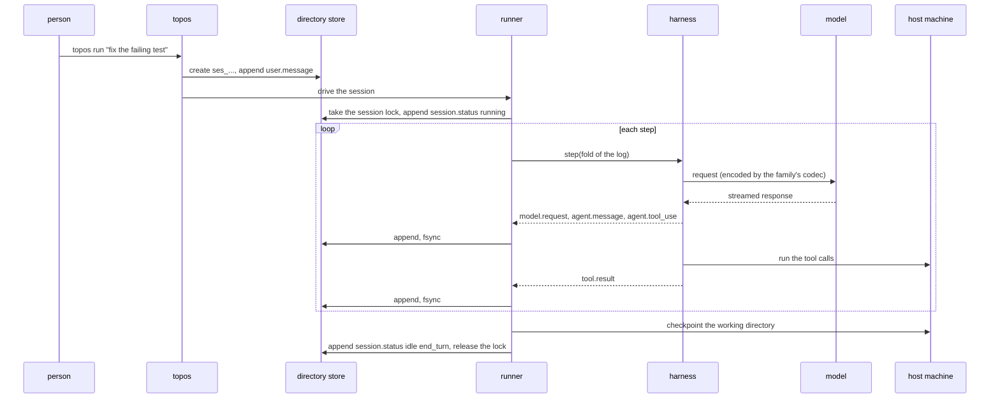

# Architecture

## Overview

Topos is an open source agent core. It keeps agent definitions and the
sessions people have with them, runs the agent loop, and moves a
session between the machines a person uses. It is built from three
parts over one session schema. The **harness** is a library that runs
one agent's loop: it builds each model request from the session's log,
streams the response, validates and executes tool calls on the
session's machine, applies permissions and hooks, and manages context.
The **session log** is the record every part reads and writes: an
append-only list of typed events plus a status. The **runner** is the
process that holds a session's lease and drives the harness one step at
a time, appending every step's events. The same three parts run in the
`topos` command on a laptop, embedded in an application, and in the
`toposd` server.

This spec fixes what every other spec assumes: the parts, the packages
and what each may dial, the extension points, the main flows, and the
thirteen invariants. Read it first.

## Current state

The repository was restarted in place on the module path
`latere.ai/x/topos`. The runtime it replaces, v0.7.0, is kept for
reference under `docs/history/`; its specs are cited from this deck as
"v0.7.0 spec NNN". That runtime had no durable session, a loop with a
fixed step cap and a fixed output cap that reported both as success, a
root package its consumers bypassed, and a multi-agent vocabulary
(regions, autonomy modes, topologies, a peer directory) that this core
retires. Nothing of this design is built; the tree holds the scaffold
of [[002-scaffold-and-configuration]].

Borrowed and cited: the rule that authority only narrows (invariant 6)
is v0.7.0 spec 031 and v0.7.0 spec 006's "a peer of a peer is a subset
of a subset"; the hook merge rule of v0.7.0,
`net_allow = hook_allow AND NOT deny_rule_matched`, is carried into
[[012-permissions-and-approvals]]. The one-writer lease of invariant 3
is the row lease of the retired hosted service that preceded this core
(a 60 second claim renewed every 15 seconds). Invariants 5, 7, 10, 11,
12 and 13 have the meaning of the invariants of the same subject in
Lux's and Cella's spec 001.

## Design

### Three parts, one schema

A session is an append-only log of typed events plus a status
([[004-session-log]]). The runner appends; clients read the log, stream
it, and send user events into it. The transcript the model sees is a
pure fold over the log, defined once in `session`, so a session written
by a runner on a laptop is continued byte for byte by a runner in a
cluster. A session has one writer at a time, the runner holding its
lease, and one machine, where its tools act ([[009-machines]]).

### Packages

The module is `latere.ai/x/topos`. The root of the module holds no Go
package. The trees below are the whole public surface; everything else
is under `internal/`.

| Package | Job | May dial | Spec |
|---|---|---|---|
| `session`, `session/dir` | the v1 schema: Session, Event and their JSON form; the fold from a log to a transcript; the `Store` interface; the directory store | nothing; `session/dir` reaches the local filesystem | [[004-session-log]] |
| `session/inputcheck` | the check for well-known token formats and high-entropy strings that clients and the manifest resolver share | nothing | [[018-credentials-and-secrets]] |
| `harness` | one agent's loop over a session: request building, streaming, tool dispatch, permissions, hooks, context management, subagent threads | nothing itself; it calls a `models.Model` and a `machine.Machine` it is given | [[005-harness-loop]], [[010-context]], [[011-instructions-and-skills]], [[012-permissions-and-approvals]], [[013-threads-and-subagents]] |
| `harness/tools` | the built-in tools and the registry | nothing; tools act through the machine | [[008-tools]] |
| `harness/tools/mcp` | MCP servers as tools | the MCP server a manifest names, or the process it starts on the host | [[021-mcp-servers]] |
| `models`, `models/dialect` | the `Model` interface, the model connection, the catalog entry, cost and the budget meter; one implementation over `latere.ai/x/pkg/llmdialect`'s backend codecs | `models/dialect` dials only the connection's base URL | [[007-models]] |
| `models/scripted` | the scripted model for tests | nothing | [[026-stubs-and-tiers]] |
| `machine`, `machine/host`, `machine/cella` | the `Machine` interface and the optional `Fetcher`; the host directory with its operating-system sandbox; a Cella sandbox through `latere.ai/x/cella/client` | host: the local filesystem and processes, and the URLs `web_fetch` names, through its `Fetcher`; cella: its base URL | [[009-machines]], [[008-tools]], [[012-permissions-and-approvals]] |
| `runner`, `runner/checkpoint` | claims sessions from a `session.Store`, holds leases, drives the harness, appends events; commits each turn's checkpoint | the store it is given; checkpoints through the machine and the git host it is given | [[016-runners]], [[034-checkpoints-and-rewind]] |
| `memory`, `memory/dir`, `memory/arca` | memory stores: attach, sync and the conflict rule; a directory backend and an Arca files-plane backend | dir: the local filesystem; arca: its base URL | [[020-memory-stores]] |
| `manifest`, `manifest/v1` | the Agent, Trigger, MemoryStore and Connection kinds as files, and one resolver | nothing | [[003-manifest]] |
| `client` | the toposd API client, including the `session.Store` an external runner uses | its base URL | [[024-client-cli-skill]] |
| `authorizer` | the action vocabulary an installation's authorizer is written against | nothing | [[006-identity]] |
| `internal/server`, `internal/store/postgres`, `internal/queue`, `internal/triggers`, `internal/events`, `internal/credentials` | toposd's API, the Postgres store, leases and claims, triggers, the sink, credential custody | the database; the authorizer and the sink | [[015-api]], [[014-store]], [[016-runners]], [[022-triggers]], [[023-events-and-observability]], [[018-credentials-and-secrets]] |
| `cmd/toposd` | the roles `serve`, `runner`, `check` and `token` | per role | [[002-scaffold-and-configuration]] |
| `cmd/topos` | the scripting and test client: run a session in print mode in the working directory, attach, apply manifests | its configured toposd, or nothing when it runs a local session | [[024-client-cli-skill]] |
| `cmd/topos-machine` | the static helper a Cella machine uploads into its sandbox to run grep and glob where the files are | nothing | [[009-machines]] |
| `internal/toposcli` | the `topos` command: its commands, flags, output and exit codes | through the runner and the model connection | [[024-client-cli-skill]] |
| `tools/catalog` | the generator of `models/catalog.json` from a Lux model catalog and OpenRouter's public model list | nothing; it reads files | [[007-models]] |
| `test/stubs/luxstub` | the stub Lux, an in-process test server on loopback | nothing; it serves | [[026-stubs-and-tiers]] |

The rule for the root packages: `session`, `harness`, `manifest` and
`authorizer` compute and decide and import no network client. A
machine dials only its substrate; `models/dialect` and `client` dial
only the base URL their caller hands them. An embedder imports
`harness`, `runner`, `session`, a machine, `models` and
`models/dialect`, and `manifest/v1`, and never an internal package;
[[024-client-cli-skill]] names that set as the supported import surface
and its example programs are held to it by test.

The core ships no interactive terminal. `topos` runs sessions in print
mode for scripts and tests; an interactive client is built on `client`
and `runner` outside this module.

### Extension points

| Interface | Package | Implemented in the core | Implemented elsewhere |
|---|---|---|---|
| `Model` | `models` | the dialect implementation over llmdialect (Messages, Responses, Chat), the scripted model for tests | an embedder's own model |
| `Machine` | `machine` | host, Cella sandbox | an embedder's own, for example a container it manages |
| `Store` | `session` | directory, Postgres (internal), the toposd client | an embedder's own database |
| `Tool` | `harness/tools` | the built-in set, MCP servers | an embedder's tools |
| `Hook` | `harness` | none | in-process hooks, and command hooks configured per agent |
| `Backend` | `memory` | directory, Arca files plane | none |
| the authorizer | an HTTP endpoint | the built-in owner policy | an installation's authorizer, on `latere.ai/x/pkg/authz` |
| the event sink | an HTTP endpoint | none (off when unset) | an installation's sink |

### Flows

A local turn, with no server:

A hosted turn is the same loop behind a lease: a client appends
`user.message` through the API, a runner claims the session over
toposd's internal listener ([[016-runners]]), runs steps on a Cella
sandbox, appends through the store, and releases the lease when the
session goes idle. A client attaches by streaming the log from a
sequence number, replay then live ([[015-api]]).

### Invariants

| # | Invariant | Held by |
|---|---|---|
| 1 | **One session schema.** Every runner, store and client reads and writes sessions in the v1 schema `session` defines, and the fold from events to transcript is defined once, there. A session moves between machines as its log and its latest checkpoint | [[004-session-log]] |
| 2 | **The log is append-only.** An appended event is never edited or removed except by deleting its session, or by redaction, which replaces one event's content with a tombstone, keeps its id and sequence, and places a compaction boundary after it. Model output is stored as llmdialect IR with the raw response body beside it, and each request as its codec version and a hash of the bytes sent, so a replay re-encodes the same bytes and proves it | [[004-session-log]], [[007-models]], [[010-context]] |
| 3 | **One writer.** At most one runner appends to a session at a time, the holder of its lease. A second writer forks; nothing merges | [[016-runners]], [[017-external-runners-handoff-fork]] |
| 4 | **The harness keeps no state between steps.** What a runner needs to continue a session is in its log and on its machine; any runner can resume any session it may claim | [[005-harness-loop]], [[016-runners]] |
| 5 | **No credential enters a machine or a log.** The runner resolves a credential per outbound call; a sandbox sees none, an event carries none, a tool result is scrubbed of the ones the runner holds | [[018-credentials-and-secrets]], [[019-git]], [[027-security]] |
| 6 | **Authority only narrows.** Along a spawn edge a thread's tools, permissions and budget are a subset of its parent's; a message between threads carries data and never authority; a session's scope is within its agent's permissions and its initiator's reach; a hook or rule may deny or modify a call and never widen one | [[012-permissions-and-approvals]], [[013-threads-and-subagents]], [[018-credentials-and-secrets]] |
| 7 | **toposd verifies and asks.** It decides nothing about a person: permission is the authorizer's answer, an unavailable authorizer is a refusal, and the owner policy applies only when no authorizer is configured | [[006-identity]] |
| 8 | **A session acts with the credentials attached to it**, never with toposd's own identity | [[018-credentials-and-secrets]] |
| 9 | **Nothing stops silently.** A stop the model did not choose (a turn limit, an output limit, a budget, an error after retries) ends the turn with a stop reason that names it; a server role refuses to start with no model connection or with the scripted model | [[005-harness-loop]], [[007-models]], [[025-task-suite]] |
| 10 | **The control plane never dials a runner or a machine it does not own.** Runners connect to toposd; a developer's own machine serves a hosted session as a Cella worker connecting to Cella | [[009-machines]], [[016-runners]] |
| 11 | **Every mutation emits one event to the sink, never content** | [[023-events-and-observability]] |
| 12 | **No Latere coordinates in the tree** outside examples and the API group. The module path, its `latere.ai/x/*` dependencies and the shared CI pipeline are the project's own coordinates and are not what this forbids | [[002-scaffold-and-configuration]], [[028-release-and-installation]] |
| 13 | **Root packages dial nothing**: `session`, `harness`, `manifest` and `authorizer` import no network client; a machine dials only its substrate, `models/dialect` and `client` only their base URL | this spec's architecture tests |

A lost lease is not a stop of the session under invariant 9: the runner
that lost it stops appending, and the session continues under the next
runner that claims it ([[016-runners]]).

### Dependencies

The build list of `./cmd/toposd` reaches the standard library,
`latere.ai/x/pkg` (among it `authkit/jwt`, `authz`, `httpjson`,
`llmdialect`, `retry`, `otel`, `health`), `latere.ai/x/cella/client`
and `latere.ai/x/cella/egress`, the Arca client once it is exported,
the YAML decoder `manifest` uses, the Postgres driver and migration
library of [[014-store]], and the OpenTelemetry SDK. No cloud SDK, no
web framework, no ORM.

`./cmd/topos` runs sessions in process, so it reaches what the harness
reaches: `latere.ai/x/pkg` for the llmdialect codecs, retry and the
instrumented HTTP client of `pkg/otel` that the family's otel-client
gate requires for every outbound call, and behind that client the
OpenTelemetry SDK, its OTLP exporters, grpc and protobuf and their
dependencies, plus the YAML decoder of scripted-model scripts and
manifests. A transport-only subpackage of `pkg/otel` would cut that
set to the OpenTelemetry API and its HTTP instrumentation.

The `depcheck` gate holds each list in `.lateregate.yaml`, one row per
module with a reason; a new entry is a new row.

### Naming

`topos.latere.ai/v1` is the manifest API group and version
([[003-manifest]]). Kubernetes asks only that a group be a DNS
subdomain, and this is the one place the project's domain appears in
the public contract. Object ids are prefixed ULIDs, with the prefixes
[[004-session-log]] defines. Variables the binaries read are `TOPOS_*`,
all in [[002-scaffold-and-configuration]]'s table. The words
`Environment`, `sandbox`, `workspace`, `worker` and `pool` are Cella's
and are used only in Cella's meaning; `worktree` is git's. A session's
agents form a graph of threads ([[013-threads-and-subagents]]); no
other multi-agent noun exists.

## Not in this spec

The schema and the fold ([[004-session-log]]), the loop
([[005-harness-loop]]), the manifest fields ([[003-manifest]]), the
configuration table ([[002-scaffold-and-configuration]]), the routes
([[015-api]]), the action vocabulary ([[006-identity]]), the threat
model ([[027-security]]), and every consumer outside this module.

## Acceptance criteria

This spec owns the architecture tests of `internal/arch` and the
`depcheck` gate, each writable against the scaffold, and is complete
when they pass. The invariants a built component proves are
held by the specs named in the invariants table and are that spec's
acceptance, not this one's; without this split nothing could dispatch,
because every spec depends on this one.

| Criterion | Test that proves it | State |
|---|---|---|
| Every package sits in one of the root trees `session`, `harness`, `models`, `machine`, `runner`, `memory`, `manifest`, `client` or `authorizer`, or under `cmd`, `internal`, `test`, `tools` or `examples`, and none at the module root | `internal/arch.TestPackagesSitInTheirTrees` over `go list` | built |
| No package of `session`, `harness`, `manifest` or `authorizer` reaches a package that opens a connection (`net`, `net/http`, `net/rpc`, `net/smtp`, `crypto/tls`), directly or through a dependency; a tree that does not exist yet is skipped by name, so the rule binds each tree the day it lands | `internal/arch.TestRootPackagesDialNothing` over `go list -deps` | built |
| `machine/cella` reaches `latere.ai/x/cella/client` and no other network client; `models/dialect` and `client` construct one HTTP client each and reach nothing under `internal/` | one allow list per package in `internal/arch` | not built |
| Each role's and each binary's build list matches its `depcheck` allow list | the `depcheck` gate over the rows of `.lateregate.yaml` for `cmd/toposd` and `cmd/topos` | built |
| No file in the tree (a document, a manifest, a workflow, a default, a Go comment or string) names a hostname of the maintainer's outside the API group `topos.latere.ai/`, a particular deployment of Topos, a component internal to one, or a private document; module paths under `latere.ai/x/` and the shared CI pipeline are allowed; the walk skips only binaries | `internal/arch.TestNoLatereCoordinatesInReleasedArtifacts` | built |

### Held by other specs

| Invariant | Held by | Test |
|---|---|---|
| 1 | [[004-session-log]], [[017-external-runners-handoff-fork]] | `TestFoldIsByteIdenticalAcrossStores`; the e2e that moves a session laptop to cloud to laptop |
| 2 | [[004-session-log]], [[007-models]] | `TestAppendedEventIsNeverRewritten`, `TestReplayReproducesRequestHash` |
| 3 | [[016-runners]] | `TestSecondWriterIsRefused`, `TestKillRunnerMidTurnLosesNoEvent` |
| 4 | [[005-harness-loop]] | `TestResumeFromLogOnFreshHarness` |
| 5 | [[018-credentials-and-secrets]] | `TestNoCredentialInAnyEventOrMachine` |
| 6 | [[013-threads-and-subagents]], [[012-permissions-and-approvals]] | `TestSubagentCannotCallToolParentLacks`, `TestHookCannotWiden` |
| 7 | [[006-identity]] | `pkg/authz/conformance` against the stub; `TestAuthorizerDownIsRefusal` |
| 8 | [[018-credentials-and-secrets]] | `TestSessionCallsCarryTheAgentKey` |
| 9 | [[005-harness-loop]], [[007-models]] | the tests of 005's failures table; `TestServeRefusesScriptedModel` |
| 10 | [[016-runners]], [[009-machines]] | `TestServerOpensNoConnectionToARunner` |
| 11 | [[023-events-and-observability]] | `TestEveryMutationEmitsOneSinkEvent` |
| 12 | [[028-release-and-installation]] | `TestReleasePublishesUnderTheOwnersNamespace` |
