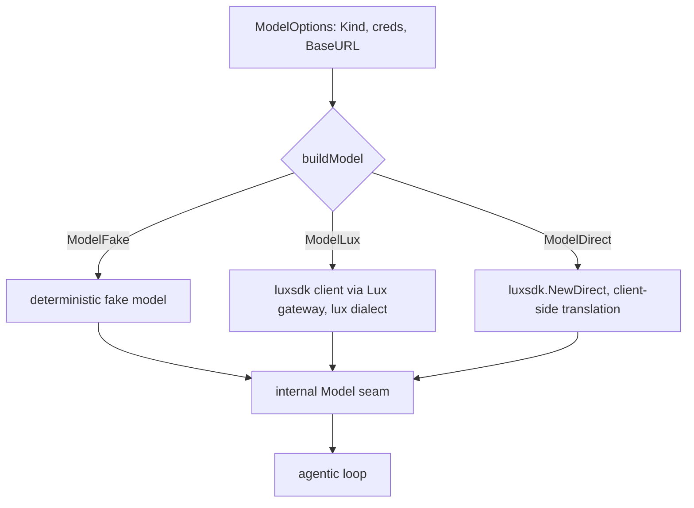

# Model Connection

## Goal

Let a host choose how the runtime reaches a model without exposing internal model
types, and keep provider secrets out of the host application. The same agents
should run against a real provider, a gateway, or a deterministic test model with
only a config change.

## Design

`ModelOptions` is the public model connection. It names a `Kind`, an optional
`Provider`, `Model` id, and `BaseURL`, plus exactly one credential: a static
`APIKey` or a `BearerSource` callback that supplies a per-call token. The host
never touches the internal model interface; the runner builds the right adapter
from these options once, when the runner is created.

`ModelKind` selects the backing:

- `ModelFake`: a deterministic, network-free model. It needs no keys and no
  network, so a host can exercise a full autonomous run (the loop calls a tool,
  the sandbox runs it, the model stops) in tests and quick checks.
- `ModelLux`: reaches a provider through Lux, the model gateway. Provider secrets
  live in the gateway, not in the embedding application; the host presents only a
  gateway virtual key or a rotating token. Local development can point at a local
  stateless gateway with the developer's own keys, so there is no cloud dependency
  for dev.
- `ModelDirect`: talks to a provider endpoint directly, a convenience for local
  development with a self-supplied provider key.

The model itself is always the same internal seam (see the agentic loop spec), so
the loop is unaware of which backing it got. Both real kinds speak the Lux
dialect via `latere.ai/x/pkg/luxsdk` (lux spec 33): `ModelLux` against the
gateway's `POST /lux/v1/generate` (any provider Lux routes), `ModelDirect`
against one provider endpoint with the dialect translated client-side
(Anthropic incl. OAuth tokens, OpenAI, Gemini, OpenRouter, Ollama). Topos owns
no wire mapping of its own; an unknown provider name is rejected with a clear
error.

## Diagram

## Outcome

Shipped in `model.go`: `ModelOptions`, `ModelKind` (`ModelFake`, `ModelLux`,
`ModelDirect`), and `buildModel`, which builds the fake model from `models/fake`
or the luxsdk-backed adapter from `models/lux`, and rejects unknown providers.
The provider-agnostic seam is `models.Model` in `models/`.

Updated 2026-07-18 (lux spec 33): the original Anthropic-wire adapters
(`models/anthropic`, `models/ollama`, and the openai/gemini stubs) were deleted;
both real kinds now ride `luxsdk`, so provider normalization lives in
`latere.ai/x/pkg/llmdialect`, not in topos.
