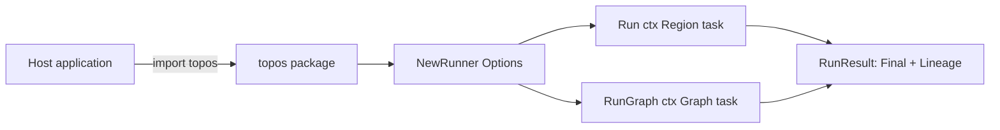

# Embeddable SDK Boundary

## Goal

Give a host application one small, stable surface to define agents and run them
in-process. The host should import a single package, use only types that package
defines (plus the standard library), and never reach into engine internals to get
a working run.

## Design

The root `topos` package is that surface. Everything a host needs is exported here:
the agent and region types, the model options, the runner, and the result types.
The engine lives in subpackages (`runtime/loop`, `models`, `harness`, `sandbox`).
Those subpackages are public for advanced or host-side use, but the root package
is the supported boundary: it speaks only `topos`-defined and standard-library
types, so the contract holds across the module edge.

The lifecycle is three calls:

1. `NewRunner(Options)` builds a `Runner`. `Options` carries a stable `SessionID`
   (deterministic child ids derive from it), the model connection (`ModelOptions`),
   a resource cap that only narrows for delegates (`BudgetUSD`), and the recursion
   bound for mesh delegation (`MaxHandoffDepth`, default 3). `NewRunner` constructs
   the model backend from `ModelOptions` once, up front.
2. `Run(ctx, Region, task)` executes a region. It creates a local sandbox for the
   run, dispatches on the region's autonomy mode, and tears the sandbox down when
   done. `task` is the user request handed to the entry agent. `RunGraph(ctx,
   Graph, task)` is the sibling call for a run that composes several regions; it
   runs each region through the same per-region unit and merges their lineages
   (see the region-graph spec).
3. The call returns a `RunResult`: `Final` (the entry agent's last text — for a
   graph, the last region's) and `Lineage` (the deterministic run graph). Even on
   error, a partial `Lineage` is returned so a caller can see how far the run got.

Because the runner constructs its own sandbox and model, a host can get a complete
autonomous run with no external services by selecting the deterministic fake model.

## Diagram

## Outcome

Shipped in `topos.go`: `Options`, `Runner`, `NewRunner`, `Run`, `RunGraph`, and
`RunResult`, along with the agent, region, graph, and lineage types the rest of the
specs cover. The
package doc comment states the boundary rule (only `topos`-defined and
standard-library types cross the edge). The model is built in `model.go`; the
per-run sandbox uses `sandbox/local`.
