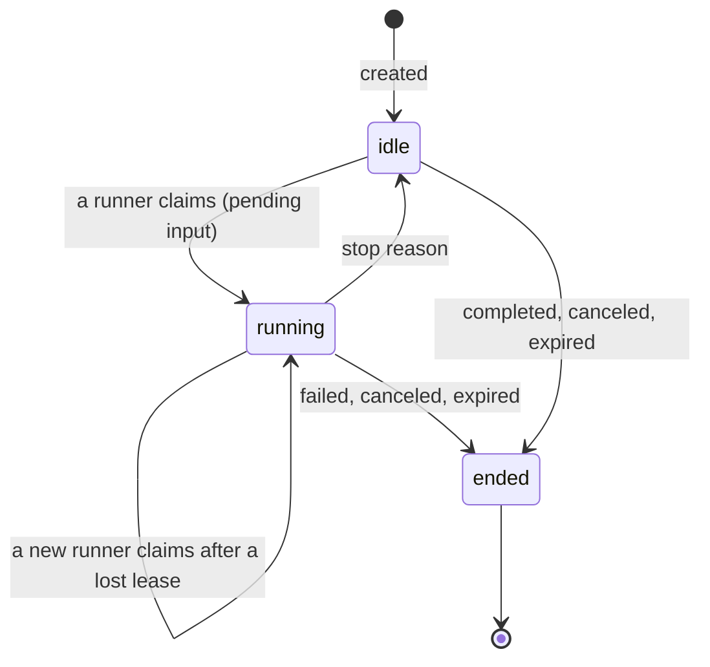

# The session log

## Overview

A session is one conversation between people and an agent: an
append-only log of typed events plus a status, a runner and a machine.
It is the unit that is stored, synced, moved and billed. This spec owns
schema v1: the Session and Event JSON, every event type and its
payload, the status and stop reasons, the id and sequence rules, the
pure fold from a log to the transcript a model sees, where raw response
bodies and request hashes live beside the IR, and the directory store a
local session lives in, with its fsync points and its single-writer
lock. Every runner, store and client reads and writes this schema, and
the fold is defined once, here (invariant 1 of [[001-architecture]]).

## Current state

v0.7.0 had no session format: the transcript was a slice of
`models.Message` in memory and was gone when the process exited, and
the run record was the static trace of v0.7.0 spec 008, which this spec
retires (spans now come from the log, [[023-events-and-observability]]).
The adversarial engine's own session format (v0.7.0 spec 027) left with
that engine for `latere.ai/x/adversarial`. The retired hosted service
kept the one sound piece this spec borrows: an append-only
`session_events` log keyed by `(session_id, seq)`, and attach as replay
then live tail. What it lacked, a versioned JSON-tagged schema owned by
the runtime, is this spec. Event names follow the vocabulary hosted
agent APIs use where the meaning is the same; the resemblance is
vocabulary and no compatibility promise.

The schema, the fold, the in-memory store and the directory store are
built. The directory store's lock is built on Unix only: there is no
`LockFileEx` implementation, so on Windows, as on any platform without
a lock, `session/dir` refuses to take one with `ErrUnsupported`.

## Design

### Identifiers

Every object id is a ULID (26 characters, Crockford base32, uppercase)
behind a kind prefix. A name may be reused after delete; an id never.

| Prefix | Object | Chosen by |
|---|---|---|
| `agent_` | an agent; a version is `agent_<ulid>@<n>` | the server, or the local resolver for a local agent |
| `ses_` | a session | the server; a local session's id is chosen by its local runner and accepted by toposd on first sync ([[017-external-runners-handoff-fork]]) |
| `evt_` | an event | the appender |
| `trg_` | a trigger | the server |
| `cred_` | a credential | the server |
| `mem_` | a memory store | the server |
| `apr_` | an approval of a step-up ([[012-permissions-and-approvals]]) | the runner |

Nothing else carries a prefix. A thread is identified by the id of the
`thread.started` event that opened it; the session's own thread has no
id and is written as an absent `thread` field. A turn is a dense
counter per session from 1; a step is a dense counter per turn from 1.
A tool call is identified by the model's `tool_use` id, unique within
the session; the harness assigns `call_<seq>_<n>` when a model supplies
none. A checkpoint is a git commit ([[034-checkpoints-and-rewind]]).

### Encoding

The session log is JSON with snake_case field names, because it embeds
the Lux wire encoding of `latere.ai/x/pkg/llmdialect`'s IR, which is
snake_case (`tool_use_id`, `input_tokens`, `cost_usd_micro`).
Manifests are camelCase ([[003-manifest]]); the two never mix inside
one object. Times are RFC 3339 in UTC with nanoseconds. Encoding uses
`encoding/json` with HTML escaping off and fields in declaration order,
so one value has one byte form. A reader keeps fields it does not know
and writes them back unchanged.

### The Session

| Field | Type | Meaning |
|---|---|---|
| `schema` | integer | `1` |
| `id` | string | `ses_…` |
| `agent` | object | `id`, `name`, `version`, `digest`: the `sha256:` of the resolved agent manifest, and `bundle`: the `sha256:` of the agent together with the agents it pins; both are blobs of the session, so the log is self-contained when it moves and a runner rebuilds the agent from `bundle` alone |
| `title` | string | optional, set by a client |
| `initiator` | Sender | who created the session |
| `runner` | string | `hosted` or `external`; a local session is `external` |
| `writer` | object | `kind` (`hosted` or `external`), `subject`, `since`: who may append now ([[017-external-runners-handoff-fork]]) |
| `status` | string | `idle`, `running` or `ended`; mirrors the last `session.status` event |
| `stop_reason` | string | the reason of the last `session.status`, empty before the first turn |
| `turn` | integer | turns started |
| `last_seq` | integer | the sequence of the last event; read-only |
| `machine` | object | the machine asked for: `kind` (`host` or `cella`), `environment`, `image`, `workdir` ([[009-machines]]); the attached one is in `session.machine` |
| `resources` | array | attachments: `{"type":"memory_store","memory_store_id","access"}` ([[020-memory-stores]]) and `{"type":"repository","url","ref"}` ([[019-git]]) |
| `scope` | array | the session scope, a list of grants ([[018-credentials-and-secrets]]) |
| `policy` | object | the merged approval policy: `mode`, `always_confirm`, `always_allow`, `thresholds` ([[012-permissions-and-approvals]]) |
| `requires` | array | names of Session fields a reader must understand; a runner that does not know one refuses the session with `schema_too_new` instead of running without it |
| `budget` | object | `max_cost_usd_micro` (absent: none) and `spent_cost_usd_micro` ([[007-models]]) |
| `limits` | object | `turn_timeout` (default `2h`) and `max_age` (default `168h`), Go durations ([[005-harness-loop]]), and `retention`, how long the session is kept after it ends, absent to keep it until it is deleted ([[014-store]]) |
| `capture` | object | `requests`: when true every model request's bytes are kept as a blob ([[007-models]]) |
| `end_on_idle` | boolean | end `completed` when the first turn goes idle `end_turn`; set by triggers ([[022-triggers]]) |
| `parent` | object | `session_id` and `seq` of the session this one was forked from |
| `trigger_id` | string | `trg_…` when a trigger started it |
| `created_at`, `updated_at`, `expires_at` | time | `expires_at` is `created_at` plus `limits.max_age` |
| `metadata` | object | string keys to string values, at most 32 entries |

A Sender is `{"subject","name","kind"}`: `subject` is the verified
subject of [[006-identity]] on a server, `local:<username>` in a local
session, `trigger:<trg_id>` for a trigger's message (a triggered
session's initiator is the trigger's owner, [[022-triggers]]); `kind` is `person`,
`trigger` or `service`; `name` is for display.

### Status and stop reasons



A waiting session is `idle` with a stop reason and holds no lease and
no goroutine. A runner appends `session.status` `running` when it
claims a session, before anything else, every time it claims it.

| Status | Stop reason | Meaning | Resumed by |
|---|---|---|---|
| `idle` | `end_turn` | the model ended its turn, by `end_turn`, a stop sequence, or a refusal (named in `detail`) | `user.message` |
| `idle` | `tool_confirmation` | at least one call's verdict is ask, or one step-up approval, waits for a person | `user.tool_confirmation` for every pending call and approval, or a `user.message`, which denies each with the message as its note |
| `idle` | `tool_result` | a client-executed tool call waits for its result | `user.tool_result` for every pending call |
| `idle` | `budget` | the session's or a thread's budget is reached, or a core refused a request for spend (`detail` names the refusal) | `user.message`, or `session.resumed` after the cap is raised or the wallet refilled ([[007-models]]) |
| `idle` | `turn_limit` | the turn's wall-clock limit passed | `user.message` |
| `idle` | `output_limit` | a `max_tokens` stop the harness could not continue | `user.message` |
| `idle` | `interrupted` | a `user.interrupt` took effect | `user.message` |
| `idle` | `error` | a model error after retries, or an internal failure, preceded by a `session.error` | `user.message` |
| `ended` | `completed` | a client ended the session, or `end_on_idle` applied | nothing |
| `ended` | `failed` | the session cannot continue: its log is corrupt, its agent version is gone, or its machine is lost and cannot be restored | nothing |
| `ended` | `canceled` | a person canceled it | nothing |
| `ended` | `expired` | `expires_at` passed | nothing |

A lost lease is not a status change: the runner that lost it stops
appending and the session stays `running` until the next runner's claim
([[016-runners]]).

### The Event

```json
{"id":"evt_01J9Z3Q4W8KX6T0M2V5N7R1B3C","seq":42,"session_id":"ses_01J9Z3P9D2F6H8K0M2Q4S6U8W0",
 "type":"agent.tool_use","time":"2026-09-27T10:11:12.123456789Z","turn":3,"step":7,
 "thread":"evt_01J9Z3Q1A2B3C4D5E6F7G8H9J0","payload":{"tool_use_id":"toolu_01","name":"bash","input":{"command":"go test ./..."}}}
```

| Field | Meaning |
|---|---|
| `id` | `evt_…`, unique within the session; a fork copies events with their ids |
| `seq` | dense per session from 1 |
| `session_id` | the session |
| `type` | one of the table below |
| `time` | when the appender created it |
| `turn`, `step` | the turn and step it belongs to; absent on events outside a turn |
| `thread` | the thread whose transcript the event renders into; absent for the session's own thread. A `thread.started` carries its own id here (its parent is `payload.parent`), and a `thread.message` the receiving thread (as `payload.to`), so a tombstone keeps the event in the right view |
| `payload` | the type's fields; `{"tombstone":true}` after redaction |

### Event types

"Visible" says whether the fold renders the event into the transcript.

| Type | Appended by | Visible | Payload |
|---|---|---|---|
| `user.message` | a client | yes | `sender`, `content` (text and image blocks) |
| `user.interrupt` | a client | yes | `sender`; the runner stops at the next step boundary ([[005-harness-loop]]) |
| `user.tool_confirmation` | a client | no | `sender`, `tool_use_id` or `approval_id` (exactly one), `decision` (`allow` or `deny`), `note`, `remember` (an argument pattern, [[012-permissions-and-approvals]]) |
| `user.tool_result` | a client | yes | `sender`, `tool_use_id`, `content`, `is_error` |
| `agent.message` | the runner | yes | `message` (the Lux wire message, role `assistant`, every block verbatim, thinking and its signature included), `stop_reason` (the IR's: `end_turn`, `tool_use`, `max_tokens`, `stop_sequence`, `refusal`), `request` (the `model.request` event id), `truncated`, `continuation_of` |
| `agent.tool_use` | the runner | no | `tool_use_id`, `name`, `input`, `risk` (`score`, `source`, `features`), `verdict`, `reason`, `mode`, `client`, `repeatable`; verdicts, sources and modes are [[012-permissions-and-approvals]]'s |
| `tool.result` | the runner | yes | `tool_use_id`, `content`, `is_error`, `outcome`, `duration_ms`, `spill` (`path`, `bytes`), `meta` (the tool's record for later calls of the thread: `{path, sha256}` for `read`, `write` and `edit`, `{dir, exit_code}` for `bash`, `{todos}` for `todo`; not rendered); outcomes and meta are [[008-tools]]'s |
| `thread.started` | the runner | yes, in the new thread | `agent` (`id`, `name`, `version`, `digest`), `parent` (thread id, absent for the session's thread), `tool_use_id`, `task`, `isolation` (`shared` or `worktree`), `branch`, `workdir`, `depth`, `model`, `tools`, `budget`, `ignored` (the fields of a referenced agent the thread does not use: `identity`, `permissions`, `model.credential`, `connections`, `memoryStores`, `machine`; absent when none) ([[013-threads-and-subagents]]) |
| `thread.ended` | the runner | no | `reason` (`completed`, `failed`, `canceled`), `final_text`, `usage`, `cost_usd_micro` |
| `thread.message` | the runner | yes, in the receiving thread | `from`, `to` (thread ids, absent for the session's thread), `from_name` (the sending thread's agent name), `content`, `tool_use_id` |
| `context.compacted` | the runner | yes | `kind` (`clear_tool_results` or `summary`), `from_seq`, `to_seq`, `tool_use_ids`, `summary`, `cause` (`threshold` or `redaction`), `request`, `tokens_before`, `tokens_after` ([[010-context]]) |
| `model.request` | the runner | no | `model`, `family`, `dialect`, `codec`, `prompt_version`, `tools_sha256`, `request_sha256`, `request_bytes`, `request_blob`, `response_blob`, `usage` (the Lux wire usage), `cost_usd_micro`, `cost_source`, `latency_ms`, `first_token_ms`, `stop_reason`, `attempts`, `outcome` (`ok`, `error`, `canceled`), `error`, `loss` ([[007-models]]) |
| `session.status` | the runner or the server | no | `status`, `stop_reason`, `detail`, `runner` (on `running`: `id`, `kind`), `checkpoint` (on a turn end: `ref`, `commit`) |
| `session.machine` | the runner | yes, as system parts | `machine` (`kind`, `id`, `workdir`, `os`, `arch`, `environment`), `reason` (`attached`, `handoff`, `restored`, `replaced`), `context`, `instructions` (`path`, `sha256`, `blob`), `skills` (`name`, `description`, `path`), `checkpoint` ([[009-machines]], [[011-instructions-and-skills]]) |
| `session.resumed` | the server | no | `by` (a Sender), `reason` (`budget_raised`, `credit_restored`, or a client's text), `max_cost_usd_micro` (the new budget, absent when unchanged) ([[007-models]]) |
| `session.scope_changed` | the server | no | `by`, `old`, `new`, `reason`, `until` (a time, `end_of_turn`, or absent for standing) |
| `approval.requested` | the runner | yes, as a system part | `approval_id`, `tool_use_id` (the call that caused it), `source` (`egress`), `destination` (`host`, and `core`, `action`, `resource` for a flagged action, or `method`, `path` for an egress pattern), `risk`, `verdict`, `reason` ([[012-permissions-and-approvals]]) |
| `approval.decided` | the runner | yes, as a system part | `approval_id`, `decision`, `by`, `note`, `grant` (`id`, `expires_at`, absent on deny) |
| `session.error` | the runner | no | `code`, `message`, `retryable`, `detail`; codes are the owning spec's |
| `memory.attached` | the runner | yes, as a system part | `memory_store_id`, `name`, `description`, `access` (`read_write` or `read_only`), `sharing` (`initiator` or `shared`), `path`, `version` |
| `memory.synced` | the runner | no | `memory_store_id`, `pushed`, `pulled`, `deleted`, `conflicts` (paths only), `version` |
| `event.redacted` | the server | no | `event_id`, `by`, `reason` |
| `session.rewound` | the runner | yes | `to_turn`, `checkpoint` (`ref`, `commit`), `saved` (the checkpoint of the state it replaced), `by` |

Content blocks are the Lux wire blocks of llmdialect (`text`, `image`,
`tool_use`, `tool_result`, `thinking`, `redacted_thinking`) plus the
provider-opaque block [[007-models]] adds to pkg. A type this list does
not name is kept, is not visible, and is reported by the fold as
unknown.

### Sequence, append and idempotency

Sequence is dense per session from 1. An append names the sequence it
follows (`after_seq`) and carries one or more events whose `seq` is
`after_seq + 1` onward. A store accepts the batch only from the
session's writer and only when `after_seq` is its last sequence; a
retry of an accepted batch whose event ids match answers success with
the same last sequence; any other mismatch is `sequence_conflict`. A
batch is atomic: every event of it is durable, or none is.

### Append-only, and the one exception

An appended event is never edited or removed except by deleting the
whole session, or by redaction. Redaction replaces the payload of one
event with `{"tombstone":true}`, keeps its `id`, `seq`, `type`,
`time`, `turn`, `step` and `thread`, and appends `event.redacted`. The
fold refuses to render a visible redacted event that no later `summary`
compaction covers (`redaction_uncompacted`), except a redacted system
part, which it skips; the runner therefore
compacts before its next request, with `cause` `redaction`, because an
edited history invalidates the thinking signatures a provider binds to
a conversation. A redaction deletes the blobs only that event named.
Who may redact is [[015-api]]'s and [[018-credentials-and-secrets]]'s.

### Blobs and request hashes

A blob is bytes addressed by `sha256:<hex>` and belongs to one
session: the resolved agent manifest, every raw response body
(`response_blob`), every captured request (`request_blob`, present
only while `capture.requests` is true), instruction files, and spill
files a machine could not keep. A blob is durable before the event
that names it is appended. Every `model.request` carries
`request_sha256`, the hash of the exact bytes sent, and `codec`, the
llmdialect codec and module version that encoded them, so a replay
that folds the log and re-encodes with the same codec version proves
it produced the same bytes ([[007-models]]).

### The fold

`session.Fold(events []Event, thread string) (Transcript, error)` is a
pure function: no clock, no I/O, no map iteration. Its output is
`Transcript{System []Part, Messages []Message, Open []string,
Unknown []string}`, where Messages are Lux wire messages and `Open`
lists the `tool_use` ids of the last step that have no result.

A `Part` is structured, not text: `Part{Kind, Context string,
Instructions *Instructions, Skills []Skill, Memory *MemoryAttached}`,
with `Kind` one of `context`, `instructions`, `skills` or `memory`; an
instructions part carries `path`, `sha256` and the blob digest, a skill
`name`, `description` and `path`. Because the fold does no I/O, the
harness reads the blobs and renders every part into system blocks
([[010-context]], [[011-instructions-and-skills]]).

1. Take, in `seq` order, the events whose `thread` is the thread, and
   the session-wide events every thread shares: `session.machine`,
   `memory.attached`, and for the session's own thread
   `session.rewound`.
2. System parts, in this order: the `context` of the latest
   `session.machine`; one `instructions` part per instruction file it
   lists; one `skills` part; then one `memory` part per attached store,
   in first-attachment order, where a later `memory.attached` for the
   same store updates its entry in place. A redacted `session.machine`
   or `memory.attached` is skipped here, because a summary cannot cover
   a system part. The harness prompt and tool definitions are not in
   the log; the harness adds them from `prompt_version` and the tool
   set.
3. Render each event:
   - `user.message`: a user message of its content, led by a text
     block `Message from <name>:` from the event where a second sender
     subject first appears onward; earlier messages are not changed,
     so their bytes and the prompt cache survive. `<name>` is the
     sender's name, else its subject, else `someone`.
   - `user.interrupt`: a user text block `<name> interrupted the
     previous turn.`
   - `agent.message`: an assistant message of its blocks verbatim. When
     `truncated`, a `tool_use` block with no `agent.tool_use` event is
     dropped, and a user text block `Your previous response was cut
     off at the output limit. Continue from where it stopped.`
     follows. An assistant message left with no blocks renders
     nothing.
   - `tool.result` and `user.tool_result`: a `tool_result` block in
     the user message after the step's assistant message, ordered by
     the assistant message's `tool_use` order, not by `seq`. A result
     that no rendered `tool_use` names is dropped.
   - `thread.started`: a user message of its `task`, in the thread it
     opened.
   - `thread.message`: a user message led by
     `Message from thread <from_name>:`, in the receiving thread, where
     `<from_name>` falls back to `from`, then to `session`.
   - `context.compacted` `summary`: the messages rendered from events
     in `from_seq..to_seq` are replaced by one user message
     `Summary of the conversation so far:` followed by the summary. A
     later summary whose range overlaps an earlier one supersedes it,
     and the replaced range is the union of the two. A summary whose
     range holds no event of the thread's view renders at the first
     view event after its range, or at the end.
   - `context.compacted` `clear_tool_results`: the content of each
     named `tool_result` becomes the text `[cleared to save context;
     run the tool again if the result is needed]`.
   - `session.rewound`: a user text block `The working directory was
     restored to its state at the end of turn <n>.`
   - every other type: nothing.
4. Adjacent messages of the same role merge, blocks in order.

The texts step 3 writes are files of `prompts/transcript/`, one per
text and version ([[011-instructions-and-skills]]). The fold renders
the versions its build names; a change of wording ships as a new
version of the file, never as an edit of a released one.

The fold of one log is byte-identical, as `json.Marshal` of the
Transcript, on every store and every run. A runner refuses to continue
a session whose fold reports unknown types (`schema_too_new`).

### The Store interface

```go
type Store interface {
	Create(ctx context.Context, s Session, blobs map[Digest][]byte) error
	Get(ctx context.Context, id string) (Session, error)
	List(ctx context.Context, o ListOptions) ([]Session, string, error)
	Append(ctx context.Context, id string, afterSeq uint64, events []Event) (uint64, error)
	Events(ctx context.Context, id string, fromSeq uint64, limit int) ([]Event, error)
	Watch(ctx context.Context, id string, fromSeq uint64) (<-chan Event, error)
	PutBlob(ctx context.Context, id string, r io.Reader) (Digest, error)
	Blob(ctx context.Context, id string, d Digest) (io.ReadCloser, error)
	Redact(ctx context.Context, id, eventID string, by Sender, reason string) error
	Acquire(ctx context.Context, id string, holder Holder) (Lease, error)
	Delete(ctx context.Context, id string) error
}
```

`List` answers sessions newest first, filtered by `ListOptions`:
`Status`, `AgentID`, `Owners` (the initiator's subject is one of
them, the narrowing an authorizer's list decision carries,
[[006-identity]]) and `Runner` (the runner kind). A store filters
before it pages, so every page holds only matching sessions, a walk of
the cursors meets each match once, and the last page names no next
cursor. `Append` updates the Session's `status`, `stop_reason`, `turn` and
`updated_at` from the batch in the same atomic write. `Watch` is replay
then live: every event from `fromSeq`, then each new one, in order.
`Acquire` returns the one-writer lease: `ErrLocked` names the current
holder; a `Lease` has `Renew`, `Release` and `Lost() <-chan struct{}`.
The server's leases are [[016-runners]]'s. `session.NewMemoryStore`
is an in-memory implementation for tests and embedders that keep
nothing. `session/storetest.Run` is
the importable conformance suite every implementation passes: the
directory store here, Postgres ([[014-store]]), the `client` Store
([[024-client-cli-skill]]).

| Error | Meaning |
|---|---|
| `sequence_conflict` | `after_seq` is not the last sequence, or a batch reuses an event id with different content |
| `redaction_uncompacted` | the fold met a redacted event no summary covers |
| `schema_too_new` | the fold met an event type this build does not know |
| `ErrLocked` | another holder has the session's lease |
| `ErrCorrupt` | the stored sequence has a gap or a repeat, a batch marker miscounts, or an undecodable line is followed by a closed batch |
| `ErrNotFound` | no such session, event or blob |
| `ErrExists` | a create names a session that exists |
| `ErrInvalid` | a session or an event fails validation |
| `ErrBlobMismatch` | a blob's bytes do not hash to its digest |
| `ErrBadID` | an id without its prefix or not in the ULID form |
| `ErrUnsupported` | the platform has no lock the store can take |

`Transcript.Check` returns the `schema_too_new` error when the fold
reported unknown types, so a caller refuses such a log in one call.

### The directory store

`session/dir` keeps each session in a directory under
`$TOPOS_DATA_DIR/sessions/` ([[002-scaffold-and-configuration]]):

```
sessions/<ses_id>/
  session.json        the Session, replaced atomically
  events.jsonl        one Event per line, LF terminated, appended; the last line of each batch adds "batch":N
  blobs/sha256/<hex>  blob bodies
  lock                the single-writer lock
```

| Operation | Durability |
|---|---|
| put a blob | write `blobs/sha256/<hex>.tmp`, fsync it, rename, fsync `blobs/sha256/`; before any event naming it |
| append a batch | one `write` of every line, then fsync `events.jsonl`; the append is acknowledged only after the fsync |
| a batch carrying `session.status` | then write `session.json.tmp`, fsync, rename over `session.json`, fsync the session directory |
| create | the whole session written into `sessions/.<id>.creating`, then renamed into place and the parent directory fsynced, so a failed create leaves no partial session |
| redact | `events.jsonl` rewritten to a temporary file, fsynced, renamed over the log, and the directory fsynced |
| delete | the directory renamed to `sessions/.<id>.<ulid>.deleting`, then removed |

The harness appends in batches that match [[005-harness-loop]]'s
commit points: a step's `model.request`, `agent.message` and
`agent.tool_use` events before any call runs, each `tool.result` when
its call returns, and each `session.status`.

The lock is the file `lock`, held with `flock(LOCK_EX|LOCK_NB)` on
Unix and `LockFileEx` on Windows for as long as a runner drives a turn
(a build whose platform has no lock implementation refuses to take one
with `ErrUnsupported`);
the holder writes `{"pid","host","runner","acquired_at"}` into it for
diagnosis only, and the operating-system lock is the truth, released
when the process exits for any reason. An idle session holds no lock.
`Append`, `Redact` and `Delete` take the lock for their call: the
store's own lease when it holds one, otherwise a transient non-blocking
lock released after the write, so a second store instance or process
that writes while a runner drives a turn gets `ErrLocked`. Readers take
none.

`session.json` records the `last_seq` it was written at. `Get` applies
the events after that sequence, so `turn`, `last_seq` and `updated_at`
are current between the batches that rewrite the file.

Each line of `events.jsonl` is the Event's JSON, and the last line of
every batch carries one storage-only member, `"batch":N`, the batch's
event count; decoders of Event ignore it. A batch is one write, so a
crash before its fsync can leave some complete lines of a batch that
was never acknowledged. On taking the lock the store truncates
everything after the last line that closes a batch, a torn last line
being the special case of this, and readers without the lock ignore
such lines. That is what makes a batch atomic on the directory store.
A gap or a repeat in the sequence is `ErrCorrupt`, which ends the
session `failed`. When `session.json`
disagrees with the last `session.status` event, the event wins and
`session.json` is rewritten. `Watch` in the writer's process is
notified in process; another process polls `events.jsonl` every 250 ms.

## Not in this spec

When the runner appends what ([[005-harness-loop]], [[016-runners]]);
the verdict, risk and mode vocabulary ([[012-permissions-and-approvals]]);
the codecs, cost and the provider-opaque block ([[007-models]]);
compaction policy ([[010-context]]); the Postgres store and the blob
store's other backends ([[014-store]]); the routes that expose the log
([[015-api]]); how a session's writer changes
([[017-external-runners-handoff-fork]]).

## Acceptance criteria

| Criterion | Test that proves it | State |
|---|---|---|
| A recorded log of every event type folds to byte-identical Transcripts across two runs, on the directory store and on the in-memory store | `session.TestFoldIsByteIdenticalAcrossStores` over the golden logs in `session/testdata/fold/` | built |
| The fold renders each type as the table says: tool results ordered by the assistant message, a truncated message's incomplete `tool_use` dropped, a summary replacing its range, cleared results replaced, senders, interrupts, threads and messages, system parts, a rewind | `session.TestFoldRendersEveryType`, one golden transcript per rule; `session.TestFoldIsPure`, `session.TestFoldRejectsMalformed` | built |
| An event is never rewritten after append; redaction keeps id, sequence and type, tombstones the payload, deletes only that event's blobs, and the fold refuses the redacted event until a summary covers it | the `AppendedEventIsNeverRewritten` and `Redact` cases of `session/storetest.Run`, and the `redacted_uncompacted` and `redacted_and_summarized` golden logs of `session.TestFoldRendersEveryType` | built |
| An append whose `after_seq` is not the last sequence is `sequence_conflict`; a retried accepted batch with the same event ids succeeds without a duplicate | the `AppendRejectsStaleSequence` and `AppendRetryIsIdempotent` cases of `session/storetest.Run` | built |
| A crash between write and fsync leaves a torn line or a partial batch that the next lock holder truncates to the last closed batch, readers never see, and no acknowledged event is lost | `session/dir.TestDirStoreTruncatesTornTail`, and `session/dir.TestDirStoreCrashAtEachDurabilityPoint`, which stops a child process at each durability point | built |
| A batch marker that miscounts, and a gap or a repeat in the sequence, are `ErrCorrupt` | `session/dir.TestABatchMarkerThatMiscountsIsCorrupt`, `session/dir.TestDirStoreRefusesCorruptSequence` | built |
| A second process that tries to take a held session's lock gets `ErrLocked` naming the holder, and gets the lock once the holder process is killed; a second store instance that writes while another holds the lease is locked out | `session/dir.TestDirStoreSingleWriterLock` across two processes, `session/dir.TestDirStoreSecondInstanceIsLockedOut` | built |
| A create that fails leaves no partial session, and every failed write and sync is returned | `session/dir.TestDirStoreCreateIsAllOrNothing`, `session/dir.TestCreateLeavesNoPartialSessionWhenABlobFails`, `session/dir.TestWriteFailuresAreReturned`, `session/dir.TestEveryFailedSyncIsReturned` | built |
| The Session's `status` always equals the last `session.status` event, including after a crash between the two writes | `session/dir.TestSessionStatusMirrorsTheLog` | built |
| An unknown event type is kept, is not rendered, and makes a runner refuse with `schema_too_new` | the `UnknownTypeIsKept` case of `session/storetest.Run`, the `unknown_type` golden log, `session.TestTranscriptCheck`, and `harness.TestATurnRefusesALogItCannotFold` | built |
| `List` filters by status, agent, owners and runner kind before it pages: each match appears once across the pages and the last page names no next cursor | the `List` and `ListFilters` cases of `session/storetest.Run` | built |
| The directory store and the in-memory store pass `session/storetest` | `session/dir.TestDirStoreConformance`, `session.TestMemoryStoreConformance` | built |
| Every id the package mints matches its prefix and the ULID form, and a thread's id is its `thread.started` event id | `session.TestIdentifiersArePrefixedULIDs`; the `threads_and_messages` golden log of `session.TestFoldRendersEveryType` | built |
| The directory store takes its lock on Windows with `LockFileEx`, and a second process is locked out as on Unix | `TestDirStoreLockOnWindows`, run on a Windows runner | not built |
