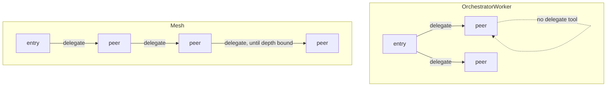

# Topology

## Goal

In a dynamic region, decide who is allowed to delegate. The default should be the
conservative shape (one coordinator, many workers), with a richer peer-to-peer
shape available when a host opts in.

## Design

`Region.Topology` selects between two shapes. It applies only to dynamic regions
and defaults to `OrchestratorWorker`.

- `OrchestratorWorker` (default): only the entry agent gets a `delegate` tool. A
  delegated peer runs without one, so it does the work itself and returns a result.
  Delegation is one level deep: entry to peer, peer back to entry. This is the safe
  default for most work.
- `Mesh` (opt-in): any agent may delegate to a peer, including a peer that was
  itself delegated to. This allows recursive, peer-to-peer handoffs. To keep it
  from fanning out without bound, mesh delegation is capped by `MaxHandoffDepth`
  (see the bounded recursion spec).

Mechanically, the runner decides per agent whether to offer the delegate tool. The
entry agent always may (when there are peers). A non-entry agent may only under
`Mesh`, and only while the current depth is below the bound. When the tool is
withheld, that agent simply completes its own task.

Discovery is separate from permission. Even under orchestrator-worker, the peer
directory describes the whole peer set; the topology controls who may act on it.

## Diagram

## Outcome

Shipped in `topos.go`: the `Topology` type with `OrchestratorWorker` and `Mesh`,
the `canDelegate` gate in `runAgent` (entry always, non-entry only under mesh and
below the depth bound), and the recursion grant computed in the delegate tool's
`Invoke`.
