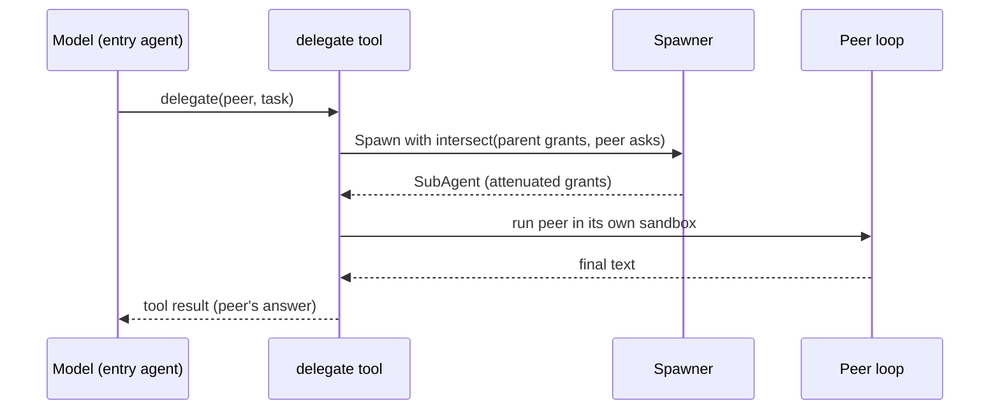

# Delegation as Agents-as-Tools

## Goal

Let a dynamic agent hand a subtask to a peer the same way it calls any other tool,
while guaranteeing the peer can never hold more authority than the agent that
spawned it.

## Design

Delegation is modeled as agents-as-tools. When an agent is allowed to delegate,
the runner injects a `delegate` tool into its tool registry. The tool takes a
`peer` name and a `task` string. To the model, choosing a peer looks exactly like
calling a function; the directory in the system prompt tells it which peers exist.

When the model calls `delegate`, the tool:

1. Looks up the named peer in the region's directory. An unknown name returns a
   tool error, not a spawn, so the agent can only reach peers it was given.
2. Spawns the peer with attenuated authority. The spawner derives the child's
   grants by intersecting the parent's tools and scopes with what the peer spec
   asks for. The result is always a subset of the parent's pool: trust decreases
   with distance from the entry agent. A child's authority is captured at spawn,
   so it cannot drift back up.
3. Creates a fresh sandbox for the peer. The peer runs in its own sandbox, so a
   provisioning failure is the child's problem and the peer's filesystem work is
   isolated from the parent's.
4. Runs the peer as a nested agentic loop with its attenuated tools and the task
   string as its prompt.
5. Returns the peer's final text as the tool result, which the loop appends back
   into the parent's transcript. From the parent's view, delegation is one tool
   call that produced an answer.

The spawn also records lineage (see the lineage spec): a node for the peer with
the tools it was actually granted and the sandbox it ran in, plus a `delegate`
edge from the caller and a `deliver` edge back when the peer finishes.

Attenuation is the core safety property. Because grants are an intersection, no
chain of delegations can widen authority: a peer of a peer is a subset of a subset.

## Diagram

## Outcome

Shipped in `topos.go`: the `delegateTool` type (`Name`, `Def`, `Invoke`) and its
recursive call back into `runAgent`. Attenuation is enforced in
`harness/subagent.go`: `Spawner.Spawn` intersects scopes and tools against the
`ParentContext`, and `SubAgent` captures the grant at spawn time.
