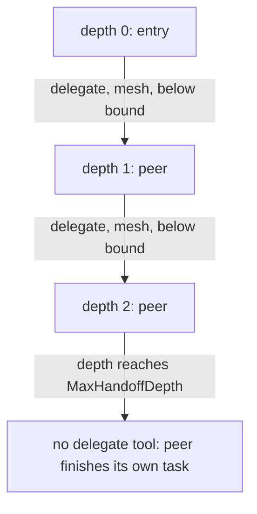

# Bounded Recursion

## Goal

Under mesh topology, where a peer may delegate again, make sure a run cannot fan
out without bound. A misbehaving or looping model must hit a hard ceiling on how
deep delegation can nest.

## Design

`Options.MaxHandoffDepth` caps how deep mesh delegation may go. It defaults to 3
when left at zero. The bound is enforced in two independent places, so a single
mistake cannot defeat it:

- The runner withholds the `delegate` tool. An agent gets the tool only when the
  current depth is below the bound (and, for a non-entry agent, only under mesh).
  Once depth reaches the cap, the agent has no way to delegate: it finishes its
  own task. This is the primary gate.
- The spawner refuses unauthorized recursion. A child carries an explicit
  "may recurse" grant, set only when topology is mesh and there is still depth
  budget left to delegate again. A sub-agent that tries to spawn without that
  grant is rejected outright. The grant itself attenuates: a child can recurse
  only if its parent both held and passed the right, so the permission narrows
  with depth just like tools and scopes do.

The two gates reinforce each other. The tool gate stops a well-behaved loop from
even offering delegation past the bound; the spawner gate is the backstop if a
spawn is attempted directly. Orchestrator-worker never grants recursion at all,
so its delegation is always one level deep.

## Diagram

## Outcome

Shipped in `topos.go`: `Options.MaxHandoffDepth`, the `maxDepth` default of 3, the
depth term in the `canDelegate` gate, and the `allowRecurse` computation in the
delegate tool. The backstop is `harness/subagent.go`: `Spawner.Spawn` returns
`ErrRecursionDenied` for a sub-agent that lacks an explicit recursion grant, and
the grant is itself intersected against the parent.
