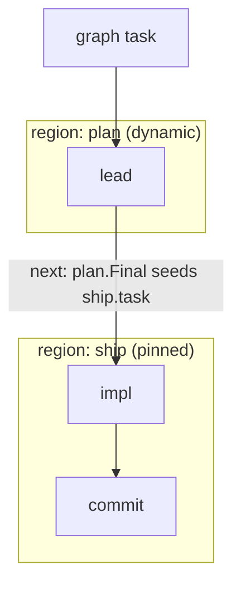

# Region Graph

## Goal

A single region is one unit of work with one autonomy mode. Real work spans
several: a dynamic planning region whose output feeds a pinned shipping chain, or
one analysis region fanning into two independent follow-ups. Let a host compose
several regions — pinned and dynamic, mixed freely — into one run, with the output
of one region feeding the next.

## Design

A `Graph` holds named regions and the edges between them:

- A `GraphRegion` is a `Region` plus an `ID` unique within the graph. The id
  namespaces the region's node ids, so agents that share a `Name` in different
  regions still get distinct lineage ids.
- A `GraphEdge` composes two regions by data flow: an edge `From -> To` seeds the
  target region's task with the source region's `Final`. A region with no incoming
  edge starts from the graph task.

`Runner.RunGraph(ctx, Graph, task)` executes the graph. Regions run in
deterministic topological order (Kahn's algorithm, seeded and expanded in declared
order), each in its own isolated sandbox through the same `runRegion` unit that
`Run` uses — so region isolation and sandbox lifecycle are identical on both paths.
Each region's lineage merges into one graph, and a cross-region `next` edge links
each source region's entry node to its target region's entry node.

Composition is text-only: a region's observable output is its `Final` text, not a
shared filesystem. This is deliberately different from a pinned region's internal
chain, where every step receives the original task and outputs are not piped —
regions compose by threading text; steps within a region do not.

Execution is sequential, which keeps lineage mutation single-threaded (no
concurrent appends to the shared graph). Two shapes are supported: a linear chain
and fan-out (one region feeding several). Fan-in — a region with more than one
incoming edge — is rejected, because merging several upstream `Final`s into one
task is an unspecified product decision. A cycle, an unknown edge endpoint, a
duplicate or empty region id, and fan-in are all configuration errors reported
before any region runs.

## Diagram

## Outcome

Shipped in `topos.go`: `Graph`, `GraphRegion`, `GraphEdge`, and `Runner.RunGraph`,
with the shared `runRegion` helper extracted from `Run` and the `planGraph`
validator (topological order, cycle/fan-in/unknown-edge rejection). Region ids
namespace node ids (`<session>/<region>/<agent>`), so the lineage merge stays
collision-free; a cross-region `next` edge records region-level flow.
`RunGraph`, `planGraph`, and `runRegion` are covered at 100%; `examples/graph`
demonstrates a dynamic-to-pinned composition.
