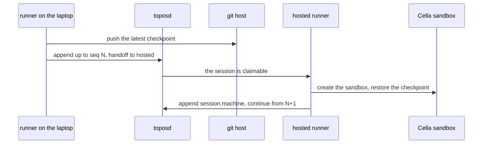

# External runners, handoff and fork

## Overview

A session has one writer. For a hosted session it is whichever hosted
runner holds the lease; for an external session it is a process the
developer runs (the `topos` command on a laptop, a CI job, a service)
that appends through the API with its own credential. This spec owns
fork, the one way a second writer continues a session: a new session
from the log at a turn boundary, with that turn's files. It owns the
external runner as a documented API surface: the append route, the
writer rule, the inbox through which messages sent to the session reach
the runner, and the `session.append` question the authorizer answers.
And it owns handoff, which moves the writer and the machine between an
external runner and the hosted runners through the latest checkpoint,
with or without a git remote of the user's. Local fork is phase 1; the
rest is phase 4.

## Current state

v0.7.0 had no session to fork or move. The retired design offered a
laptop tunnel so a hosted loop could act on a laptop, which was never
validated and is replaced by a hosted session on a Cella Environment
whose workers the developer runs ([[009-machines]]). The rule that a
second writer never merges and that a person taking over an unreachable
session gets a fork is new here.

## Design

### Fork

`fork(session, at_seq)` creates a session that starts from another's
log.

| Rule | Value |
|---|---|
| fork point | `at_seq` must be the sequence of a `session.status` `idle` event, a turn boundary; default the last one; otherwise `invalid_fork_point` |
| events | 1 to `at_seq` copied verbatim, ids included, redacted events as tombstones, and every blob they name |
| the new Session | a new `ses_` id, `parent` set to `{session_id, seq}`, status `idle` with the stop reason at `at_seq`, the same agent version, `expires_at` from now, the forker as initiator and writer |
| files | the checkpoint named by the `session.status` at `at_seq` ([[034-checkpoints-and-rewind]]) is restored into the new session's working directory, and recorded as the new session's checkpoint of that turn |
| budget | `spent_cost_usd_micro` is the sum over the copied `model.request` events; the budget itself is the new session's |

Locally, `topos fork <session> [--at <seq>] [--dir <path>]` forks over
the directory store and restores the files into `--dir` or a new
worktree ([[009-machines]]); on a server the route is
`POST /v1/sessions/{id}/fork` ([[015-api]]), decided by
`session.fork` ([[006-identity]]). A person who takes over a session
whose writer is unreachable forks it at its last synced sequence; the
old session keeps whatever its writer appends when it returns. Nothing
merges two writers' events.

### The writer

The Session's `writer` ([[004-session-log]]) is `{kind, subject,
since}`. A session created with `runner: hosted` has writer kind
`hosted`, and only the lease holder of [[016-runners]] appends. A
session created with `runner: external` has writer kind `external` and
the creating subject as its writer, and only that subject appends.

### The append route

`POST /v1/sessions/{id}/append`, body
`{"after_seq":N,"events":[...],"session":{...}}`.

| Check | Refusal |
|---|---|
| the caller is the session's writer subject | 409 `not_writer` |
| the authorizer allows `session.append` for the caller on the session | 403 `append_refused` |
| `after_seq` is the session's last sequence, and the events continue it densely | 409 `sequence_conflict` ([[004-session-log]]), with the server's last sequence in `detail` |
| every blob an event names was uploaded with `PUT /v1/sessions/{id}/blobs/{digest}` | 422 `blob_missing` |
| the event types are runner types or user events taken from the inbox | 422 `invalid_request` |

A retried batch whose event ids match an accepted one answers success
with the same `last_seq`. A local session's first sync is an append
with `after_seq` 0 and `session` set: toposd creates the session with
the id the local runner chose when that id is unused, `runner`
`external`, and the caller as writer; an id another subject holds is
409 `session_exists`. An append refused by the authorizer leaves the
session local, and the client says why. The authorizer's answer follows
the installation's policy; in a common one a person's own sessions may
sync by default, and in an organization an admin decides whether
members' external runners may append at all.

### The inbox

A user event sent to an external session with the send route of
[[015-api]] does not enter the log, because the server cannot number
it without racing the writer. It enters the session's inbox: an ordered
list of pending events, each with its server-assigned `evt_` id, its
sender and its time.

| Route | Does |
|---|---|
| `GET /v1/sessions/{id}/inbox?after=<evt_id>` | the pending events after one, replay then live with `Accept: text/event-stream` |

The writer appends inbox events into its log in inbox order, keeping
their ids, senders and times and giving them its own sequence numbers;
an appended id leaves the inbox. A client shows inbox events as
pending until then. While the runner is offline the inbox accumulates,
and the log catches up when it returns; nobody else writes the session
meanwhile. `user.interrupt` travels the same way.

### Handoff

`POST /v1/sessions/{id}/handoff`, body `{"to":"hosted"|"external",
"after_seq":N,"checkpoint":{"ref","commit"}}`, decided by
`session.handoff`.

Laptop to cloud, called by the external writer:

1. It finishes or interrupts its turn, so the session is idle and its
   last turn's checkpoint exists, and appends every inbox event.
2. It pushes that checkpoint: to the session's repository refs on the
   user's remote when the working directory is a checkout the hosted
   runners can fetch, otherwise to the session repository on the git
   host ([[034-checkpoints-and-rewind]]). No git remote of the user's
   is needed.
3. It appends up to `N` and calls handoff with `to: hosted`. toposd
   checks `N` is the last sequence and the inbox is empty
   (`inbox_not_empty`), that the session's agent is one the server
   holds and that its `bundle` is a version of that agent
   (`agent_not_hosted`), and asks the authorizer `session.handoff`,
   which applies the initiator cap as at a create, because from here
   the session acts as the agent's identity and no longer as the
   developer ([[018-credentials-and-secrets]]). It then sets the writer
   to `hosted`.
4. A hosted runner claims the session on its next input, creates the
   sandbox, restores the checkpoint, appends `session.machine` with
   reason `handoff`, and continues from `N + 1`.

The log an external runner wrote is input to the hosted runner, never
authority. The hosted runner takes the agent, its policy, the scope and
the budget from the Session and the authorizer's decision, never from
an event; the external writer's events render into the transcript and
change nothing it may do. A handed-off session is as trustworthy as any
content its model reads, and the approval layers apply to what it does
next ([[012-permissions-and-approvals]]).

Cloud to laptop, called by the external runner that takes the write:

1. If the session is idle, toposd sets the writer to the caller at
   once, and the answer names the checkpoint of the last turn.
2. If it is running, toposd records the handoff; the hosted runner
   stops at its next step boundary, ends the turn idle with
   `interrupted` and `detail` `handoff`, takes and pushes the turn's
   checkpoint, releases the lease, and toposd sets the writer. A
   second handoff while one is pending is 409 `handoff_in_progress`.
3. The external runner restores the checkpoint into a directory, a new
   worktree unless told otherwise, and appends `session.machine` with
   reason `handoff`.

### Error codes

| Code | Status | Meaning |
|---|---|---|
| `invalid_fork_point` | 422 | `at_seq` is not a turn boundary |
| `not_writer` | 409 | the caller is not the session's writer |
| `append_refused` | 403 | the authorizer refused `session.append` |
| `blob_missing` | 422 | an event names a blob not uploaded |
| `session_exists` | 409 | a first sync names an id another subject holds |
| `inbox_not_empty` | 409 | a handoff while inbox events are not yet appended |
| `handoff_in_progress` | 409 | a handoff while another is pending |
| `agent_not_hosted` | 422 | a handoff to `hosted` for a session whose agent the server does not hold, or whose bundle is no version of it |

## Not in this spec

The lease and the hosted runners' claims ([[016-runners]]); the other
routes ([[015-api]]); checkpoints and where they are pushed
([[034-checkpoints-and-rewind]]); the credential an external runner
presents ([[006-identity]]).

## Acceptance criteria

| Criterion | Test that proves it | State |
|---|---|---|
| A local fork at a turn boundary copies the log to that sequence, restores that turn's files, and the new session's fold equals the old one's at that sequence | `TestLocalForkRestoresTurnFiles` | not built |
| A fork at a sequence that is not a turn boundary is refused with `invalid_fork_point` | `TestForkPointMustBeATurnBoundary` | not built |
| After a fork, events the old writer appends to the old session never appear in the new one | `TestForkNeverMerges` | not built |
| A program using only `client` and a key runs a session as an external runner: it syncs a local session, appends its turns, and receives a message sent through the send route by way of the inbox | `TestExternalRunnerWithClientOnly` in the e2e tier | not built |
| An append from a subject other than the writer is `not_writer`; one the authorizer refuses is `append_refused` and leaves the local session intact | `TestAppendWriterRule` | not built |
| A retried append batch succeeds once and never duplicates an event | `TestAppendRouteRetryIsIdempotent` | not built |
| One session moves laptop to cloud to laptop with an identical fold at every sequence and identical files, with and without a git remote of the user's | `TestHandoffRoundTrip` in the e2e tier, two subtests | not built |
| A handoff to external while a hosted turn runs ends that turn `interrupted` with `detail` `handoff` at the next step boundary | `TestHandoffInterruptsRunningTurn` | not built |
| A handoff to `hosted` of a session whose agent the server does not hold, or whose bundle is no version of it, is `agent_not_hosted`; an accepted one is asked of the authorizer as `session.handoff` with the initiator cap, and the hosted runner takes policy, scope and budget from the Session, not from events | `TestHandoffToHostedActsAsTheAgent` | not built |
