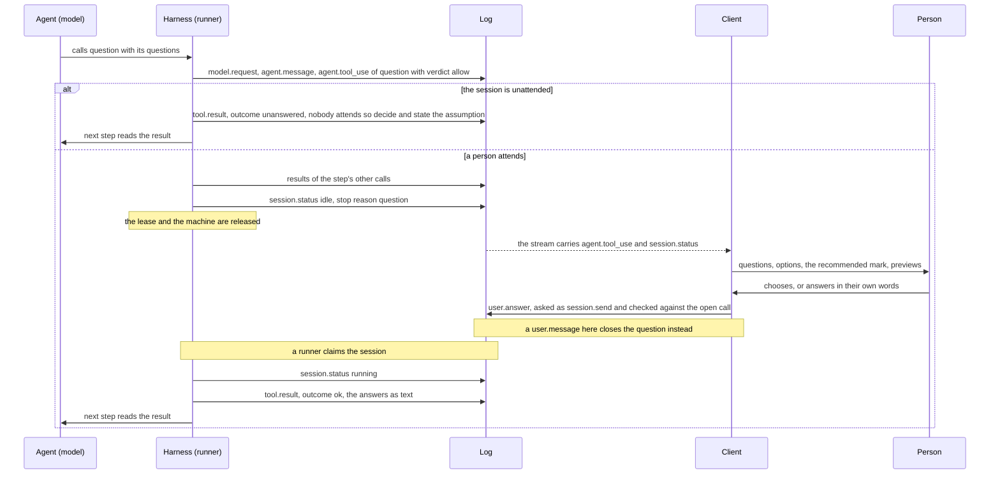

# Questions

## Overview

An agent that reaches a decision which is the person's to make has no
way to put it to them and wait. It writes the question into its text
and ends the turn, so the question has no structure, nothing marks the
session as waiting on a decision, and a session nobody attends ends
with a question as its last word.

This spec adds one built-in tool, `question`, modeled on the question
tool of Anthropic's Claude Code (`AskUserQuestion`), from which it
borrows two things: one call asks several questions at once, and every
question and every option carries an explanation. A call holds one to
four questions, each with a short header and two to four options; an
option has a label, a description and an optional preview; a question
may take several options; the person may always answer in their own
words; a recommended option goes first and is marked.

The session goes idle with the stop reason `question` and holds
nothing while it waits. A person answers with one `user.answer` event,
or with a plain message, and the turn continues with the answer as the
call's result. In a session nobody attends, the call is answered at
once and the model is told to decide and to state what it assumed.

Each choice this spec makes is a recommendation until the spec is
validated. The table that opens the design lists them with the
alternative each was weighed against, and the three that reach past
this spec are questions under Open for the owner.

## Current state

- The built-in set is eight tools, `read`, `write`, `edit`, `bash`,
  `grep`, `glob`, `web_fetch` and `todo` (`harness/tools/builtin.go`),
  and the harness adds `spawn`, `message` and `advisor` to a thread
  whose configuration has subagents or an advisor
  (`harness/threads.go`). None addresses a person.
- A model that needs a decision ends its turn with the question as
  text. The session goes idle `end_turn` and the next `user.message` is
  the answer. A session with `end_on_idle` ends `completed` there.
- A call whose verdict is ask stops the session idle
  `tool_confirmation`, and a `user.tool_confirmation` naming the call
  allows or denies it ([[012-permissions-and-approvals]]).
- The send route takes four types (`internal/server/events.go`):
  `user.message`, `user.interrupt`, `user.tool_confirmation` and
  `user.tool_result`. The last is the result of a client-executed tool
  ([[008-tools]]): a tool an agent's manifest declares with
  `client: true`, whose call stops the session idle `tool_result`
  until a client appends its result. The route validates and appends
  the event and the harness waits and resumes
  (`harness.TestClientToolsWaitForTheirResult`), but no runner
  registers a manifest's client tools: the hosted runner builds its
  registry from the built-ins alone (`internal/hosted`) and `topos run`
  refuses an agent that declares one (`internal/toposcli`). A hosted
  session's model is never offered a client tool today.
- [[004-session-log]] says a `user.message` denies every call that
  waits for a confirmation, with the message as its note. That rule is
  not built: a turn claimed with a message and no confirmation goes
  back to idle `tool_confirmation` (`harness.resume`), and the only
  denial is a confirmation's. `internal/triggers` holds a firing while
  a session waits on a confirmation, on the written rule.
- A `user.interrupt` sent to an idle session is appended and changes
  nothing. It is not pending input (`session.HasPendingInput`), and a
  turn reads only the interrupts appended after it started. A call
  that waits for a confirmation stays open across an interrupt.
- Every send is put to the authorizer as `session.send` with `sender`
  and `event_type`, an interrupt as `session.interrupt`
  ([[006-identity]]). Every request counts toward the per-subject
  request rate of [[015-api]].
- A session may run with no person present: a trigger starts it
  (`trigger_id`), or its creator set `end_on_idle`
  ([[022-triggers]]). The header records neither as a statement that
  nobody will answer.
- An agent whose manifest names no tools holds every built-in. The
  resolver writes the names into the resolved spec at apply
  (`manifest/defaults.go`), so a stored version keeps the set it was
  applied with.
- Context clearing clears every `tool.result` older than ten steps
  except `todo`'s, and tells the model to run the tool again
  ([[010-context]]).
- The registry's schema validator has `minLength` and `maxLength` and
  no keyword for an array's length (`harness/tools/schema.go`).

## Design

### Recommendations

| Item | Recommended | Weighed against, and why not |
|---|---|---|
| the name | `question` | `ask`: [[012-permissions-and-approvals]] and the harness use "ask" for a verdict in nearly every sentence, and a pattern names a tool by its bare name. `ask_user`: clear, and longer than the name needs to be beside `todo` and `advisor` |
| a built-in | a built-in tool with one schema and one description | a client-executed tool per agent (below) |
| the wait | idle with a stop reason of its own, `question` | `tool_result`: a list could not tell a person's decision from a program's pending result |
| the answer | a new event, `user.answer`, and the `tool.result` the runner renders from it | `user.tool_result`: free blocks a client words itself, which the server cannot check against the question |
| a plain message | closes the open question, and the model reads the message as the answer | keeping the session waiting: a client that does not know the event could then never move the session on |
| an interrupt | cancels a question not yet put; changes nothing once the session is idle on it | closing an idle question: no runner holds the session then, and an approval behaves the same way today |
| nobody to ask | answered at once, in a session whose header says `unattended` | withholding the tool: the question the agent had would leave no record, and the model would need a prompt section to learn that nobody is there |
| several calls | every open call waits, and the description asks for one call | refusing a second call of a step: a special case where "for every pending call" already holds |
| threads | a thread whose agent names the tool may ask, and pauses the session | withholding it from threads: a second rule beside narrowing, where the agent's author already chose |
| the authorizer | `session.send` with `event_type` `user.answer` | a new action: every authorizer would deny answers until it learned it |
| the default set | an agent holds `question` only when its manifest names it | joining the default set (Open for the owner) |

### Relation to client-executed tools

A product can declare a client tool with this input schema and answer
it with `user.tool_result`. That stays possible once a runner registers
client tools, and it is the wrong carrier for a person's decision:

| | A client tool | `question` |
|---|---|---|
| the schema and the description | each agent's own, unmeasured | one, with instruction tests ([[008-tools]]) |
| the answer | content blocks the client words | labels and words the server checks against the open question |
| the log | text | the structured answer, which a client renders again on a reload |
| a session nobody attends | waits until it expires | answered at once |
| the session list | `tool_result`, a program's turn | `question`, a person's turn |
| a plain message | leaves the session waiting | stands in for the answer |

### The tool

| Name | Parallel | Effect | Input | Limits |
|---|---|---|---|---|
| `question` | yes | none | `questions`: a list of `{question, header, options, multiple}`, each option `{label, description, preview, recommended}` | the bounds below; never run by the runner, answered by a person or by the harness |

It is a built-in of `harness/tools` beside the eight, with a
description file `prompts/tools/question-v1.md`. An agent holds it
when its `spec.tools` names it ([[003-manifest]]); the set of an agent
whose manifest names no tools stays the eight, so the built-ins a
registry knows and the default set the resolver writes become two
lists where they are one today (`manifest.Builtins`). A client tool
may not take the name, as it may take no built-in's.

```json
{"questions": [
  {"header": "Storage",
   "question": "Which database should the new service keep its records in?",
   "options": [
     {"label": "Postgres", "recommended": true,
      "description": "The cluster the other services use. One more schema, no new operations work."},
     {"label": "SQLite",
      "description": "A file beside the binary. Nothing to operate, and one writer at a time.",
      "preview": "data/\n  service.db\n  service.db-wal"}]},
  {"header": "Regions", "multiple": true,
   "question": "Which regions does the first release serve?",
   "options": [
     {"label": "Europe", "description": "Where the current customers are."},
     {"label": "North America", "description": "Two prospects asked for it."}]}]}
```

| Field | Required | Meaning |
|---|---|---|
| `questions` | yes | the questions of one call, shown together |
| `question` | yes | the full question, one the person can answer without reading the transcript |
| `header` | yes | a short label for the question, such as a tab's title |
| `options` | yes | the choices, in the order they are shown |
| `multiple` | no, default false | the person may choose several options |
| `label` | yes | the option's name, unique in its question; an answer names an option by it |
| `description` | yes | what choosing the option means: what follows from it and what it costs |
| `preview` | no | a mockup or a snippet that helps compare the options, plain text shown in a monospace font |
| `recommended` | no, default false | marks the option the agent would take |

No option stands for "other": a person may always answer in their own
words, and the description tells the model not to add one.

Bounds are constants of the `session` package, which the tool's
schema, its checks, the server's validation of an answer, the OpenAPI
text and the description file are all rendered from or held to by a
test, so no bound is written twice. Lengths are characters (Unicode
code points). The reference tool takes 1 to 4 questions, 2 to 4
options and a header of 12 characters; the lengths it does not bound
are bounded here so a client can lay a question out without measuring
it.

| Constant | Value | Bounds |
|---|---|---|
| `MaxQuestions` | 4 | the questions of one call, at least 1 |
| `MinQuestionOptions` | 2 | the options of one question |
| `MaxQuestionOptions` | 4 | the options of one question |
| `MaxQuestionLength` | 400 | `question` |
| `MaxQuestionHeaderLength` | 16 | `header` |
| `MaxOptionLabelLength` | 60 | `label` |
| `MaxOptionDescriptionLength` | 300 | `description` |
| `MaxOptionPreviewLength` | 2000 | `preview` |
| `MaxAnswerTextLength` | 2000 | an answer's `text`, per question |
| `MaxAnswerNoteLength` | 2000 | an answer's `note` |

The schema holds the types, the required fields and the lengths. The
counts and three more rules are checked by the harness once the schema
passes, since the validator has no array length: the number of
questions and of options, a label used twice in one question, more
than one recommended option in a question that is not `multiple`, and
a recommended option that follows one that is not. A call that fails a
check is answered `invalid_input` with the rule it broke, without
waiting; the texts are files of `prompts/results/question/`.

The call is scored and decided as any call is
([[012-permissions-and-approvals]]). Effect `none` scores 0.0, so the
verdict is `allow` in every mode, `plan` included: an agent that may
only read can still ask. A `block` answers it `blocked`. An
installation that puts `question` on `always_confirm` gets a
confirmation before the question is put, and nothing special-cases it:
once allowed, the call waits for its answer as any `question` call
does, and `session.Awaiting` names it as awaiting one.

What the description tells the model:

| Rule | Text of the rule |
|---|---|
| when | a decision that is the person's and that changes what you do next: a requirement with more than one reading, a trade-off between approaches, a preference nothing in the machine settles |
| never | a choice with a conventional default (take it and say so); a fact the machine can tell you (read it); permission for an action (make the call, and the approvals decide); whether to continue |
| how | everything you need in one call, at most four questions; each question complete on its own; two to four options, each with what it leads to; the option you would take first, marked `recommended`; no option for "other" |
| previews | only where seeing helps compare: a layout, a snippet, a file tree |
| the result | the labels the person chose and their own words; a question left to you is yours to decide, and you say what you assumed; a message in place of an answer is the answer |
| nobody there | the result says so; decide, state each assumption in your final message, and do not ask again in this session |

The description has two instruction tests ([[008-tools]]):
`test/tasks/instructions/question/`, a task whose requirement has two
readings and no default, whose checker passes only when the log holds
a `question` call with described options and no call that asks
permission; and `test/tasks/instructions/question-default/`, a task
with a conventional default, whose checker fails on any `question`
call. The suite's sessions are unattended, so a call is answered at
once and the task runs on.

### The wait

A valid `question` call is recorded as its `agent.tool_use`, with the
questions as its `input`, in the step's first commit
([[005-harness-loop]]). The step's other calls run and their results
are appended. Then the session goes idle:

| Status | Stop reason | Meaning | Resumed by |
|---|---|---|---|
| `idle` | `question` | at least one `question` call waits for a person's answer | `user.answer` for every open call, or a person's `user.message` |

The wait is durable as an ask's is: the call is in the log before the
session goes idle, an idle session holds no lease and no machine, and
nothing times it out. It ends with the session's age if nobody
answers. The log records the question as the tool's use, and the
answer twice, as the person gave it and as the model read it:

| Event | Appended by | Holds |
|---|---|---|
| `agent.message` | the runner | the response, with the call's `tool_use` block |
| `agent.tool_use` | the runner | `name` `question`, `input` the checked questions, risk 0.0, verdict `allow` |
| `session.status` | the runner | `idle`, `question` |
| `user.answer` | a client | the person's answer (below) |
| `session.status` | the runner | `running`, the next claim |
| `tool.result` | the runner | the answer as the text the model reads, with its outcome |

| | `tool_confirmation` | `question` |
|---|---|---|
| what waits | a call that will run once allowed | a call whose result is the answer itself |
| after the person's event | the runner runs the call, with its effects | the runner renders the answer; nothing runs |
| the person's event | allow or deny, a note, `remember` | per question, labels and words |
| a runner that stops after the person's event | closes the call `unknown_effect` when an earlier runner may have started it | renders the answer again: the call has no effect outside the log |
| in `plan` mode | does not occur, the call is blocked | occurs |
| a person's message | written to deny the call, built to leave it waiting | closes the question |

When calls of several kinds wait at once, the status names the first
of `tool_confirmation`, `question`, `tool_result`; once that kind is
answered the session goes idle on the next. The stop reason is read in
these places, and each gains the row:

| Where | Change |
|---|---|
| `harness`, the end of a step and the recovery of an open step | `question` after `tool_confirmation`, before `tool_result` |
| `harness`, a thread's turn | pauses the session, as the other two waits do |
| `session.HasPendingInput`, `session.Awaiting` | `user.answer` is input, and an open `question` call awaits one |
| `session.Summarize` and the Postgres count | `waiting_for_answer` |
| `internal/triggers` | a session idle `question` is active, and a firing is held while it is, as for a confirmation; unreachable while a trigger's sessions are unattended, named so the rule holds if one is not |
| `internal/toposcli` | exit code 3, waiting for a person ([[024-client-cli-skill]]) |

A client that lists sessions reads `status` `idle` and `stop_reason`
`question` on each Session and shows it as waiting for an answer. The
summary of [[015-api]] gains a fifth disjoint count:

```json
{"sessions": {"running": 2, "waiting_for_approval": 1, "waiting_for_answer": 1, "idle": 2, "ended": 10}, "agents": 3}
```

`waiting_for_answer` is the idle sessions whose stop reason is
`question`, and `idle` stays every other idle session.

### The answer

A person answers one call with one event, sent as any user event is:

```json
{"type": "user.answer", "payload": {"tool_use_id": "toolu_01",
  "answers": [{"selected": ["Postgres"], "text": "only if it shares the existing cluster"},
              {"selected": ["Europe", "North America"]}],
  "note": "Keep the first change small."}}
```

| Type | Appended by | Visible | Payload |
|---|---|---|---|
| `user.answer` | a client | no | `sender`, `tool_use_id`, `answers` (one entry per question, in the questions' order, each `selected`, the chosen labels, and `text`, the person's own words), `note` (a remark on the whole answer) |

An entry with `text` alone is an answer in the person's words. One
with `selected` and `text` is a choice and their note on it, so a
question needs no second text field. An empty entry leaves the question
to the agent, and an answer whose entries are all empty leaves every
question to it: that is how a person declines without stopping the
work.

The server checks the event in two places, as it checks a
confirmation today: its shape before the authorizer is asked, and its
fit to the open call after the allow and before anything is appended,
so a caller who may not send learns nothing of the session's calls.

| Check | When | Refusal |
|---|---|---|
| no field the payload does not name; `tool_use_id` and `answers` present | before the authorizer is asked | `invalid_request` |
| `text` and `note` within their bounds | before the authorizer is asked | `invalid_request` |
| `tool_use_id` names a `question` call with no result and no answer | after its allow | `conflict`, as for a confirmation that answers no call |
| `answers` has one entry per question | after its allow | `invalid_request` |
| each label of `selected` is a label of that question, none twice | after its allow | `invalid_request` |
| more than one label only where the question is `multiple` | after its allow | `invalid_request` |

The developer detail names the entry and the rule ([[015-api]]).
Whoever the authorizer lets send to the session may answer; the first
valid answer stands and a second is `conflict`.

The runner that next claims the session appends the call's
`tool.result`, rendered from the question and the answer by a file of
`prompts/results/question/`, and the turn continues with the next
step. The fold does not render `user.answer`: the result is what the
model reads, as a denial's note reaches it through the result
([[004-session-log]]). The log therefore holds both, the person's
answer as they gave it and the text the model read.

```
The person answered.

1. Storage: Which database should the new service keep its records in?
   Chosen: Postgres
   In their words: only if it shares the existing cluster
2. Regions: Which regions does the first release serve?
   Chosen: Europe, North America

Their note: Keep the first change small.
```

| The call is closed by | Outcome ([[008-tools]]) | The result tells the model |
|---|---|---|
| a `user.answer` with at least one entry that is not empty | `ok` | each question with its chosen labels and the person's words; a question with an empty entry is left to it, to decide and to state the assumption |
| a `user.answer` whose entries are all empty | `unanswered` | every question is left to it |
| a person's `user.message` | `unanswered` | the person sent a message in place of an answer; it follows, and is read as the answer |
| an unattended session | `unanswered` | nobody attends the session (below) |
| an interrupt before the session went idle | `canceled` | the person interrupted before answering |

`unanswered` is a new outcome and not an error. The result names the
sender from the event where a second sender subject first appears
onward, as the fold leads a message ([[004-session-log]]).

**A plain message.** A `user.message` from a person, appended after
the call's `agent.tool_use`, closes every open `question` call of the
session. The fold already places a call's result straight after the
step and the message after it, so the model reads that no option was
chosen and then the message, and takes it as an answer in the
person's words or as a new direction, whichever it is. The harness
does not classify the message. A thread's open question is closed the
same way and told that no answer came, since a message reaches the
session's own thread alone. A message appended before the call was not
written as its answer and closes nothing; a trigger's message never
does. The boundary is the call's `agent.tool_use`, the event a client
shows the question from, and not the idle status that follows the
step's other calls.

**An interrupt.** An interrupt that takes effect in the step that
holds the call ends the turn `interrupted` and closes the call
`canceled` with the step's other canceled calls
([[005-harness-loop]]), so the person who stopped the work is not then
asked a question. An interrupt sent while the session is already idle
on a question changes nothing, as it changes nothing on any idle
session today: the question stays open. To decline, a client sends an
answer of empty entries; to redirect, a message; to stop for good, it
ends the session.

**After days.** The answer may come any time before the session
expires. It is checked against the log, asked as a send, which carries
`idle_seconds` and may move the session to another model before the
turn ([[038-routed-models]]), and appended. The runner that claims
the session attaches the machine as after any idle and renders the
result from the log alone, so any runner renders the same bytes.

`user.answer` holds what a person wrote, so it joins the redactable
types ([[015-api]]); its words are also in the `tool.result` rendered
from it, and a client that redacts an answer redacts both. A
`question` result is never cleared ([[010-context]]), as a `todo`
result is not: the cleared text tells the model to run the tool again,
which here would ask the person twice.

### Nobody to ask

The Session gains one field.

| Field | Type | Meaning |
|---|---|---|
| `unattended` | boolean | no person answers questions in this session: a `question` call is answered at once. Absent is false |

| The session is created by | `unattended` |
|---|---|
| `POST /v1/sessions` | the body's `unattended`; when the body names none, the value of `end_on_idle` |
| a trigger's firing | true |
| a fork | false: a person forks a session to continue it. A fork made while a question is open holds the open call and is answered on its own |

The field is set at create and no event changes it, so every runner
reads the same value. It changes nothing about approvals: a call
whose verdict is ask still waits for a person or the session's age
([[012-permissions-and-approvals]]).

In an unattended session the tool is still offered. A valid call is
recorded and answered in the same step with outcome `unanswered` and
this instruction: nobody attends the session, so decide each question
yourself, take the option you marked recommended where you marked one,
state each assumption in your final message, and do not ask again in
this session. The session never goes idle on it.

Answering at once is preferred to withholding the tool for three
reasons. The log keeps what the agent was unsure of, with its options
and its recommendation, which is what the owner of a triggered session
reads afterward. The model is told at the moment it matters and needs
no section of the harness prompt. And one agent runs attended and
unattended sessions with the same tools.

An agent whose product cannot render a question does not name the
tool, which withholds it. A product that drives one agent through
several clients creates the sessions of a client that cannot render
questions with `unattended` true.

### Several at once

- **Beside other tools.** The step's other calls run first and are
  not held for the answer. The description says so, and asks for the
  call alone when what follows depends on the answer.
- **Two `question` calls in one step.** Both are recorded and both
  wait. Each is answered by its own `user.answer`, and the turn
  continues when every open call is closed. The description asks for
  one call; `MaxQuestions` bounds a call, not a step.
- **A thread.** A thread holds `question` when its agent's tools name
  it, narrowed as any tool is ([[013-threads-and-subagents]]). Its
  call pauses the whole session as a thread's ask does: the session
  goes idle `question`, the parent's `spawn` or `message` call waits
  with it, and the `agent.tool_use` carries the thread, so a client
  shows which agent asks. After the answer the thread continues and
  then its parent. An advisor's thread holds no tools.

### The authorizer and limits

An answer is put to the authorizer as `session.send`, with the
`event_type` `user.answer` in the fields every send carries
([[006-identity]]):

```json
{"kind": "session", "id": "ses_01", "agent": "agent_01", "owner": "https://login.example|alice", "runner": "hosted",
  "sender": "https://login.example|alice", "event_type": "user.answer",
  "model": "vendor/model-a", "idle_seconds": 93600}
```

A new action would make every installation's authorizer deny answers
until it learned the name, and the sender rule an answer needs is a
message's. A deny is `forbidden`, nothing is appended, and the
question stays open for someone the authorizer allows. An allow that
names another model moves the session before the answer, as at any
send.

The core counts one thing itself, the per-subject request rate of
[[015-api]], and an answer is one request toward it. Whether an answer counts toward
what an installation meters is the authorizer's, which tells an answer
from a message by `event_type`. An answer continues a turn the person
already started, as a confirmation does, so an installation that
meters messages counts `user.message` alone; a plain message that
stands in for an answer is a message. An authorizer that lists the
event types it allows adds `user.answer` before an agent names the
tool.

### What a client does

This is the contract [[015-api]] and the OpenAPI document state.

| A client | Rule |
|---|---|
| finds the open questions | the `agent.tool_use` events named `question` with no `tool.result`, in log order, whatever the stop reason names; it reads the validated `input` of that event, never the response's deltas |
| shows each question | `header` as its short label, `question` in full, the options in the order given, each with `label` and `description` |
| marks | an option whose `recommended` is true, in its own wording; the mark is not part of the label |
| lets the person choose | one option, or several where `multiple` is true, and always their own words beside or in place of the options |
| shows a `preview` | as plain text in a monospace font with its line breaks and spaces kept, beside or under its option; it is never rendered as markup |
| treats every field | as text a model wrote: no markup, no link followed on its own |
| names the asker | by the event's `thread`, when it has one ([[013-threads-and-subagents]]) |
| sends | one `user.answer` per call, an entry per question; empty entries to leave the questions to the agent |
| on `conflict` | reads the log again: someone else answered |
| shows an answered question | from the `user.answer` of the same `tool_use_id` |

A client that does not render questions lets the person send a
message, which closes the question.

### API changes

| Surface | Change |
|---|---|
| event types | `user.answer`, added to schema v1 |
| `session.status` | the stop reason `question` |
| `tool.result` | the outcome `unanswered` |
| the Session | `unattended` |
| `POST /v1/sessions` | the body takes `unattended` |
| `POST /v1/sessions/{id}/events` | takes `user.answer`; `conflict` and `invalid_request` as above |
| `GET /v1/sessions/summary` | `waiting_for_answer` |
| the OpenAPI document | the three operations' descriptions and examples, and two schemas: `QuestionInput`, the tool's input as `agent.tool_use` holds it, and `UserAnswer`, the payload of `user.answer`, each with the bounds |

No route, action or error code is added. When this spec is built, the
owning specs gain the rows: the stop reason and the event in
[[004-session-log]], the tool and the outcome in [[008-tools]], the
default set in [[003-manifest]], the routes in [[015-api]], the
recovery row in [[016-runners]], the clearing exception in
[[010-context]], and the exit code in [[024-client-cli-skill]].

### Compatibility and rollout

Every change under `/v1` is additive: a tool name, an event type, a
stop reason, an outcome, a Session field, a body field and a summary
member. No existing member changes its meaning for a session that
exists today.

| Who | What they meet |
|---|---|
| an agent that does not name the tool | nothing: the tool is not offered, and none of its sessions reaches `question` |
| a stored agent version | its tool list as applied; applying the same manifest again resolves to the same digest, since the default set is unchanged |
| a client that does not know the stop reason | only for an agent that names the tool. The session is idle with a reason it cannot name; a message from the person closes the question and the turn continues. A client treats an idle stop reason it does not know as waiting for a message |
| a client that does not know the event | sees `user.answer` in a stream when another client answered, and skips it as any unknown type |
| a client that sums the summary's four counts | misses the sessions waiting for an answer, which exist only for agents that name the tool |
| a runner built before this spec | never offers the tool, so it writes no question. Handed a log that holds `user.answer`, it refuses the session `schema_too_new` ([[004-session-log]]) until it is upgraded |
| a server built before this spec | refuses a manifest that names `question` as `invalid_manifest` |

Order: the core, with its tests and the instruction tier's result for
the description; then a client that follows the contract; then an
agent that names the tool. Nothing changes for anyone until the last
step. Where runners are processes of their own ([[016-runners]]), they
are upgraded before the server that accepts the event, and a fleet is
not rolled back below this build while a session holds an answer.

### The flow



## Open for the owner

1. **Does `question` join the tools an agent holds when its manifest
   names none?** The default set is every built-in today, so adding
   the tool to it gives it to every such agent at its next apply, as a
   new version, whether or not the product that drives the agent
   renders questions.
   - (a) Opt in: an agent holds it only when it names it.
   - (b) Opt in now, and join the default set in a later release, once
     a client renders it and the instruction tier has measured it.
   - (c) Join the default set now.

   Recommended: (b). The spec is written to (a), and (b) is one line
   later. (c) changes what existing manifests mean before any client
   can show the result.

2. **Is "nobody attends this session" a fact the session declares, or
   one each part infers?** This spec adds the header field
   `unattended` and reads it for questions alone.
   - (a) A declared field, defaulted from `end_on_idle`, true for a
     trigger's sessions, read by `question` only.
   - (b) No field: a session is unattended when `end_on_idle` is set
     or a trigger started it.
   - (c) A declared field that approvals read too, so an unattended
     session's ask is decided without a person.

   Recommended: (a). (b) cannot express an integration that keeps a
   session open with no person, or a one-turn session a person
   watches. (c) is against [[012-permissions-and-approvals]], where an
   ask never becomes a silent deny or allow. Whether a trigger may
   start an attended session is left for the day one needs it.

3. **What does a person's message do to an open wait?**
   [[004-session-log]] says it denies every call waiting for a
   confirmation; the code leaves the call waiting, and the triggers
   are built on the written rule. This spec makes a message close an
   open question.
   - (a) Build the written rule, so one sentence covers both: a
     person's message always moves the session on, denying an open
     approval with the message as its note and standing in for an
     open question's answer.
   - (b) Correct [[004-session-log]] to the code: a message waits
     behind an open approval, and only a question is closed by one.

   Recommended: (a), as work of [[012-permissions-and-approvals]]. A
   client that knows neither event can then always continue a session,
   and a person who types "no, do this instead" at an approval is not
   left waiting. Until it is decided, questions follow this spec and
   approvals follow the code.

## Not in this spec

- Registering a manifest's client tools in a runner ([[008-tools]]).
- A message denying an open approval (question 3 above), and an
  interrupt that closes a wait of an idle session.
- A deadline on a question, or an answer chosen for the person when
  none comes: the session's age is the only bound.
- Changing `unattended` after create, and a trigger that starts an
  attended session.
- A `topos answer` command: `topos run` exits 3 on `question`, and a
  message sent with `--session` continues the turn
  ([[024-client-cli-skill]]).
- Answers a decision service suggests ([[037-decision-services]]).
- Images or files in an option, and markup in any field.
- How a client lays a question out.

## Acceptance criteria

| Criterion | Test that proves it | State |
|---|---|---|
| The built-in set holds `question` with parallel yes and effect none and its description embedded; an agent whose manifest names no tools resolves to the eight, with the digest it had; a manifest that names `question` resolves, and a client tool may not take the name | `harness/tools.TestBuiltinsFollowTheTable`, `manifest.TestTheDefaultSetLeavesOutQuestion` | not built |
| The schema's lengths are the constants', and the description file and the OpenAPI text hold no bound that differs from them | `harness/tools.TestQuestionSchemaFollowsTheConstants`, `prompts.TestQuestionDescriptionHoldsTheBounds` | not built |
| A call with no question, five questions, one option, five options, a label used twice, two recommended options in a single-choice question, or a recommended option after one that is not, is answered `invalid_input` naming the rule, and the session does not go idle on it | `harness.TestAQuestionCallIsChecked` | not built |
| A valid call scores 0.0 and is allowed in `plan`, `confirm` and `progressive`; the step's other calls run and their results are appended; the session goes idle `question`; a claim with no answer keeps it waiting and sends no request | `harness.TestAQuestionWaitsForItsAnswer` | not built |
| A `user.answer` is rendered into one `tool.result` with outcome `ok` that holds each chosen label and the person's words and marks an empty entry as left to the agent; all entries empty is `unanswered`; a fresh harness renders the same bytes from the log, and a runner that stops between the answer and the result leaves exactly one result | `harness.TestAnAnswerIsRenderedOnce` | not built |
| The send route refuses a `user.answer` that names no open question or one answered already as `conflict`, and one with the wrong number of entries, an unknown or repeated label, several labels on a single-choice question, a text past its bound or an unknown field as `invalid_request`, each with nothing appended; a caller the authorizer denies hears `forbidden` whatever the answer holds | `internal/server.TestAnAnswerIsCheckedAgainstItsQuestion` | not built |
| A person's message appended after the question closes it `unanswered`, and the next request holds the result and then the message; a message appended before the question, and a trigger's message, close nothing | `harness.TestAMessageStandsInForAnAnswer` | not built |
| An interrupt in the step that holds the call closes it `canceled` and ends the turn `interrupted`; an interrupt sent to a session idle on a question leaves the question open and answerable | `harness.TestAnInterruptCancelsAQuestionNotYetPut`, `internal/server.TestAnInterruptLeavesAnIdleQuestionOpen` | not built |
| In an unattended session a valid call is recorded and answered in the same step with `unanswered`, and the session never goes idle `question` | `harness.TestAnUnattendedSessionIsAnsweredAtOnce` | not built |
| A create takes `unattended`, defaults it to `end_on_idle`, and an explicit false with `end_on_idle` waits on a question; a trigger's session is unattended and a fork is not | `internal/server.TestUnattendedAtCreate`, `internal/server.TestATriggersSessionIsUnattended` | not built |
| Two `question` calls of one step both wait, and the turn continues only when both are closed; a step with an ask, a question and a client tool's call goes idle `tool_confirmation`, then `question`, then `tool_result` | `harness.TestEveryOpenQuestionWaits`, `harness.TestWaitsStopInOrder` | not built |
| A thread's `question` pauses the session `question` with the event's thread set, and after the answer the thread and then its parent continue; a message to the session closes a thread's question with no answer | `harness.TestAThreadsQuestionPausesTheSession` | not built |
| An answer is asked as `session.send` with `event_type` `user.answer`; a deny is `forbidden`, appends nothing and leaves the question open; an allow that names another model appends `session.model_changed` straight before the answer | `internal/server.TestAnAnswerIsASend` | not built |
| The summary counts a session idle `question` in `waiting_for_answer` and in no other count, on the memory, directory and Postgres stores, and the list answers its stop reason | the summary cases of `session/storetest`, run by each store's tests, and `internal/server.TestSummarizeSessions` | not built |
| `user.answer` is a known type the fold renders nothing for, counts as pending input, and is redactable; a `question` result is never cleared | `session.TestTheFoldSkipsAnAnswer`, `internal/server.TestAnAnswerIsRedactable`, `harness.TestQuestionResultsAreNeverCleared` | not built |
| `topos run` exits 3 on `question` and names the open calls, and a message sent with `--session` continues the turn | `internal/toposcli.TestExitCodes`, `internal/toposcli.TestAMessageContinuesAQuestion` | not built |
| The OpenAPI document names `user.answer`, the stop reason, `unattended`, `waiting_for_answer` and the two schemas, is the one the handlers generate, and the send route shows an example of the event | `internal/server.TestOpenAPIIsGenerated`, `internal/server.TestOpenAPIMatchesHandlers`, `internal/server.TestEveryAnswerShowsAnExample` | not built |
| The two instruction tests exist, and each checker passes its scripted solution and refuses its scripted wrong one by an assertion on the log | `test/tasks.TestEveryToolDescriptionHasAnInstructionTest`, `test/tasks.TestScriptedSolutions` | not built |
| Both instruction tests pass against a real model in the instruction tier | `test/tasks.TestTheSuiteAgainstAModel` with the `instructions` tag | not built |
| End to end on a server over the stub Lux, whose script calls `question` and then, on reading the result, ends its turn: a session of an agent that names the tool streams the `agent.tool_use` and goes idle `question`; the summary counts it; a `user.answer` choosing an option is appended; the second request holds a result naming that option; the session goes idle `end_turn`. The same script in an unattended session ends its turn with one `unanswered` result and never idles on the question | `cmd/toposd.TestAQuestionIsAskedAnsweredAndContinued` | not built |
