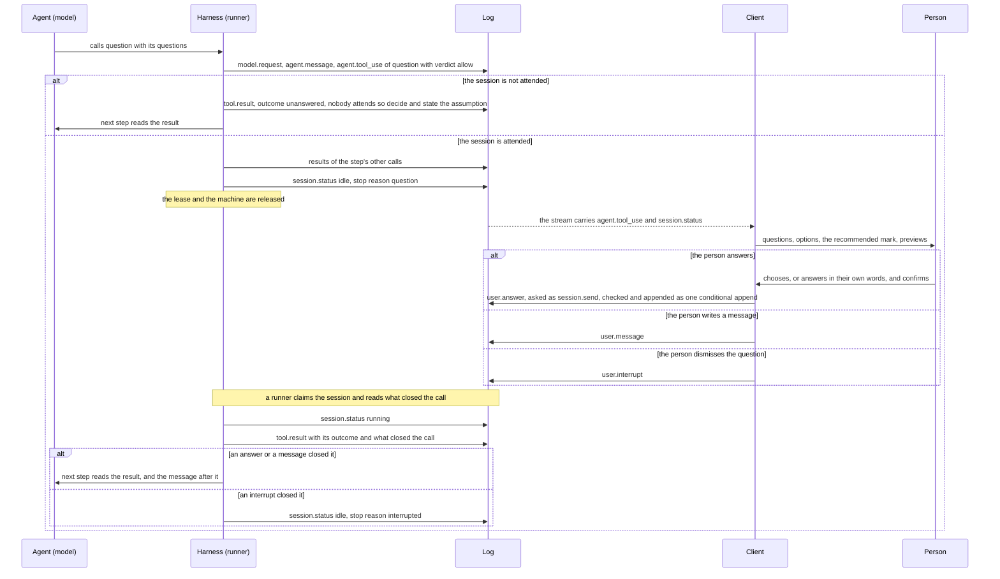

# Questions

## Overview

An agent that reaches a decision which is the person's to make has no
way to put it to them and wait. It writes the question into its text
and ends the turn, so the question has no structure, nothing marks the
session as waiting on a decision, and a session nobody attends ends
with a question as its last word.

This spec adds one tool, `question`, modeled on the question tool of
Anthropic's Claude Code (`AskUserQuestion`), from which it borrows two
things: one call asks several questions at once, and every question
and every option carries an explanation. A call holds one to four
questions, each with a short header and two to four options; an option
has a label, a description and an optional preview; a question may
take several options; the person may always answer in their own words;
a recommended option goes first and is marked.

A session answers a question at once, telling the model to decide and
to state what it assumed, unless its creator declared that a person
attends it. An attended session goes idle with the stop reason
`question` and holds nothing while it waits. The person answers with
one `user.answer` event, writes a plain message, or dismisses the
question, and one rule says which of those closed it.

Each choice this spec makes is a recommendation until the spec is
validated. The table that opens the design lists them with the
alternative each was weighed against, and the three that reach past
this spec are questions under Open for the owner.

## Current state

- The built-in set is eight tools, `read`, `write`, `edit`, `bash`,
  `grep`, `glob`, `web_fetch` and `todo` (`harness/tools/builtin.go`).
  It is also the default set of an agent whose manifest names no tools
  (`manifest.Builtins`) and the set three registries are built from:
  the hosted runner's, the CLI's and the task suite's. The harness
  adds `spawn`, `message` and `advisor` itself, as tools that hold the
  turn (`harness/threads.go`). None addresses a person.
- A model that needs a decision ends its turn with the question as
  text. The session goes idle `end_turn` and the next `user.message` is
  the answer. A session with `end_on_idle` ends `completed` there.
- A call whose verdict is ask stops the session idle
  `tool_confirmation`, and a `user.tool_confirmation` naming the call
  allows or denies it ([[012-permissions-and-approvals]]).
- A confirmed call is lost when two waits of one step are answered in
  separate claims: `harness.resume` goes idle on the call that still
  waits before it runs the one already confirmed, and the next claim
  closes the confirmed call `unknown_effect`. No test covers it.
- The send route takes four types (`internal/server/events.go`):
  `user.message`, `user.interrupt`, `user.tool_confirmation` and
  `user.tool_result`. The last is the result of a client-executed tool
  ([[008-tools]]): a tool an agent's manifest declares with
  `client: true`, whose call stops the session idle `tool_result`
  until a client appends its result. The route validates and appends
  the event and the harness waits and resumes
  (`harness.TestClientToolsWaitForTheirResult`), but no runner
  registers a manifest's client tools: the hosted runner builds its
  registry from the built-ins alone (`internal/hosted`) and `topos run`
  refuses an agent that declares one (`internal/toposcli`). A hosted
  session's model is never offered a client tool today.
- The route checks a confirmation or a result against the log and then
  appends in a second step that follows the log when another writer
  appended first, without checking again (`appendBatch`). Two answers
  sent at once are both appended.
- [[004-session-log]] says a `user.message` denies every call that
  waits for a confirmation, with the message as its note. That rule is
  not built: a turn claimed with a message and no confirmation goes
  back to idle `tool_confirmation`, and the only denial is a
  confirmation's.
- A `user.interrupt` sent to an idle session is appended and starts
  nothing: it is not pending input (`session.HasPendingInput`), and a
  turn reads only the interrupts appended after it started. The fold
  still renders it, so the model later reads that the person
  interrupted.
- Every send is put to the authorizer as `session.send` with `sender`
  and `event_type`, an interrupt as `session.interrupt`
  ([[006-identity]]). Every request counts toward the per-subject
  request rate of [[015-api]].
- A session may run with no person present: a trigger starts it, a
  script runs `topos run`, or the task suite drives it. The header
  says nothing about whether a person will answer.
- The redact route replaces one event's payload, and `session.Awaiting`
  and `openCalls` skip a redacted event.
- Context clearing clears every `tool.result` older than ten steps
  except `todo`'s and tells the model to run the tool again, and the
  compaction prompt asks for requests and decisions, not for what a
  tool result held ([[010-context]]).
- The schema validator has `minLength` and `maxLength` and no keyword
  for an array's length ([[005-harness-loop]]).
  `tools.Result.IsError` counts every outcome but `ok` as an error.

## Design

### Recommendations

| Item | Recommended | Weighed against, and why not |
|---|---|---|
| the name | `question` | `ask`: [[012-permissions-and-approvals]] and the harness use "ask" for a verdict throughout, and a pattern names a tool by its bare name. `ask_user`: clear, and longer than it needs to be beside `todo` and `advisor` |
| a tool of its own | one tool with one schema and one description | a client-executed tool per agent (below) |
| where it lives | a harness tool beside `spawn`, added when the agent names it | a ninth built-in: a tool of `harness/tools` cannot see the Session or leave its call open, and the default set would need a second list |
| who answers | a question is answered at once unless the session's creator declares `attended` | waiting unless declared unattended: every client and integration that says nothing would wait on its first question |
| nobody to ask | the call is answered at once, and recorded | withholding the tool: the question the agent had would leave no record, and the model would need a prompt section to learn that nobody is there |
| the wait | idle with a stop reason of its own, `question` | `tool_result`: a list could not tell a person's decision from a program's pending result |
| the answer | a new event, `user.answer`, and the `tool.result` the runner renders from it | `user.tool_result`: text a client words itself, which the server cannot check against the question |
| what closes a question | one function, the first of an answer, a person's message or an interrupt | a rule per reader: the server, the harness and a client would each call a different set of calls open |
| a plain message | closes the question, and the model reads that the message may be the answer | keeping the session waiting: [[004-session-log]] writes that a message moves a waiting session on |
| an interrupt | closes the question `canceled` and leaves the session idle | changing nothing: the person would have no way to dismiss a question without restarting the work |
| several calls | one `question` call a step; a second is refused | every call waiting: `MaxQuestions` would not bound what a person is shown |
| threads | only the session's own thread asks | a thread asking: a message would answer in the wrong thread, and parallel threads would all ask at once |
| the session list | no new count: a session waiting for an answer is `idle` in the summary, and the list shows its stop reason | a fifth count: it changes what `idle` is documented to mean, and no client needs it yet |
| the authorizer | `session.send` with `event_type` `user.answer` | a new action: every authorizer would deny answers until it learned it |
| the default set | an agent holds `question` only when its manifest names it, and it joins the default set in a later release | joining now (Open for the owner) |

### Prerequisite: a confirmed call runs in the claim that reads its confirmation

A question may wait beside an approval, so this spec stands on a rule
of [[012-permissions-and-approvals]] that is built first, under that
spec. Today the first of two answered waits is lost: `resume` goes
idle on the call that still waits before it runs the one a person
allowed, the next claim finds two `session.status` `running` after
that confirmation, and the call is closed `unknown_effect`. It never
ran.

| Function | Change |
|---|---|
| `harness.resume` | settles every open call, then runs the calls it found confirmed and the repeatable ones, and only then goes idle on what still waits. Today it returns at the first wait, a thread's pause included, with the confirmed calls not run |
| `openCalls` (`harness/resume.go`) | none. It counts the claims that follow a confirmation, and once `resume` runs a call in the claim that reads its confirmation, a second claim again means what [[012-permissions-and-approvals]] says: an earlier runner may have started the call |
| `session.Awaiting` | none for approvals: a confirmed call awaits nothing more. This spec adds the open question to it, below |

The failing test is that spec's: two asks of one step, each confirmed
and then claimed, where today the first is closed `unknown_effect` and
the command runs once.

### Relation to client-executed tools

A product can declare a client tool with this input schema and answer
it with `user.tool_result`. That stays possible once a runner registers
client tools, and it is the wrong carrier for a person's decision:

| | A client tool | `question` |
|---|---|---|
| the schema and the description | each agent's own, unmeasured | one, with instruction tests ([[008-tools]]) |
| the answer | content blocks the client words, so the product writes what the model reads | labels and words the server checks against the open question |
| the log | text | the structured answer, which a client renders again on a reload |
| a session nobody attends | waits until it expires | answered at once |
| the session list | `tool_result`, a program's turn | `question`, a person's turn |
| a plain message | leaves the session waiting | closes the question |

### The tool

| Name | Parallel | Effect | Input | Limits |
|---|---|---|---|---|
| `question` | yes | none | `questions`: a list of `{question, header, options, multiple}`, each option `{label, description, preview, recommended}` | the bounds below; one call a step; the session's own thread only |

`question` is a harness tool, as `spawn`, `message` and `advisor` are
([[013-threads-and-subagents]]): it is defined in `harness`, holds the
turn, and is added to the registry of the session's own thread when
the agent's `spec.tools` names it, which the runner tells the harness
as it tells it the subagents. `tools.Builtins` and the default set
stay the eight, so the three registries built from them are unchanged
and no second list exists. The manifest validator's list of names is
the one place that learns the name ([[003-manifest]]): it accepts
`question` among an agent's tools and refuses a client tool that takes
it. The description is the file `prompts/tools/question-v1.md`.

Its call does one of two things:

| The session | The call |
|---|---|
| is not attended (below) | returns its result at once, outcome `unanswered` |
| is attended | returns the pause a thread's wait returns ([[013-threads-and-subagents]]): it keeps no result, the step's other calls run on, and the session goes idle `question` |

```json
{"questions": [
  {"header": "Storage",
   "question": "Which database should the new service keep its records in?",
   "options": [
     {"label": "Postgres", "recommended": true,
      "description": "The cluster the other services use. One more schema, no new operations work."},
     {"label": "SQLite",
      "description": "A file beside the binary. Nothing to operate, and one writer at a time.",
      "preview": ["data/", "  service.db", "  service.db-wal"]}]},
  {"header": "Regions", "multiple": true,
   "question": "Which regions does the first release serve?",
   "options": [
     {"label": "Europe", "description": "Where the current customers are."},
     {"label": "North America", "description": "Two prospects asked for it."}]}]}
```

| Field | Required | Meaning |
|---|---|---|
| `questions` | yes | the questions of one call, shown together |
| `question` | yes | the full question, one the person can answer without reading the transcript |
| `header` | yes | a short label for the question, such as a tab's title |
| `options` | yes | the choices, in the order they are shown |
| `multiple` | no, default false | the person may choose several options |
| `label` | yes | the option's name, unique in its question; an answer names an option by it |
| `description` | yes | what choosing the option means: what follows from it and what it costs |
| `preview` | no | a mockup or a snippet that helps compare the options: a list of lines of plain text, shown in a monospace font |
| `recommended` | no, default false | marks the option the agent would take |

No option stands for "other": a person may always answer in their own
words, and the description tells the model not to add one.

Bounds are constants of the `session` package. The schema, the
server's check of an answer, the OpenAPI text and the description file
are rendered from them or held to them by a test, so no bound is
written twice. Lengths are characters (Unicode code points).

| Constant | Value | Bounds | Why this value |
|---|---|---|---|
| `MaxQuestions` | 4 | the questions of one call, at least 1 | the reference's |
| `MinQuestionOptions` | 2 | the options of one question | the reference's |
| `MaxQuestionOptions` | 4 | the options of one question | the reference's |
| `MaxQuestionHeaderLength` | 12 | `header` | four headers sit side by side as tabs, and four of twelve characters fit a phone's width; what does not fit belongs in the question |
| `MaxQuestionLength` | 300 | `question` | two or three sentences |
| `MaxOptionLabelLength` | 40 | `label` | a few words on one line |
| `MaxOptionDescriptionLength` | 200 | `description` | two sentences |
| `MaxOptionPreviewLines` | 15 | the lines of a `preview` | shown beside the options without a scroll of its own |
| `MaxOptionPreviewColumns` | 40 | one line of a `preview` | a monospace line that fits a phone's width without wrapping |
| `MaxAnswerTextLength` | 2000 | an answer's `text`, per question | a paragraph in the person's words |

The schema holds every bound: the lengths as `maxLength`, a preview as
an array of strings, and the counts as `minItems` and `maxItems`,
which the validator gains beside `minLength` and `maxLength`
([[005-harness-loop]]), so the model reads the counts where it reads
the rest. A call at every bound at once is about 15,000 characters,
near half the output cap in English ([[005-harness-loop]]); a response
cut inside a call's arguments at the cap is not sent again, which is
why the bounds are no larger. In a script that spends a token or more
on a character such a call passes the cap and is answered as any cut
call is, asking for shorter arguments.

Two rules are checked by the harness after the schema, and a call that
breaks one is answered `invalid_input` without waiting, with a text of
`prompts/results/question/`:

| Rule | Why it is checked |
|---|---|
| no label twice in one question | an answer names an option by its label |
| one `question` call a step | `MaxQuestions` bounds what a person is shown at once; the first call of a step is asked and each later one is refused, asking for one call |

Nothing else is refused. Where the recommended option sits, how many
are marked, and a preview on a question that takes several options are
the description's to ask for and a client's to tolerate, since a
refusal costs a model request.

The call is scored and decided as any call is
([[012-permissions-and-approvals]]). Effect `none` scores 0.0, so the
verdict is `allow` in every mode, `plan` included: an agent that may
only read can still ask. A `block` answers it `blocked`. It is never
held for a confirmation: a pattern of `always_confirm` does not match
it, since the call is itself put to a person.

What the description tells the model:

| Rule | Text of the rule |
|---|---|
| when | a decision that is the person's and that changes what you do next: a requirement with more than one reading, a trade-off between approaches, a preference nothing in the machine settles |
| never | a choice with a conventional default (take it and say so); a fact the machine can tell you (read it); permission for an action (make the call, and the approvals decide); whether to continue; anything the person already answered or left to you |
| how | everything you need in one call, at most four questions and one call a step; each question complete on its own; two to four options, each with what it leads to; the option you would take first, marked `recommended`; no option for "other"; other calls of the same step do not wait for the answer |
| previews | only where seeing helps compare, and only on a question that takes one option: a layout, a snippet, a file tree; the question must be answerable without them |
| the result | the labels the person chose and their own words; a question left to you is yours to decide, and you say what you assumed; a message in place of an answer may be the answer |
| nobody there | the result says so; decide, state each assumption in your final message, and do not ask again in this session |

The description has three instruction tests ([[008-tools]]):

| Directory | The task | The checker passes when |
|---|---|---|
| `test/tasks/instructions/question/` | a requirement with two readings and no default | the log holds one `question` call with described options, a recommended option first when one is marked, and no call that asks permission |
| `test/tasks/instructions/question-default/` | a choice with a conventional default | the log holds no `question` call |
| `test/tasks/instructions/question-answered/` | the first task in an attended session, whose driver sends a `user.answer` that chooses the option not marked recommended and leaves one entry empty | the outcome follows the option chosen, and the final message names what was assumed for the question left open |

### Who answers

The Session gains one field.

| Field | Type | Meaning |
|---|---|---|
| `attended` | boolean | the session's creator declares that a person answers its questions, through a client that shows them. Absent is false |

| The session is created by | `attended` |
|---|---|
| `POST /v1/sessions` | the body's `attended` |
| `POST /v1/sessions/{id}/fork` | the body's `attended`: a fork is a session of its own, and its client declares it again. A fork made while a question is open copies the open call, and the fork's first message closes it as a message closes any |
| `topos run` | the flag `--attended` ([[024-client-cli-skill]]) |
| a trigger's firing | false |
| the task suite | false, except a task that names the answers its driver sends |

The default is the zero value of the Session, so every program that
builds one gets it with no rule of its own, and no route derives it
from another field. The field is set at create and no event changes
it, so every runner reads the same value. Approvals do not read it: a
call whose verdict is ask waits for a person in any session
([[012-permissions-and-approvals]]).

In a session that is not attended the tool is still offered. A valid
call is recorded and answered in the same step with outcome
`unanswered` and this instruction: nobody attends the session, so
decide each question yourself, take the option you marked recommended
where you marked one, state each assumption in your final message, and
do not ask again in this session. The session never goes idle on it.

The default is false for two reasons. A client that knows nothing of
this spec never sets the field, so it never meets the stop reason or
the event, whatever its agent names. And the tool can join the default
set later without making an integration that creates sessions and
reads their results wait on a question nobody will see.

Answering at once is preferred to withholding the tool for three
reasons. The log keeps what the agent was unsure of, with its options
and its recommendation, which is what the owner of a triggered session
reads afterward. The model is told at the moment it matters and needs
no section of the harness prompt. And one agent runs attended and
other sessions with the same tools.

An attended session whose person does not return holds its question
until the session expires, at its `limits.max_age`
([[004-session-log]]). Nothing times a question out and the core
notifies nobody: telling the person that a session waits for them is
the product's. Letting a client set `attended` after create, so a
session a person later joins can ask, is the follow-up to this spec.

### The wait

A valid `question` call in an attended session is recorded as its
`agent.tool_use`, with the questions as its `input`, in the step's
first commit ([[005-harness-loop]]). The step's other calls run and
their results are appended. Then the session goes idle:

| Status | Stop reason | Meaning | Resumed by |
|---|---|---|---|
| `idle` | `question` | a `question` call waits for the person | `user.answer` or a person's `user.message`; a `user.interrupt` dismisses the question and leaves the session idle |

The wait is durable as an ask's is: the call is in the log before the
session goes idle, an idle session holds no lease and no machine, and
nothing times it out. The log records the question as the tool's use,
and the answer twice, as the person gave it and as the model read it:

| Event | Appended by | Holds |
|---|---|---|
| `agent.message` | the runner | the response, with the call's `tool_use` block |
| `agent.tool_use` | the runner | `name` `question`, `input` the checked questions, risk 0.0, verdict `allow` |
| `session.status` | the runner | `idle`, `question` |
| `user.answer` | a client | the person's answer (below) |
| `session.status` | the runner | `running`, the next claim |
| `tool.result` | the runner | the answer as the text the model reads, with its outcome and what closed the call |

| | `tool_confirmation` | `question` |
|---|---|---|
| what waits | a call that will run once allowed | a call whose result is the answer itself |
| after the person's event | the runner runs the call, with its effects | the runner renders the answer; nothing runs |
| the person's event | allow or deny, a note, `remember` | per question, labels and words |
| a runner that stops after the person's event | closes the call `unknown_effect` when an earlier runner may have started it | renders the answer again: the call has no effect outside the log |
| in `plan` mode | does not occur, the call is blocked | occurs |

The stop reason and the event are read in these places, and each gains
the row:

| Where | Change |
|---|---|
| `harness`, a step's end | the pause the call returned ends the step idle `question`, after the step's other calls |
| `harness.resume` | a closed `question` call gets its result; an open one keeps the session idle `question`, after the calls it settled have run (the prerequisite) |
| `harness`, `turn.pending` | `user.answer` is a person's event the model has not read |
| `session.HasPendingInput` | `user.answer` is input, and so is a `user.interrupt` that closed a question, and no other interrupt |
| `session.Awaiting` | an open `question` call awaits an answer |
| `internal/toposcli` | exit code 3, waiting for a person ([[024-client-cli-skill]]) |
| the summary of [[015-api]] | none: a session idle `question` is counted `idle`, and the list answers its stop reason |

When a question and a call that waits for a confirmation are open at
once, the stop reason names one of them. A client finds what is open
from the log and never from the stop reason.

### What closes a question

At most one `question` call is open in a session: only the session's
own thread holds the tool, a step takes one call, and no step follows
one whose call is open. One function of `session` says what closed a
call, from the log alone.

| The log holds | The call is | The runner |
|---|---|---|
| the call's `tool.result` | closed, and the result's `meta` says by what | owes nothing |
| no result, and after the call's `agent.tool_use` a `user.answer`, a `user.message` whose sender is a person, or a `user.interrupt` | closed by the first of them in log order | appends the result that event calls for |
| neither | open | waits |

The first closing event stands and a later one changes nothing.
`session.Awaiting`, the server's check, `harness.resume` and the
client's rule below all read this function and hold no rule of their
own, so no two of them call a different set of calls open. A redacted
`user.answer` still closes its call: with one call open at a time it
needs no id to be matched.

### The answer

A person answers the call with one event, sent as any user event is:

```json
{"type": "user.answer", "payload": {"tool_use_id": "toolu_01",
  "answers": [{"selected": ["SQLite"], "text": "we have nobody to run a second schema"},
              {}]}}
```

| Type | Appended by | Visible | Payload |
|---|---|---|---|
| `user.answer` | a client | no | `sender`, `tool_use_id`, `answers`: one entry per question, in the questions' order, each `selected`, the chosen labels, and `text`, the person's own words |

An entry with `text` alone is an answer in the person's words. One
with `selected` and `text` is a choice and their note on it, so an
answer has no second text field. An empty entry leaves the question to
the agent, and an answer whose entries are all empty leaves every
question to it: that is how a person declines without stopping the
work.

The server checks the event's shape before the authorizer is asked,
and its fit to the open call after the allow, so a caller who may not
send learns nothing of the session's calls.

| Check | When | Refusal |
|---|---|---|
| no field the payload does not name; `tool_use_id` and `answers` present | before the authorizer is asked | `invalid_request` |
| `text` within its bound | before the authorizer is asked | `invalid_request` |
| `tool_use_id` names the open `question` call | after its allow | `conflict`; the developer detail says what closed the question, or that none was asked |
| `answers` has one entry per question | after its allow | `invalid_request` |
| each label of `selected` is a label of that question, none twice | after its allow | `invalid_request` |
| more than one label only where the question is `multiple` | after its allow | `invalid_request` |

The check and the append are one conditional append: the event is
appended after the sequence the check read ([[004-session-log]]), and
when another writer appended first the server reads and checks again
instead of following the log. Of two answers sent at once one stands
and the other is `conflict`, and an answer that crosses a person's
message or an interrupt is refused, not appended and never read. The
route's other checked events, a confirmation and a client tool's
result, pass through the same code and gain the same guarantee.

Whoever the authorizer lets send to the session may answer. An answer
is final once it is appended, since the runner is notified at once: a
client confirms before it sends, and a correction is a message. The
send answers the appended event, and the stream carries it, which is
how a client learns its answer was recorded.

The runner that next claims the session appends the call's
`tool.result`, rendered from the question and the answer by a file of
`prompts/results/question/`, and the turn continues with the next
step. The fold renders nothing for `user.answer`: the result is what
the model reads, as a denial's note reaches it through the result
([[004-session-log]]). The fold notes the event's sender as it notes
a confirmation's, so a later message of a second person is led by
their name, and the result names nobody.

```
The person answered.

1. Storage: Which database should the new service keep its records in?
   Chosen: SQLite
   In their words: we have nobody to run a second schema
2. Regions: Which regions does the first release serve?
   Left to you. Decide, and state what you assumed.
```

| The call is closed by | Outcome ([[008-tools]]) | `meta.closed_by` | The result tells the model |
|---|---|---|---|
| a `user.answer` with an entry that is not empty | `ok` | `answer` | each question with its chosen labels and the person's words; a question with an empty entry is left to it |
| a `user.answer` whose entries are all empty | `unanswered` | `answer` | every question is left to it |
| a person's `user.message` | `unanswered` | `message` | the person sent a message in place of an answer; it follows and may be the answer |
| a `user.interrupt` | `canceled` | `interrupt` | the person stopped the work before answering |
| nobody: the session is not attended | `unanswered` | `unattended` | nobody attends the session (above) |

`unanswered` is a new outcome and not an error, so
`tools.Result.IsError` learns the exception. The result's `meta`
([[004-session-log]]) carries `closed_by` and `event_id`, the id of
the event that closed the call, absent when nobody attends; from the
two a client says why a question closed without reading the result's
text.

### A message, an interrupt

**A plain message.** A person's message moves a waiting session on, as
[[004-session-log]] writes it for an approval. Appended after the
call's `agent.tool_use`, it closes the question. The fold already
places a call's result straight after its step and the message after
that, so the model reads that no option was chosen and then the
message, and takes it as the answer in the person's words or as a new
direction, whichever it is. The harness does not classify the message,
and the result says only that it may be the answer. The boundary is
the call's `agent.tool_use`, the event a client shows the question
from, and not the idle status that follows the step's other calls: a
message appended before it closes nothing. The approvals' side of the
same rule, a message that denies a call waiting for a confirmation, is
written and not built, and is [[012-permissions-and-approvals]]'s
work; this spec does not wait for it.

**An interrupt.** A `user.interrupt` after the call's `agent.tool_use`
dismisses the question. In the step that holds the call, the turn ends
`interrupted` and the call is closed `canceled` with the step's other
canceled calls ([[005-harness-loop]]). On a session already idle on
the question the interrupt is pending input, the one case in which an
interrupt is: a runner claims the session, appends the `canceled`
result and `session.status` idle `interrupted`, and sends no request.
Nothing runs until the person's next message, before which the model
reads the canceled result and the fold's line that the person
interrupted.

### Redaction, clearing and compaction

- `user.answer` holds what a person wrote and joins the redactable
  types ([[015-api]]). Its words are also in the `tool.result`
  rendered from it, so the redact route, given a `user.answer`,
  redacts that result in the same call: it reads the answer's
  `tool_use_id` before it replaces the payload.
- A redacted answer still counts as the answer. When its result was
  not yet rendered, the result is `unanswered` and says the answer was
  removed.
- The `agent.tool_use` of an open question is not redacted: the route
  answers `conflict` until the call is closed, since a tombstone would
  leave a wait nothing can find. A person dismisses the question
  first.
- A `question` result is never cleared ([[010-context]]), as a `todo`
  result is not: the cleared text tells the model to run the tool
  again, which here would ask the person twice.
- The compaction prompt gains, as a new version of its file, a heading
  for the questions put to the person, each with its answer or that it
  was left to the agent ([[010-context]]), so a summary carries what
  was decided and the model does not ask again.

### Several at once, and threads

- **Beside other tools.** The step's other calls run and are not held
  for the answer. The description says so.
- **A second `question` call in one step.** Refused, as above. The
  model reads the first call's answer and the refusal together, and
  asks what it still needs in its next step.
- **A thread.** A thread is never offered `question`: `spawn` leaves
  the name out of a subagent's tools where it leaves out `spawn` and
  `message` ([[013-threads-and-subagents]]). A subagent that needs a
  decision ends its turn saying so, as the harness prompt asks of
  every agent, and its parent, which holds the conversation with the
  person, asks. An advisor's thread holds no tools.

### The authorizer and limits

An answer is put to the authorizer as `session.send`, with the
`event_type` `user.answer` in the fields every send carries
([[006-identity]]):

```json
{"kind": "session", "id": "ses_01", "agent": "agent_01", "owner": "https://login.example|alice", "runner": "hosted",
  "sender": "https://login.example|alice", "event_type": "user.answer",
  "model": "vendor/model-a", "idle_seconds": 93600}
```

A new action would make every installation's authorizer deny answers
until it learned the name, and the sender rule an answer needs is a
message's. A deny is `forbidden`, nothing is appended, and the
question stays open for someone the authorizer allows. An allow that
names another model moves the session before the answer, as at any
send ([[038-routed-models]]). A dismissal is a `user.interrupt` and is
asked as `session.interrupt`.

The core counts one thing itself, the per-subject request rate of
[[015-api]], and an answer is one request toward it. Whether an answer
counts toward what an installation meters is the authorizer's, which
tells an answer from a message by `event_type`. An answer continues a
turn the person already started, as a confirmation does, so an
installation that meters messages counts `user.message` alone; a plain
message that closes a question is a message. An authorizer that lists
the event types it allows adds `user.answer` before a client sets
`attended`.

### What a client does

This is the contract [[015-api]] and the OpenAPI document state.

| A client | Rule |
|---|---|
| declares | `attended` at create, and again at a fork, only when it shows questions and a person is there to answer |
| finds the open question | the `agent.tool_use` named `question` that nothing closed (the table above): no `tool.result`, and after it no `user.answer`, no person's `user.message` and no `user.interrupt`. There is at most one. It reads the checked `input` of that event, never the response's deltas, and never the stop reason |
| shows each question | `header` as its short label, `question` in full, the options in the order given, each with `label` and `description` |
| marks | each option whose `recommended` is true, in its own wording; the mark is not part of the label |
| lets the person choose | one option, or several where `multiple` is true, and always their own words beside or in place of the options |
| shows a `preview` | on a question that takes one option: each item one line of plain text in a monospace font, spaces kept, never rendered as markup. It may collapse a preview, and shows none on a question that takes several |
| treats every field | as text a model wrote: no markup, no link followed on its own |
| confirms, then sends | one `user.answer`, an entry per question. The answer is final; the send's reply and the stream carry the appended event |
| leaves it to the agent | with an answer of empty entries |
| dismisses | with `user.interrupt`: the question closes and nothing runs until the next message |
| on `conflict` | reads the log again: something else closed the question, and the detail says what |
| shows a closed question | from its `user.answer`, and from the result's `meta` when no answer closed it |

A client that does not show questions does not set `attended`, and
never meets one.

### API changes

| Surface | Change |
|---|---|
| event types | `user.answer`, added to schema v1 |
| `session.status` | the stop reason `question` |
| `tool.result` | the outcome `unanswered`; `meta` carries `closed_by` and `event_id` on a `question` call's result |
| the Session | `attended` |
| `POST /v1/sessions`, `POST /v1/sessions/{id}/fork` | the body takes `attended` |
| `POST /v1/sessions/{id}/events` | takes `user.answer`; `conflict` and `invalid_request` as above; a checked event is appended conditionally |
| `POST /v1/sessions/{id}/events/{event_id}/redact` | a `user.answer` is redactable and takes its result with it; the `agent.tool_use` of an open question is `conflict` |
| the OpenAPI document | those operations' descriptions and examples, and two schemas: `QuestionInput`, the tool's input as `agent.tool_use` holds it, and `UserAnswer`, the payload of `user.answer`, each with the bounds |
| `topos run` | the flag `--attended` |

No route, action or error code is added, and the summary is unchanged.
When this spec is built, the owning specs gain the rows: the stop
reason, the event and the Session field in [[004-session-log]], the
tool and the outcome in [[008-tools]], the name in [[003-manifest]],
the array keywords in [[005-harness-loop]], the routes in
[[015-api]], the recovery row in [[016-runners]], the clearing
exception and the compaction prompt in [[010-context]], and the flag
and the exit code in [[024-client-cli-skill]].

### Compatibility and rollout

Every change under `/v1` but one is additive: an event type, a stop
reason, an outcome, two `meta` members, a Session field and a body
field. The one that is not is the reserved name.

| Who | What they meet |
|---|---|
| an agent that does not name the tool | nothing: the tool is not offered |
| a client that does not set `attended` | nothing new: a question in its sessions is answered at once, so it never meets the stop reason or the event, whatever its agent names |
| a stored agent version | its tool list as applied; applying the same manifest again resolves to the same digest, since the default set is unchanged |
| an agent that declares a client tool named `question` | the name is reserved, so its next apply is `invalid_manifest` until the tool is renamed. A stored version keeps its client tool, which a runner does not take for the harness tool |
| a client that does not know the event | sees `user.answer` in a stream only when another client that set `attended` answered, and skips it as any unknown type |
| a runner built before this spec | never offers the tool. If it claims a session with an open question, after a newer runner's lease lapsed or on a person's message, it closes the call `unknown_effect`, as it closes any call it has no rule for ([[016-runners]]), and the question is lost; a log that holds `user.answer` it then refuses `schema_too_new` |
| a server built before this spec | refuses a manifest that names `question` as `invalid_manifest` |

The rule the runner row gives: no runner below this build drives
sessions while a session of an agent that names the tool is open, on
the way up and on a rollback. Nothing in the log enforces it. The
Session's `requires` ([[004-session-log]]) is the field meant for such
a rule, and no build reads it, so it would bind only runners built
after it is.

Order: the prerequisite; the core, every runner and the server, with
its tests and the instruction tier's result for the description; an
authorizer that lists the event types it allows adds `user.answer`; a
client that follows the contract sets `attended`; an agent names the
tool. Nothing changes for anyone until the last two steps have both
happened.

### The flow



## Open for the owner

The spec is written to the recommended answer of each. None is the
owner's decision yet, and each is reversible.

1. **Does `question` join the tools an agent holds when its manifest
   names none?** The default set is every built-in today, so adding
   the tool to it gives it to every such agent at its next apply, as a
   new version.
   - (a) Opt in: an agent holds it only when it names it.
   - (b) Opt in now, and join the default set in a later release, once
     a client shows questions and the instruction tier has measured
     the description.
   - (c) Join the default set now.

   Recommended: (b). With `attended` false by default, joining later
   breaks no session whose client says nothing.

2. **When a session's creator says nothing, does a question wait or is
   it answered at once?**
   - (a) It waits unless the creator declares the session unattended.
     Every integration that omits the field waits on its first
     question until the session expires.
   - (b) It is answered at once unless the creator declares
     `attended`. A client that shows questions sets one field at
     create.
   - (c) No field: the core infers it from `end_on_idle` or from a
     trigger.

   Recommended: (b). (c) cannot express a script that keeps a session
   open, or a one-turn session a person watches. An attended session
   whose person does not return holds its question until it expires;
   letting a client set `attended` after create is the follow-up, and
   a deadline on a question is not proposed.

3. **What does a person's message do to a session that waits?**
   [[004-session-log]] says it denies every call waiting for a
   confirmation; the code leaves the call waiting.
   - (a) A person's message always moves a waiting session on, as
     written: it stands in for a question's answer, and it denies an
     open approval with the message as its note.
   - (b) Correct [[004-session-log]] to the code: a message waits
     behind an open approval, and only a question is closed by one.

   Recommended: (a). This spec builds the question's side; the
   approvals' side is work of [[012-permissions-and-approvals]].

## Not in this spec

- Registering a manifest's client tools in a runner ([[008-tools]]).
- A message that denies an open approval
  ([[012-permissions-and-approvals]]).
- A question from a thread, and several questions open at once.
- A deadline on a question, an answer chosen for the person when none
  comes, and notifying the person that a session waits.
- Setting `attended` after create, and a trigger that starts an
  attended session ([[022-triggers]]).
- A count of the sessions waiting for an answer in the summary.
- The Session's `requires` ([[004-session-log]]).
- A `topos answer` command: an attended `topos run` exits 3 on
  `question`, and a message sent with `--session` continues the turn.
- Answers a decision service suggests ([[037-decision-services]]).
- Images or files in an option, and markup in any field.
- How a client lays a question out.

## Acceptance criteria

| Criterion | Test that proves it | State |
|---|---|---|
| The harness offers `question` to the session's own thread when the agent's tools name it and to no thread a `spawn` starts; `tools.Builtins` and the default set stay the eight, with the digest an agent had; the validator accepts the name among an agent's tools and refuses a client tool that takes it | `harness.TestQuestionIsOfferedWhenNamed`, `manifest.TestQuestionIsAKnownToolName` | not built |
| The validator checks `minItems` and `maxItems`; the tool's schema states every bound from the constants; the description file and the OpenAPI text hold no bound that differs from them | `harness/tools.TestSchemaArrayLengths`, `harness.TestQuestionSchemaFollowsTheConstants`, `prompts.TestQuestionDescriptionHoldsTheBounds` | not built |
| A call that uses a label twice in one question is answered `invalid_input`; of two `question` calls in one step the first is asked and the second is answered `invalid_input`; a call past a count or a length is refused by the schema | `harness.TestAQuestionCallIsChecked` | not built |
| A Session is not attended unless its creator says so: `session.New` leaves it false, the create and fork routes take the body's value, a trigger's session is not attended, and `topos run` sets it with `--attended` | `session.TestASessionIsNotAttendedByDefault`, `internal/server.TestAttendedAtCreate`, `internal/toposcli.TestRunAttended` | not built |
| In a session that is not attended a valid call is recorded and answered in the same step, outcome `unanswered`, not an error, `meta.closed_by` `unattended`, and the session never goes idle `question` | `harness.TestAQuestionNobodyAttendsIsAnsweredAtOnce` | not built |
| In an attended session a valid call scores 0.0 and is allowed in `plan`, `confirm` and `progressive`, a pattern of `always_confirm` that names it does not make it ask, the step's other calls run and their results are appended, the session goes idle `question`, and a claim with nothing that closed the call keeps it waiting and sends no request | `harness.TestAQuestionWaitsForItsAnswer` | not built |
| One function says what closed a call: its result when it has one, else the first of a `user.answer`, a person's message and an interrupt after its `agent.tool_use`; a message before it closes nothing; a later event changes nothing; a redacted answer still closes. `session.Awaiting` and `session.HasPendingInput` follow it, and an interrupt is pending input only when it closed a question | `session.TestWhatClosedAQuestion` | not built |
| A `user.answer` is rendered into one `tool.result` with outcome `ok` that holds each chosen label and the person's words and marks an empty entry as left to the agent, with `meta.closed_by` `answer` and the answer's id; all entries empty is `unanswered`; a fresh harness renders the same bytes from the log, and a runner that stops between the answer and the result leaves exactly one result | `harness.TestAnAnswerIsRenderedOnce` | not built |
| The send route refuses a `user.answer` when no question is open, and after an answer, a person's message or an interrupt closed it, as `conflict` with what closed it in the detail; one with the wrong number of entries, an unknown or repeated label, several labels on a single-choice question, a text past its bound or an unknown field as `invalid_request`; each with nothing appended; a caller the authorizer denies hears `forbidden` whatever the answer holds | `internal/server.TestAnAnswerIsCheckedAgainstItsQuestion` | not built |
| Of two answers sent at once one is appended and the other is `conflict`, and the same holds for two confirmations of one call | `internal/server.TestTwoAnswersAtOnce` | not built |
| A person's message appended after the question closes it `unanswered` with `meta.closed_by` `message`, and the next request holds the result and then the message; a message appended before the question closes nothing | `harness.TestAMessageStandsInForAnAnswer` | not built |
| An interrupt in the step that holds the call closes it `canceled` and ends the turn `interrupted`; an interrupt on a session idle `question` is claimed, the call is closed `canceled`, the session goes idle `interrupted`, and no request is sent; an interrupt on any other idle session is still not pending input | `harness.TestAnInterruptDismissesAQuestion`, `runner.TestAnInterruptOnAnOpenQuestionIsClaimed` | not built |
| An answer is asked as `session.send` with `event_type` `user.answer`; a deny is `forbidden`, appends nothing and leaves the question open; an allow that names another model appends `session.model_changed` straight before the answer | `internal/server.TestAnAnswerIsASend` | not built |
| `user.answer` is a known type the fold renders nothing for and notes the sender of; redacting it redacts the result rendered from it; an answer redacted before its result is rendered closes the call `unanswered`; redacting the `agent.tool_use` of an open question is `conflict` | `session.TestTheFoldSkipsAnAnswer`, `internal/server.TestRedactingAnAnswerTakesItsResult` | not built |
| A `question` result is never cleared, and the compaction prompt's version asks for the questions put to the person with their answers | `harness.TestQuestionResultsAreNeverCleared`, `prompts.TestTheCompactionPromptKeepsQuestions` | not built |
| An attended `topos run` exits 3 on `question` and names the open call, and a message sent with `--session` continues the turn; without the flag a question does not stop the run | `internal/toposcli.TestExitCodes`, `internal/toposcli.TestRunAttended` | not built |
| The OpenAPI document names `user.answer`, the stop reason, `attended` on the create and the fork, the redact rule and the two schemas, is the one the handlers generate, and the send route shows an example of the event | `internal/server.TestOpenAPIIsGenerated`, `internal/server.TestOpenAPIMatchesHandlers`, `internal/server.TestEveryAnswerShowsAnExample` | not built |
| The three instruction tests exist, the third in an attended session whose driver sends its answer, and each checker passes its scripted solution and refuses its scripted wrong one by an assertion on the log | `test/tasks.TestEveryToolDescriptionHasAnInstructionTest`, which gains the harness's `question`, `test/tasks.TestScriptedSolutions`, `test/tasks.TestADriverAnswersAQuestion` | not built |
| The three instruction tests pass against a real model in the instruction tier | `test/tasks.TestTheSuiteAgainstAModel` with the `instructions` tag | not built |
| End to end on a server over the stub Lux, whose script calls `question` and then, on reading the result, ends its turn: an attended session of an agent that names the tool streams the `agent.tool_use` and goes idle `question`; the list answers that stop reason and the summary counts the session `idle`; a `user.answer` choosing an option is appended; the second request holds a result naming that option; the session goes idle `end_turn`. The same script in a session created without `attended` ends its turn with one `unanswered` result and never idles on the question | `cmd/toposd.TestAQuestionIsAskedAnsweredAndContinued` | not built |
