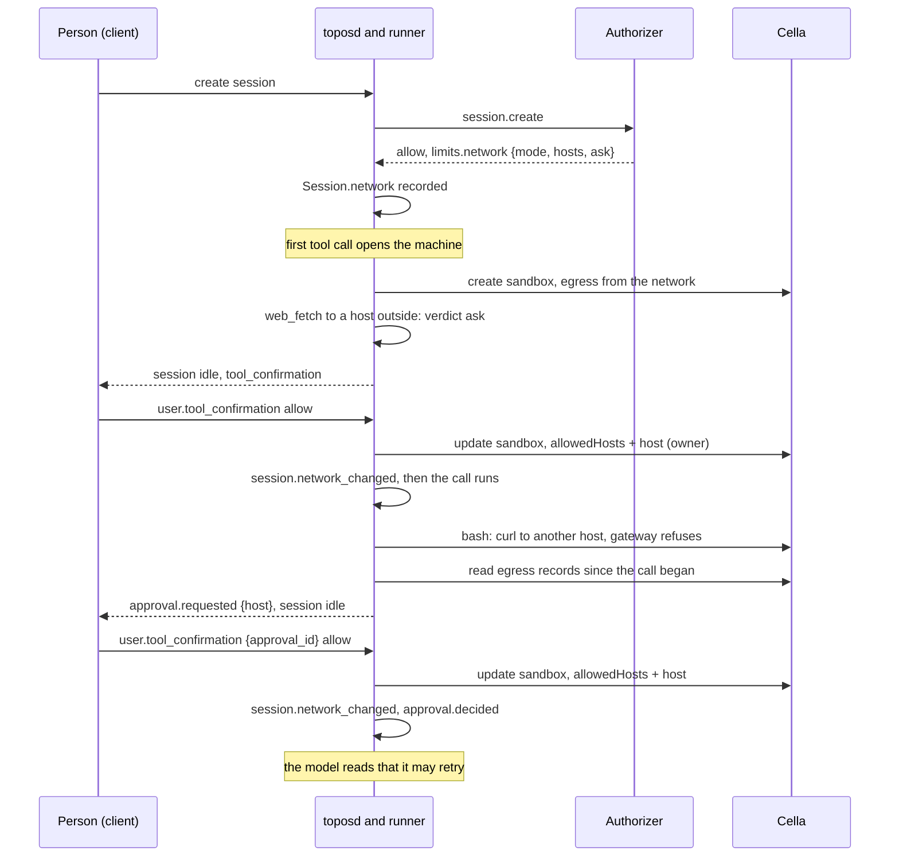

# A session's network

## Overview

A hosted session's machine is a Cella sandbox, and it reaches the
internet only through Cella's egress gateway. Topos creates every
sandbox in `allowlist` mode with the agent's `spec.machine.egress`, the
hosts of the session's named secrets and the git hosts of its
repositories. Nothing else is reachable, and nothing outside the agent
can change that: an installation that wants a person to decide where
their sessions may reach has no way to say so, short of editing every
agent. `web_fetch` runs inside the sandbox, so a fetch of any other
site fails with the gateway's refused `CONNECT`, after the harness has
already asked the person whether it may run.

This spec makes the network a session's own, decided by the
installation's authorizer and grown by the person who attends the
session:

1. `spec.machine` gains `egressMode` beside its hosts.
2. An allow of `session.create` or `session.send` may carry `network`:
   a mode, hosts, and whether a first contact elsewhere asks.
3. A `web_fetch` to a host inside the session's network runs without
   asking. One outside it asks before it runs when the network asks,
   and is blocked with a reason the model reads when it does not.
4. A command's connection the gateway refused becomes an
   `approval.requested` the person answers, after the command's result.
5. An allow widens the running sandbox to that host for the rest of the
   session, recorded in the log so every runner applies it.

Nothing here names an installation, a product or a list of hosts. The
authorizer decides what a session may reach; the core enforces it and
asks.

## Current state

| Piece | Where | Today |
|---|---|---|
| The agent's hosts | `v1.Machine.Egress` in `manifest/v1/agent.go` | `[]string`, hosts only; no mode |
| The sandbox's egress | `(*cella.Machine).manifest` in `machine/cella/cella.go` | always `mode: allowlist`, hosts from the agent, the secrets' scopes and `repositoryHosts` (`internal/hosted/hosted.go`) |
| The authorizer's answer | `authorizer.Limits`, `WireLimits` in `authorizer/limits.go` | lists, thresholds, budget, ages, scope, retention, owner, model, reasoning; nothing about the network |
| `web_fetch`'s verdict | `Policy.Decide` in `harness/permission.go` | `ask` in `confirm` mode unless an `always_allow` or remembered pattern names it; the agent's hosts lower the score in `progressive` (`egress:named`) |
| Remembered patterns | `rememberedPatterns` in `harness/resume.go` | `user.tool_confirmation` with `remember`, `<tool>(<glob>)`, for the rest of the session; `web_fetch(domain:<host>)` for a page |
| A command's refused connection | Cella's connection records, `GET /v1/sandboxes/{id}/egress`, decision `denied` | not read; the model reads `curl`'s error and nothing reaches the person |
| `approval.requested`, `approval.decided` | the schema table of [[004-session-log]], designed in [[012-permissions-and-approvals]] for the step-up | in the table, not defined in `session`; a log holding one is refused `schema_too_new` |
| Widening a running sandbox | Cella spec 003: `network.egress.allowedHosts` and `mode` are `narrow` fields that any caller may narrow and only a non-workload actor may widen | Topos never updates a sandbox's egress after create |

## Design



### Recommendations

| Choice | Picked | Weighed against |
|---|---|---|
| Where a session's network comes from | The authorizer's answer at create, replacing the agent's mode, with its hosts joined to the agent's | Editing the agent per person, which a managed agent's next version overwrites; a client field on the create, which no policy decides |
| How a first contact is confirmed | `allowlist` grown by allows, so the boundary is what asks | `open` with an ask on `web_fetch` only: a command's `curl` would reach any host unasked, and the ask would bound nothing |
| A command's first contact | Read the gateway's refusals after the call and ask then; the model retries | Parse the command for hosts before it runs: a script's connections are not in its text, so this can be a fast path and never the boundary |
| How long an allow lasts | The rest of the session | One call: the sandbox reaches the host once it is widened, so narrowing back after one fetch would race the session's own commands and promise more than the boundary holds |
| Where an allow is recorded | `session.network_changed` in the log | The confirmation's `remember` pattern: a pattern is the harness's, and the machine's boundary must be rebuilt from the log by any runner |
| A session nobody attends | A first contact is refused and recorded, never asked | Asking: nothing times out an ask, so a scheduled run would wait for its age |

### The agent's mode

`v1.Machine` gains `egressMode`, one of `open`, `allowlist` and `none`,
beside `egress`, which stays a list of hosts and keeps its meaning:

```yaml
spec:
  machine:
    kind: cella
    egressMode: allowlist   # open | allowlist | none; absent is allowlist
    egress: [api.example.com]
```

Absent is `allowlist`, which is every session's mode today, and stays
absent in the resolved spec, so an agent that names none keeps its
digest. `egress` with `open` or `none` is a problem of the manifest at
`spec.machine.egress`, refused `invalid_manifest`, as Cella refuses
`allowedHosts` outside `allowlist`; a mode outside the three is one at
`spec.machine.egressMode`. The field is read on a Cella
machine; a host machine's driver applies what it can and records the
mode it ran with.

### The authorizer's network

`authorizer.Limits` and `WireLimits` gain one member:

```json
"network": {"mode": "allowlist", "hosts": ["example.com", "*.example.org"], "ask": true}
```

| Member | Meaning |
|---|---|
| `mode` | `open`, `allowlist` or `none`; required when `network` is present |
| `hosts` | host patterns under Cella's host rule (`latere.ai/x/pkg/hostmatch`: an exact name or one leading `*.`; no address, port or single label); only with `allowlist`; at most `MaxNetworkHosts`, 512 |
| `ask` | with `allowlist`, a first contact to a host outside the network asks the person attending the session; absent is false |

`DecodeLimits` refuses a mode outside the three, `hosts` or `ask` with
another mode, a host the rule refuses, and more than 512 hosts, so
toposd answers `authorizer_unavailable`: a boundary it cannot read is
one it cannot apply.

It is read where `model` is ([[038-routed-models]]):

- **`session.create`.** The session's network is the answer's. Absent,
  it is the agent's: its `egressMode` and `egress`, `ask` false.
- **`session.send`.** An answer that differs from the session's current
  network replaces it before the next turn. Absent keeps it.

The session's **base network** is the one the authorizer named, or the
agent's. Its **effective network** is what the sandbox is given:

| Mode | Sandbox `mode` | Sandbox `allowedHosts` |
|---|---|---|
| `open` | `open` | none; `deniedHosts` stay the agent's and Cella's |
| `allowlist` | `allowlist` | the base hosts, the agent's `egress`, the hosts of the session's named secrets, the git hosts of its repositories, and the hosts the person allowed in this session |
| `none` | `none` | none |

The agent's hosts, the secrets' hosts and the repositories' hosts join
every `allowlist` network, so an authorizer that names a narrow list
never cuts a session off from its model gateway, its checkpoints or a
host its author declared. An authorizer that wants a session with no
egress at all answers `none`.

An authorizer may only answer what the installation's admission then
admits: Cella's admission may narrow a sandbox's mode to a floor, and
a sandbox it narrowed runs narrowed. The core records the mode the
sandbox reports.

### The session's record

The `Session` header gains `network`, the base network: the one the
create named, which each authorizer's change at a send replaces as
`session.model_changed` replaces `model`:

```json
"network": {"mode": "allowlist", "hosts": ["example.com"], "ask": true, "source": "authorizer"}
```

`source` is `authorizer` or `agent`. One event type joins
[[004-session-log]], not shown to the model, appended by the runner for
a person's allow and by toposd for an authorizer's change at a send:

| Type | Payload |
|---|---|
| `session.network_changed` | `added` and `removed` (hosts), `mode` and `ask` when they changed, `source` (`authorizer` for a send's answer, `person` for an allow), `tool_use_id` or `approval_id` for an allow |

The fold reads the effective network from the header and every
`session.network_changed` a person's allow appended, so every runner
rebuilds the same boundary after a restart or a handoff.

### `web_fetch`

`Policy` gains the effective network. Before the mode applies, after
`always_confirm`:

| The fetch's host | Verdict | Reason recorded |
|---|---|---|
| inside the effective network (any host under `open` but a denied one) | `allow` in `confirm`; in `progressive` the score of `egress:named`, 0.4 | `inside the session's network` |
| outside it, `ask` true, the session attended ([[039-questions]]) | `ask` | `outside the session's network` |
| outside it, otherwise; any host under `none` | `block` | the result `prompts/results/call/outside-network-v1`, which tells the model the host is outside the network this session may reach and that the person decides where it may reach |

`always_confirm` still wins, and a hook may still lower a verdict.
`remember` keeps its meaning for other tools; for a fetch it is no
longer needed, since an allowed host is in the network for the rest of
the session.

When a person allows an asked fetch whose host is outside the
effective network, the runner, before it runs the call:

1. updates the sandbox with the host added to `allowedHosts`, as the
   sandbox's owner, which Cella spec 003 admits;
2. appends `session.network_changed` with `added: [host]`, `source:
   person` and the call's `tool_use_id`;
3. runs the call.

An update Cella or its admission refuses leaves the network as it was,
appends no event, and closes the call with the result
`prompts/results/call/network-unavailable-v1` and the error code
`network_unavailable` in its `session.error`.

### A command's connection

A command reaches the network through the gateway like any other
process in the sandbox, and its connections are not in its text. After
each `bash` call returns, when the effective network is `allowlist`:

1. The runner reads the sandbox's connection records,
   `GET /v1/sandboxes/{id}/egress`, back to the call's start, and keeps
   the distinct hosts with decision `denied`.
2. It drops a host already in the effective network (a record from
   before a widening) and a host the person denied earlier in this
   session.
3. For each of the first `MaxAsksPerCall`, 3, it appends
   `approval.requested`, defined here in `session` with the payload of
   [[004-session-log]]'s table:

   ```json
   {"approval_id": "apr_01J9...", "tool_use_id": "toolu_07", "source": "egress",
    "destination": {"host": "api.example.com", "port": 443},
    "reason": "connection outside the session's network", "verdict": "ask"}
   ```

   In a session nobody attends, or one whose network does not ask, the
   verdict is `block` and nothing waits: the record lets a client offer
   the host for next time. Hosts past the third are named in the last
   request's `more`, a count.
4. The model reads each request as text after the call's result, in
   the same user message: which host was refused, and that the person
   is asked.
5. With an `ask` among them, the session goes idle with
   `tool_confirmation` once the call's result is in, as an ask does.

`user.tool_confirmation` gains `approval_id`, the request it answers in
place of `tool_use_id`. On `allow` the runner widens the sandbox as for
a fetch, appends `session.network_changed` with the `approval_id`, then
`approval.decided` (`decision`, `by`, `note`); the model reads that the
host is now reachable and it may try again. On `deny` it appends
`approval.decided` and the host is not asked again in this session.

The command ran once and failed before the person was asked; its retry
is the model's. That cost is the price of a boundary the command cannot
talk past. A client may still read a command's text for hosts and offer
them before it runs; that is a convenience and never the boundary.

The step-up of [[012-permissions-and-approvals]] uses the same two
events with Cella's `confirmation_required` refusals; this spec defines
them in `session` for both sources, and the step-up's own reading of
refusals stays its own.

### A change at send

An allow of `session.send` that carries a `network` other than the
base replaces the base before the turn: toposd computes the hosts added
and removed and appends `session.network_changed` with `source:
authorizer` straight before the sent event, in one batch, as it appends
`session.model_changed`; the runner gives the running sandbox the new
effective network before the turn's first request (a removal is a
narrowing any caller may make; an addition the owner's widening), and a
sandbox found by name is given it before any call runs in it. Hosts the
person allowed in this session stay. A sandbox that is not running is
created from the new effective network when it next opens. A network
the machine cannot take ends the turn with `network_unavailable` before
any request: a session never runs on a boundary its authorizer did not
name.

### Subagents and forks

A thread works on its session's machine and shares its network. A
fork is a create: the authorizer answers its network, and the hosts the
person allowed in the parent are not carried, since each allow was for
one session.

### Configuration

Nothing new. An installation without an authorizer runs every session
on its agent's mode and hosts, with `ask` false.

## Not in this spec

Which hosts an installation offers, a person's list, and where it is
kept: the authorizer's. The gateway's own allowances and confirmation
patterns for requests that carry a credential: Cella spec 077 and
[[012-permissions-and-approvals]]'s step-up. Web search, which the
runner sends to the installation's search service and which no
sandbox egress governs ([[047-web-search]]). A host machine's sandbox
egress beyond what its driver applies.

## Roll order

1. The authorizer may answer `network` first: `DecodeLimits` ignores a
   member it does not know, so a core before this spec runs on the
   agent's hosts as today.
2. toposd and every runner, together: a runner that reads the log
   must know `session.network_changed`, `approval.requested` and
   `approval.decided` before any is appended.
3. A client that renders `approval.requested` and answers by
   `approval_id`. Until it does, a command's refusal blocks and is
   recorded, and nothing waits.

## Acceptance criteria

| Criterion | Test | State |
|---|---|---|
| `egressMode` decodes, defaults to `allowlist`, and `egress` with `open` or `none` is a problem of the manifest | `manifest/v1.TestEgressMode` | built |
| `DecodeLimits` reads `network` and refuses a bad mode, hosts outside `allowlist`, a host the rule refuses, and 513 hosts | `authorizer.TestDecodeNetwork` | built |
| A create's network sets the sandbox's mode and hosts, with the agent's, the secrets' and the repositories' hosts joined under `allowlist` | `machine/cella.TestManifestTakesTheSessionsNetwork`, `harness.TestEffectiveNetworkJoinsTheSessionsHosts`, `hosted.TestTheSandboxTakesTheSessionsMode`, `server.TestNetworkAtCreateAndSend` | built |
| A fetch inside the network runs without asking in `confirm`, records `inside the session's network`, and is still asked when `always_confirm` names it | `harness.TestFetchInsideTheNetwork` | built |
| A fetch outside an asking network asks; allowed, the sandbox is updated before the call runs and the log holds `session.network_changed` | `hosted.TestAllowedFetchWidensTheMachine` (Cella stub), `harness.TestAnAllowedFetchWidensBeforeItRuns` | built |
| A fetch outside a network that does not ask, or in an unattended session, is blocked with the result file | `harness.TestFetchOutsideBlocks` | built |
| A command's denied connection appends `approval.requested` after its result, at most three, and the session idles; an allow by `approval_id` widens and appends `approval.decided`; a deny is not asked again | `hosted.TestRefusedConnectionAsks` (Cella stub with denied records), `harness.TestARefusedConnectionAsksAfterTheCall`, `server.TestConfirmationByApprovalID` | built |
| A send's answer that removes a host narrows the running sandbox before the turn and keeps the person's allows | `hosted.TestSendNarrowsTheNetwork`, `harness.TestASendsNetworkReachesTheMachineBeforeTheTurn`, `server.TestNetworkAtCreateAndSend` | built |
| A runner that claims the session after a restart rebuilds the same effective network from the log | `hosted.TestNetworkSurvivesAClaim`, `machine/cella.TestAFoundSandboxTakesTheSessionsNetwork` | built |
| A widening Cella refuses closes the call `network_unavailable` and changes nothing | `hosted.TestWideningRefused`, `machine/cella.TestApplyNetworkWidensAndNarrows` | built |

## Outcome

Built on 2026-10-06, in no release yet, and not yet run against a live
authorizer or Cella. Every criterion has its test. The end-to-end tests
live in `internal/hosted`, whose runner drives a session against the
stub Cella and the stub model gateway; the stub Cella gained the
sandbox's apply (`PUT /v1/sandboxes/{name}`, refusing a change of a
field Cella holds immutable) and its egress records, which a command
that names a refused host adds at exec time. What shipped differs from
the draft in these points:

- **The manifest's refusal.** Topos has no `invalid_field`: `egress`
  with `open` or `none` is a problem at `spec.machine.egress` of an
  `invalid_manifest` refusal. A machine that names `egressMode` is not
  the default machine, as one that names `egress` is not.
- **The header keeps the current base network.** `Session.network` is
  the base the create named as each authorizer's change replaced it,
  folded at append as `model` is; the log's person allows join it. A
  fork's copied changes are its parent's and leave its header alone.
- **toposd appends a send's change.** Only toposd holds the send's
  allow, so it appends `session.network_changed` in the send's batch,
  straight before the sent event. The runner gives the machine the
  session's network at the start of each turn, and a sandbox found by
  name is given it before any call runs in it; a network the machine
  cannot take ends the turn `network_unavailable` before any request.
- **An outside host that the network does not ask about is blocked even
  when `always_confirm` names the fetch**: no answer could reach it.
  `always_confirm` still asks for a host inside. In `progressive` a host
  inside scores 0.4 and its verdict carries the threshold's reason; the
  reason `inside the session's network` is recorded in `confirm`. The
  network's decision is settled by the rules, so a decision service
  suggests past none of it. The rules apply on a Cella machine; a host
  machine keeps its decisions by the mode.
- **The secrets' hosts are the machine's.** The harness decides a fetch
  by the base hosts, the person's allows, the agent's hosts and the
  repositories' git hosts; the hosts of the session's named secrets are
  joined by the machine alone, so a fetch of one asks or is blocked
  although the sandbox reaches it.
- **The model reads the approval events as text after the call's
  result**, in the user message that carries the result, not as a part
  of the system prompt, which sits in the cached prefix and has no place
  beside a result. `approval.decided` reads as allowed, denied, or, for
  an allow whose widening Cella refused, as still out of reach.
- **A widening opens the machine first.** The allow of a fetch or of an
  approval applies to a running sandbox, so a refusal is known before
  anything is recorded: it appends a `session.error`
  `network_unavailable` and no `session.network_changed`. An approval's
  allow therefore starts a stopped sandbox. The update applies the
  sandbox's whole spec read back from Cella with its egress replaced,
  since an apply that omits a field sets it to its default, and a
  network the machine last asked for sends nothing.
- **A person's message in place of an answer denies a waiting
  approval**, as it denies an asked call, and `approval.decided` names
  the sender; otherwise the session would wait on the approval forever.
  A host with a request still open is not requested again.
- **Thread coverage.** An approval asks only in the session's own
  thread; a subagent's refused connection is recorded with verdict
  `block`. A subagent's fetch asks and widens as the session's does.
- **The window of records.** The runner reads the gateway's records
  stamped at or after the call's start by its own wall clock, at most
  200, Cella's page ceiling; a skew between the two clocks moves the
  window by as much.
- **The wire payloads** are the ones a client renders: `approval.requested`
  carries no `risk` and `approval.decided` no `grant`, the fields
  [[004-session-log]] lists for the step-up of
  [[012-permissions-and-approvals]], which keeps its own reading.
- **The recorded mode.** `session.machine` records `machine.egress`, the
  mode the sandbox reports once its admission ran.
- **Beyond the draft.** `DecodeLimits` refuses an address as a host;
  `topos confirm` takes an `apr_` id; a confirmation of an `approval_id`
  that carries `remember` is `invalid_request`.

A platform authorizer answers `network` on `session.create` and on
`session.send`, and rolls first: a core before this spec ignores the
member. toposd and every runner roll together. A client then renders
`approval.requested`, answers by `approval_id`, and shows the reasons
`inside the session's network` and `outside the session's network` on a
fetch's `agent.tool_use`.
