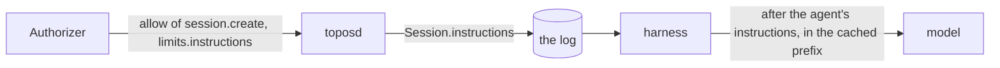

# The initiator's instructions

## Overview

A person who uses one agent for many sessions wants it to know a few
things every time: what to call them, what they work on, how they like
an answer. Today that text can live only in the agent's own
instructions, which belong to the agent and its owner. When one agent
definition serves many people, an installation that manages the agent
for them, each person's copy is replaced by the next version, so a
person's edits to it do not last, and a client that splices the text
into the first message puts policy where no one decides it.

This spec lets the installation's authorizer answer it: an allow of
`session.create` may carry `instructions`, text the session records at
create and the model reads, marked as the initiator's, after the
agent's own instructions. The authorizer decides whose text it is and
whether it applies; the core places it and keeps it stable for the
session's prompt cache.

## Current state

- The prompt's parts and their order are [[010-context]]'s: the
  harness prompt, the context block, the agent's instructions, the
  project's instruction files, the skills index, the memory notes.
- `authorizer.Limits` carries no text for the model.
- The `Session` header records the policy merged at create; nothing a
  person set for themselves.

## Design



### The member

`WireLimits` gains `instructions`, a string, read on an allow of
`session.create` only. `DecodeLimits` refuses one longer than
`MaxInitiatorInstructions`, 8 KiB of UTF-8, or one that is not valid
UTF-8, as `authorizer_unavailable`. Empty is none.

A send's answer does not carry it: the text sits in the prompt's
cached prefix, and changing it in the middle of a session would pay for
the whole prefix again on the next request. A fork is a create, so it
takes the authorizer's text at the fork.

### The record

The `Session` header gains `instructions`, the text as the authorizer
answered it, absent when none. It is the session's own, read back by
whoever may read the session, deleted with it, and redacted only by
deleting the session.

### The prompt

The harness renders `prompts/context/initiator-v1.md` after the agent's
instructions and before the project's instruction files, in the cached
prefix:

```
<initiator_instructions>
The person who started this session keeps these standing instructions.
Follow them where they do not conflict with your own instructions, the
session's permissions or a person's answer in this session.

{{.Text}}
</initiator_instructions>
```

The text is data inside the wrapper and is never parsed. It cannot
widen anything: the boundary, the permissions and the approvals are
decided outside the model, so an instruction to skip an ask is one
more sentence the model reads and the harness does not.

`model.request` already records the prompt version; the wrapper's
version is part of it.

## Not in this spec

Whose text it is, its length for a person, and in which contexts it
applies: the authorizer's. A memory the agent writes for itself
([[020-memory-stores]]).

## Roll order

The authorizer may answer `instructions` before toposd reads it; a core
before this spec ignores the member. toposd and every runner then roll
together, since the header's new field is read by the harness.

## Acceptance criteria

| Criterion | Test | State |
|---|---|---|
| `DecodeLimits` reads `instructions` and refuses 8 KiB plus one byte and invalid UTF-8 | `authorizer.TestDecodeInstructions` | not built |
| A create's text is recorded on the header and rendered after the agent's instructions in the cached prefix, the same bytes on every turn | `harness.TestInitiatorInstructionsInThePrefix` | not built |
| A send's answer never changes the text; a fork takes the authorizer's text at its create | `server.TestInstructionsAtCreateOnly` | not built |
| A session with no text renders no wrapper | `harness.TestNoInitiatorInstructions` | not built |
