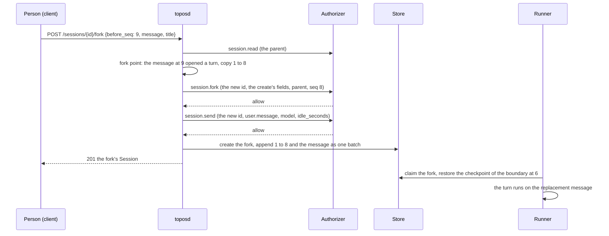
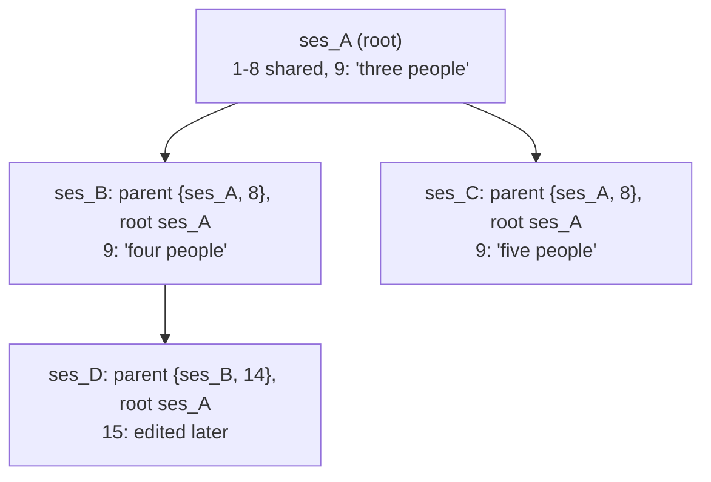

# A fork before a person's message, and the branches of a session

## Overview

A person reads an answer, sees that their question was put badly, and
wants to ask it again from that point: edit the message and run the
conversation on from there, keeping the original as it was. A client
then shows both versions on that message, "1 / 2", and lets the person
move between them. The core has the mechanism already: a fork copies a
session's log up to a turn boundary into a new session with its own
lifetime, budget and credentials ([[017-external-runners-handoff-fork]]).
Four things are missing for an edit:

1. A fork point named by the message to replace. A fork is taken at a
   turn boundary, and a session's opening message has none before it,
   so its first message cannot be edited at all today.
2. The replacement message in the same call. A fork followed by a send
   is two calls, and a client that fails between them leaves a branch
   with no edited message, which reads as a duplicate.
3. The title. A fork's title is marked as a continuation, "Notes
   (continued)", which is right for a session that ended and wrong for a
   second version of the same conversation.
4. A way to read the branches. A fork names its parent, but the list
   cannot be filtered by it, so a client that draws "1 / 2" pages through
   every session to find a session's forks.

This spec adds `before_seq`, `message` and `title` to the fork body,
`root` to the Session, three filters to the session list, and two
corrections a fork needs once forks are common: its budget counts its
own spend, and its requests share one cache key with the session it was
forked from.

| Capability | What a client calls |
|---|---|
| edit fork | `POST /v1/sessions/{id}/fork` with `before_seq`, `message` and `title` |
| branch list | the Session's `parent` and `root`; `GET /v1/sessions?root=<id>`, `?parent=<id>`, `?group=tree` |

## Current state

| Piece | Today | This spec |
|---|---|---|
| Fork route | `POST /v1/sessions/{id}/fork` with `at_seq`, a turn boundary, and `attended` ([[015-api]], `internal/server/fork.go`) | adds `before_seq`, `message`, `title` |
| Fork point | `session.ForkPoint` accepts only a turn boundary and refuses a log with none (`session/fork.go`) | a person's message names the point; seq 0 copies nothing |
| What is copied | events 1 to `at_seq` verbatim, the blobs they name, the agent's bundle; the fork point's checkpoint restored when the runner reaches it ([[034-checkpoints-and-rewind]], [[035-hosted-checkpoints-at-the-git-host]]) | unchanged; the copy may end between a boundary and the message |
| Parent link | the Session's `parent`, `{session_id, seq}` ([[004-session-log]]) | unchanged, readable as today in a read and in each list item |
| Tree | none | the Session's `root`; the list's `root`, `parent` and `group` filters |
| Title | the parent's, marked as a continuation (`continuedTitle`) | the body's `title` when it names one |
| Model | the model the parent stood on at the copy's end, `modelAt` ([[038-routed-models]]) | unchanged; a change between the boundary and the message is inside the copy |
| Spend | `spent_cost_usd_micro` is the sum over the copied events, and `harness/harness.go` `checkBudget` compares `session.Spent` over the whole log, copied events included, with the fork's own budget | `budget.carried_cost_usd_micro`; the check counts the fork's own spend |
| Cache key | the session id (`harness/harness.go`, `CacheKey: t.s.ID`; [[010-context]]) | the tree's root |
| Postgres | the parent is in the session's JSON body only (`internal/store/postgres/migrations/0001_sessions.up.sql`) | columns `parent_id`, `parent_seq`, `root_id`, indexed |

## Design



### Which message is edited

`before_seq` names a message to replace. The fork copies the log from 1
to `before_seq - 1` and the replacement takes the message's place.

| Rule | Value |
|---|---|
| What `before_seq` names | a `user.message` of the session's own thread (no `thread`), whose sender's `kind` is `person`, and which opened a turn: no `session.status` of the session's own thread lies between it and the last one before it that is `idle`, or the log holds no status of the own thread before it |
| What is copied | events 1 to `before_seq - 1`, verbatim, with the blobs they name and the agent's bundle, as [[017-external-runners-handoff-fork]] copies; this includes what lies between the last turn boundary and the message, such as a `session.model_changed` the person made before sending it |
| The session's opening message | a message no status precedes copies nothing: the fork's `parent` is `{session_id, seq: 0}`, its log is empty, its status `idle` with no stop reason and its turn 0 |
| Anything else | `invalid_fork_point`: a sequence that is not such a message, a message sent while a turn ran (it steered a turn and opened none), a trigger's or a service's message, an answer, a confirmation |
| With `at_seq` | `before_seq` and `at_seq` together are `invalid_request` |

`at_seq` keeps its meaning, a fork at a turn boundary that continues the
session. `before_seq` is the edit. The two produce the same kind of
session; only the copy's end differs. A copy that ends at
`before_seq - 1` ends after the boundary before the message, so the
fork's header takes that boundary's status and stop reason, as the
store's header takes them from the batch today.

### The replacement message

`message` is the payload of a `user.message`, exactly as the send route
takes it ([[015-api]], "Images and files on a message"): `content`, text
blocks and inline images, and `attachments`, with the same limits
(`MaxImages`, `MaxImageBytes`, `MaxAttachments`, `MaxAttachmentBytes`,
`MaxAttachmentName`, 015's constants) and the same refusals. An inline
image travels in the event itself, so a client that keeps the original
message's image sends the block as the original event holds it. An
attachment may name a blob in place of its data, so a file the person
attached to the original message is kept without being uploaded again:

```json
{"before_seq": 9,
 "title": "Trip budget",
 "message": {
   "content": [{"type": "text", "text": "Plan it for four people, not three."}],
   "attachments": [{"name": "prices.csv", "blob": "sha256:9f86d081884c7d659a2feaa0c55ad015a3bf4f1b2b0b822cd15d6c15b0f00a08"}]}}
```

| Attachment member | Rule |
|---|---|
| `data` | base64 bytes, as on a send |
| `blob` | a digest that an attachment of a `user.message` in the parent's log, at any sequence, names; its `media_type` and `size` are the parent's record of it; any other digest is `invalid_request` |
| both, or neither | `invalid_request` |

The fork stores each new file as a blob of its own and records it at
`attachments/<event id>/<name>`, as a send does, with the event id
minted for the replacement message; a blob named by digest is copied
into the fork. The runner delivers the fork's files to its machine as
it delivers any message's ([[015-api]]): the copied messages' files and
the replacement's alike.

**The questions.** The route asks `session.read` of the parent, then
`session.fork` with the create's fields and `parent` and `seq`, as
today, where `seq` is the copy's end, and then, with a `message`,
`session.send` of the new session with the fields a send carries:
`sender`, `event_type` `user.message`, `model` and `model_via` (the
model the fork starts on), and `idle_seconds`, the whole seconds since
the last copied `model.request`, absent when none was copied
([[038-routed-models]]). The send is asked before anything is written:
an authorizer that keeps a record of the sessions it allows has written
the fork's at the allow of `session.fork`, and answers the send about
it. A deny of either refuses the call as that question's deny, with the
authorizer's reason, and nothing is written. An allow of the send that
names another model as `limits.model` appends `session.model_changed`
straight before the message, as a send's allow does.

**The write.** The fork is a create and one append, as today: the copied
events, then any `session.model_changed` the send's allow made, then the
replacement message, in one batch. A batch that fails deletes the new
session ([[017-external-runners-handoff-fork]]), so no fork is left
without its message. A fork with a message is claimed by a runner at
once, as a send wakes a session. The answer is 201 with the fork's
Session, whose `last_seq` is the message's.

Without `message`, a fork with `before_seq` waits idle for its first
message, as a fork with `at_seq` does.

### The title

`title` in the fork body is the fork's title, under the create's rules;
`""` gives the fork none. Absent, the fork takes the continuation title
of [[017-external-runners-handoff-fork]] as today. A client that edits a
message passes the parent's title, so the two versions read as one
conversation.

### The tree

A fork tree is every session reached from one session by forks, and
its root is the session at the top.

| Session field | Type | Meaning |
|---|---|---|
| `root` | string | the `ses_` id of the session at the top of this session's fork tree: the parent's `root` when the parent has one, otherwise the parent's id; absent on a session no fork made, whose tree's root is itself |
| `parent` | object | as today: `session_id` and `seq`, the session forked and how many of its events were copied, `seq` 0 for a fork before the opening message |
| `budget.carried_cost_usd_micro` | integer | the spend of the copied events, below; absent on a session no fork made |

A client keys a tree by `root`, or by `id` where `root` is absent. A
fork of a fork whose copy ends inside the events its parent copied is
still a child of the session forked, and its `root` is the tree's.
Deleting a session in the middle of a tree changes no other session:
each fork's log is whole on its own ([[017-external-runners-handoff-fork]]),
and `root` and `parent` are plain values, which go on naming the deleted
session. The root's own deletion leaves its tree keyed by its id.



The versions of a message are read from the tree: the message at
`k + 1` in a session, and the first message of each fork whose `parent`
is that session with `seq` `k`, and of their forks with the same `seq`.
In the figure, the message after 8 has three versions, in `ses_A`,
`ses_B` and `ses_C`; `ses_D` is a second version of `ses_B`'s message at
15. Event ids are copied verbatim, so a client tells a shared event from
a new one by its id.

### The list

`GET /v1/sessions` takes three more parameters. Each narrows the
sessions the list already keeps: the caller's context, the authorizer's
owners, `agent`, `status`, `runner` and `archived` apply first, and a
tree's sessions the caller may not list are not in the answer and not in
any count.

| Parameter | Answers |
|---|---|
| `root=<ses_id>` | that session and every session whose `root` it is |
| `parent=<ses_id>` | the sessions forked from that session, whatever their `parent.seq` |
| `group=tree` | one session per tree: of a tree's sessions the list keeps, the one whose `updated_at` is latest, ties by the greater id; each item carries `tree`, below |

```json
{"items": [
  {"id": "ses_B", "title": "Trip budget", "root": "ses_A", "parent": {"session_id": "ses_A", "seq": 8},
   "tree": {"root": "ses_A", "sessions": 3}, "...": "..."}],
 "next_cursor": "..."}
```

| `tree` member | Meaning |
|---|---|
| `root` | the tree's key: the root's id |
| `sessions` | how many of the tree's sessions the list keeps under the same filters |

`group` takes `tree` alone; any other value is `invalid_request`. The
grouped list orders its items as the list does, newest id first, by the
id of the session that stands for each tree, and pages by that id. The
session that stands for a tree can change between two pages when
another of its sessions is updated; a client that reads the list again
sees the tree once. `root`, `parent` and `group` combine with each other
and with the other filters. `GET /v1/sessions/summary` takes none of
them and counts sessions, as today.

A client that draws "1 / 2" reads the session and its tree, `?root=`
with the session's `root` or id, in one call, and needs no other read
until a fork is made. A client that lists conversations rather than
sessions lists `?group=tree`.

### The stores

| Store | Change |
|---|---|
| Postgres | migration `0008_session_tree`: `parent_id text`, `parent_seq bigint`, `root_id text` on `sessions`; indexes `sessions_root (root_id, id DESC) WHERE root_id IS NOT NULL` and `sessions_parent (parent_id, id DESC) WHERE parent_id IS NOT NULL`; the columns are written from the body at insert, and an update sets them only where the body names them, never clearing one (Roll order). `root` filters on `(id = $1 OR root_id = $1)`; `group=tree` is a `DISTINCT ON (COALESCE(root_id, id))` over the filtered rows ordered by `updated_at DESC, id DESC`, ordered again by id and paged by it |
| directory and memory | filter and group the headers they read for a list, as they filter today |

The migration backfills `parent_id` and `parent_seq` from each body's
`parent`, and `root_id` with a recursive walk up `parent_id` that stops
at a session not in the table: a fork whose ancestor was deleted before
the migration gets the deleted session's id as its root, which a later
fork in the same tree, made after the migration, also takes. It also
writes `root` into each such body, so a read answers it. The migration
runs in one transaction and adds no index concurrently; the table is
small enough at this version for both.

### The fork's spend

A fork's log holds its parent's `model.request` events, and
`spent_cost_usd_micro` sums them, so a fork's header shows what the
conversation cost. The budget check reads the same sum: `checkBudget`
compares `session.Spent(t.events())` plus the next request's estimate
with the fork's own `max_cost_usd_micro` (`harness/harness.go`), so a
fork of a session that spent most of a cap stops at its first request,
though the installation's authorizer gave it a budget of its own. This
spec separates the two:

| Value | Meaning |
|---|---|
| `budget.spent_cost_usd_micro` | the whole log's spend, copied events included, as today |
| `budget.carried_cost_usd_micro` | the copied events' spend, fixed at the fork |
| the check | `spent - carried + estimate >= max_cost_usd_micro` stops the turn `budget` ([[007-models]]) |

The same holds for a fork with `at_seq`, which continues a session that
ended. Nothing is charged twice: a copied `model.request` is a record of
a request the parent sent and paid for, and the cores that charge, the
model gateway among them, charge requests they receive. The fork's
first request does send the shared prefix again, and the fork pays for
that request as for any other, below.

### The prompt cache

The fork's first request is built from its fold, which at the copy's
end equals its parent's ([[017-external-runners-handoff-fork]]). Of the
request's parts ([[010-context]]):

| Part | The fork's first request |
|---|---|
| tool definitions, the harness prompt, the agent's instructions | the parent's: the same agent version and the same harness prompt version where the same release serves both |
| the initiator's instructions ([[053-the-initiators-instructions]]) | the authorizer's text at the fork; the parent's when the person has not changed it since |
| the context block, project instruction files, the skills index | the last copied `session.machine`'s ([[011-instructions-and-skills]]), until the fork's own first machine attaches; a turn that only talks opens none |
| the route | the parent's `model.via` at the copy's end, since the fork starts on that model |
| the messages | the parent's fold to the copy's end, then the replacement message |

So the prefix up to the copy's end is byte for byte the parent's, and
the parent's own requests wrote cache entries at its breakpoints: its
breakpoint on the last block of each request's final user message
covers every step of the turn before the message. For a dialect that
matches a cached prefix by its bytes, the fork's first request reads
that prefix from the provider's cache when it runs on the same model,
under the same provider account, within the provider's cache lifetime
of the parent's request; it writes the rest: the end of the parent's
last answer and the replacement message. When any of the three does not
hold, the whole prefix is written again, at the provider's cache-write
rate where it has one.

When the fork's first tool call opens a machine, the new
`session.machine` changes the context block: its date, its working
directory and, in a repository, a branch named after the session. The
system prompt then differs from the parent's, and the request after it
writes the cache from the system prompt on, as any session's next
machine does ([[010-context]]).

For a dialect that takes a cache key, the session id has been the key,
so a fork's first request was keyed apart from every request its parent
sent and found no cached prefix. The key becomes the tree's: the
request's cache key is the session's `root`, or its id where it has
none. A fork and its parent then send one key, a provider that routes by
key routes their shared prefix to one cache, and a session no fork made
keeps the key it has. This amends [[010-context]]'s rule that the
session id is the cache key.

What a fork pays: its first request's input at the cache-read rate for
the prefix found and at the input or cache-write rate for the rest;
the copied requests nothing. A client that shows a branch's cost shows
`spent - carried`.

### What a fork carries

| Of the parent | The fork |
|---|---|
| events | 1 to the copy's end, verbatim ([[017-external-runners-handoff-fork]]) |
| blobs | every blob a copied event names, found by `Event.Blobs`, which reads every digest in a payload (`session/store.go`), and every blob the replacement message names by digest |
| files of the working directory | the checkpoint named by the last own-thread `idle` status at or before the copy's end, restored when the fork's first machine opens and the runner reaches it ([[034-checkpoints-and-rewind]], [[035-hosted-checkpoints-at-the-git-host]]); otherwise a fresh machine with `checkpoint_missing`; a fork before the opening message has no checkpoint to restore and opens a fresh machine with no error |
| a message's files | delivered to the fork's first machine, the copied messages' and the replacement's ([[015-api]]) |
| model and reasoning | the model and level the parent stood on at the copy's end, by `modelAt`, so a change the person made after the last answer and before the edited message is the fork's ([[038-routed-models]], [[049-reasoning]]) |
| approval mode | the agent's, as the fork's create gives it; copied `session.policy_changed` events move nothing ([[041-approval-mode-change]]) |
| network | the authorizer's answer at the fork; the parent's allowed hosts are not carried ([[052-a-sessions-network]]) |
| the initiator's instructions | the authorizer's text at the fork ([[053-the-initiators-instructions]]) |
| budget | the fork's own, from its create; the copied spend is `carried_cost_usd_micro` |
| lifetime and credentials | the fork's own, from now |
| title | the body's `title`, or the continuation title |
| repositories, capture, metadata | the parent's, as today |
| `end_on_idle`, `trigger_id` | not carried, as today |

### Limits

The core counts no forks: each fork is a create, so the installation's
authorizer applies whatever it applies to a create, and a client is
held by those answers. The copy is bounded by the parent's log, as
today, the message by a send's limits and the event body's 8 MiB, and
the body without a message by the JSON body's 1 MiB ([[015-api]]). The
list's new filters page as every list does.

### Error codes

No new code.

| Code | Status | When |
|---|---|---|
| `invalid_fork_point` | 422 | `before_seq` names no message that opened a turn, as above |
| `invalid_request` | 400 | `before_seq` with `at_seq`; an attachment with both or neither of `data` and `blob`, or a `blob` no attachment of the parent names; `group` other than `tree` |
| `forbidden` | 403 | the authorizer denied `session.fork` or `session.send`, with its reason in `details.reason` |

### Decisions

| Choice | Picked | Weighed against |
|---|---|---|
| How an edit is named | `before_seq`, the message replaced | `at_seq` at the boundary before it: a client then finds the boundary itself, the events between the boundary and the message (a model change) are lost, and the opening message has no boundary |
| The opening message | a fork that copies nothing, `parent.seq` 0 | a plain new session: it carries no `parent`, so no client can draw the two versions as one message |
| The replacement message | in the fork's body, asked as a send before anything is written | a fork, then a send: two calls, and a failure between them leaves a branch with no edited message |
| A file of the original message | named by its blob | uploaded again by the client: the bytes are already the parent's, and a large file doubles the call |
| How branches are read | `root` on the Session, with `root`, `parent` and `group` filters | `parent` alone: a client walks one call per level; a route of its own per session: one more contract for what a filter answers |
| The session that stands for a tree | the one updated last | the newest fork: a person who goes back to an older version and goes on there expects to find that version |
| A fork's budget | its own spend against its own cap | the whole log against its cap, as today: a fork of an expensive session stops at once though nothing was spent |
| The cache key | the tree's root | the session id: forks never share a cached prefix in a dialect that keys its cache; a key per fork point: a key per conversation is what a dialect that takes one asks for |

## Not in this spec

How a client draws versions, and which version it opens. Deleting a
whole tree in one call: a client deletes each session ([[040-session-deletion]]).
A fork at any other point, such as inside a turn: a fork stays at a
turn's edge. Editing an agent's answer: the core records what a model
said. A fork's local twin, `topos fork --before <seq>`, which follows
the server.

## Roll order

1. toposd and every runner in one release. Its migration adds the
   columns, which an earlier release ignores, and backfills them. The
   Session decodes into a fixed struct, so a replica of the earlier
   release that rewrites a fork's header during the roll drops `root`
   and `carried_cost_usd_micro`, which it does not know
   ([[004-session-log]]). Two rules make that harmless: the store
   writes `parent_id`, `parent_seq` and `root_id` at a fork's insert
   and an update never clears them, which an earlier release's update
   does not name, and a read fills a body's missing `root` from
   `root_id`; a dropped `carried_cost_usd_micro` leaves that fork's
   check over the whole log, which is today's behavior.
2. The next release's migration repeats the backfill for forks whose
   `root_id` is empty: a fork an earlier replica created during the
   first roll has no columns.
3. An installation's authorizer needs no change: `session.fork` asks
   the fields it asks today, and the send of a fork's message is a send.
   An authorizer that reads its own record of a session on a send finds
   the fork's, written at the allow of `session.fork`.
4. Clients after the first release: an older core refuses `before_seq`,
   `message` and `title` in a fork body as unknown members, and the
   list's new parameters are ignored by it, so a client checks the
   version it talks to before it draws versions.

## Acceptance criteria

| Criterion | Test that proves it | State |
|---|---|---|
| A fork with `before_seq` naming a message that opened a turn copies events 1 to `before_seq - 1`, a model change between the boundary and the message included, and its header takes the boundary's status | `session.TestForkBeforeAMessage`, `internal/server.TestAForkBeforeAMessageCopiesUpToIt` | not built |
| A fork before the session's opening message copies nothing, has `parent.seq` 0, is idle with no stop reason, and opens a fresh machine with no `checkpoint_missing` | `internal/server.TestAForkBeforeTheOpeningMessage`, `runner.TestAForkOfNothingStartsFresh` | not built |
| `before_seq` naming a message sent while a turn ran, a trigger's message, an answer, or a sequence that is no message is `invalid_fork_point`; with `at_seq` it is `invalid_request` | `session.TestBeforeSeqMustOpenATurn`, `internal/server.TestForkBodyRefusals` | not built |
| A fork with `message` asks `session.read`, `session.fork` and `session.send` in that order, writes the copy and the message in one batch, and answers the fork with the message's `last_seq`; a deny of either question writes nothing | `internal/server.TestAForkWithAMessage`, `internal/server.TestAForkWhoseSendIsDeniedWritesNothing` | not built |
| The send of a fork's message carries the fork's model, its `model_via` and the seconds since the last copied request; an allow naming another model appends `session.model_changed` before the message | `internal/server.TestAForksSendCarriesTheCopiedIdle` | not built |
| An attachment that names a blob of the parent's messages is copied and recorded under the new message's id; a digest the parent's messages do not name is refused | `internal/server.TestAForkMessageKeepsAnAttachmentByBlob` | not built |
| `title` sets the fork's title, `""` gives none, absent keeps the continuation title | `internal/server.TestForkTitle` | not built |
| A fork's `root` is its parent's root or its parent's id; a session no fork made has none | `session.TestRootOfAFork`, `internal/server.TestForkRoot` | not built |
| `root`, `parent` and `group=tree` answer as the table says in every store, inside the list's other filters and the authorizer's owners, and `tree.sessions` counts only what the list keeps | `session/storetest` conformance rows `ListByRoot`, `ListByParent`, `ListGroupedByTree`, run by the memory, directory and Postgres stores | not built |
| The migration backfills `parent_id`, `parent_seq` and `root_id`, and writes `root` into the bodies of existing forks | `internal/store/postgres.TestMigrationBackfillsTheTree` (postgres tier) | not built |
| Deleting a session in the middle of a tree leaves its forks readable, with `root` and `parent` unchanged, and they still list under `root` | `internal/server.TestDeletingAParentLeavesItsForks` | not built |
| A fork's budget check counts only the fork's own spend: a fork of a session that spent past the fork's cap runs its first request | `harness.TestAForksBudgetCountsItsOwnSpend` | not built |
| Every request of a fork carries the tree's root as its cache key; a session no fork made carries its own id | `harness.TestTheCacheKeyIsTheTreesRoot` | not built |
| The fork's first request equals its parent's last request up to the copy's end, byte for byte, when no machine attached in between | `harness.TestAForksPrefixIsItsParents` | not built |
| The OpenAPI document carries `before_seq`, `message`, `title`, `root`, `carried_cost_usd_micro`, the three list parameters and `tree` | `internal/server.TestOpenAPIMatchesHandlers`, `internal/server.TestOpenAPIIsGenerated` | not built |

## Open questions

1. Which version a conversation opens on: the session updated last
   (picked here, so a person who went back to an older version finds
   it) or the newest fork.
2. Whether a trigger's message may be edited as a person's is. A
   scheduled task's text is its owner's, and an edit would make a
   one-off variant of it; this spec refuses it.
3. Whether the fork's own-spend rule should also apply to a fork that
   continues an ended session. It does here, so a continued session
   runs longer before its cap than it does today.
