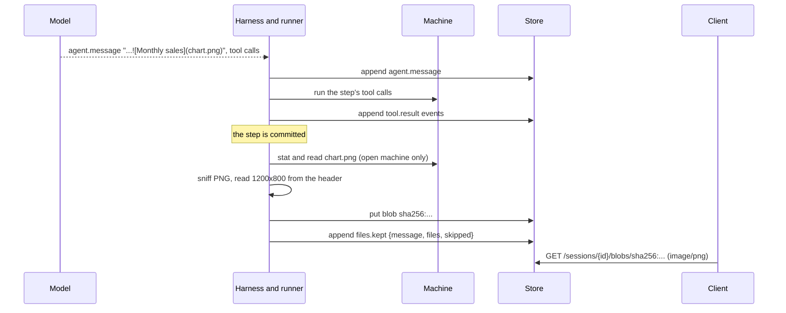

# Images an answer shows

## Overview

An agent makes a chart with a script, saves it as `chart.png` in its
working directory, and answers with the chart in its text:

```markdown
March dips because two stores closed for a week.


```

A client that draws the answer can read `chart.png` through the files
route ([[044-reading-a-sessions-files]]), but only while the session's
machine runs. A sandbox rests when the session is idle, the read then
answers `file_unavailable`, and a session that keeps no checkpoint has
nothing to read the file back from. The picture in the answer breaks
the moment the person looks away, and anything that shows the
conversation later, a reader of an ended session, an export, has no
picture at all.

This spec keeps the picture with the answer. When a step of the
session's own thread is committed, the runner reads each local image
the step's `agent.message` names from the open machine, stores it as a
blob of the session, and appends `files.kept`, which maps each name the
message used to the blob. The blob route answers such a blob as an
image. Nothing about the model's work changes: it names a file it made,
as it already does.

| Capability | What a client reads |
|---|---|
| session image | the `files.kept` event after an `agent.message`; `GET /v1/sessions/{id}/blobs/{digest}` answers the image with its type |

## Current state

A file a tool writes lives only in the machine ([[009-machines]]). The
files route reads it live and never starts a machine
([[044-reading-a-sessions-files]]). The blob route,
`GET /v1/sessions/{id}/blobs/{digest}` ([[015-api]]), answers a
session's stored bytes, a message's attachments and the agent's bundle,
always as `application/octet-stream` (`internal/server/events.go`,
`blob`), with no `nosniff`, no disposition and no cache policy. A file
written by a command is not named in the log at all
([[008-tools]]), so an image made by a script exists for a client only
when the answer names it. Checkpoints keep a working directory per turn
for a session in a repository ([[034-checkpoints-and-rewind]]), not per
answer, and a session without one keeps none.

## Design



### Which images

The runner reads the text blocks of each `agent.message` of the
session's own thread (no `thread`) with a CommonMark parser, so a
reference inside a code span or a fenced block is text and not an
image.

| Reference | Kept |
|---|---|
| a Markdown inline image, `` or ``, and a reference-style image whose definition is in the same message | yes |
| an HTML `img` element's `src` in the message's text | yes |
| a destination with no scheme (`chart.png`, `./out/chart.png`, `/work/out/chart.png`) or the `file:` scheme | yes, after percent-decoding, with any query and fragment dropped |
| a destination with another scheme (`https:`, `data:`) | no: not a file of the machine, and nothing is recorded for it |
| a Markdown link that is no image, `[report](report.pdf)` | no |

A relative destination resolves against the working directory the
session's latest `session.machine` names; an absolute one is kept only
when it lies inside that directory after cleaning. The read goes
through the machine's `FileReader` ([[044-reading-a-sessions-files]]),
which reaches the working directory alone, so a symbolic link that
leads out of it is refused there. The same destination named twice in
one message is kept once.

### When

When the step is committed: after its `agent.message` and every
`tool.result` of its calls are appended, before the next step's
request or the status that closes the turn. A model that writes "here
is the chart" and runs the script that draws it in the same step has
its chart kept once the script has run. A client therefore has every
`files.kept` of a turn before the turn's `session.status`.

The keep reads only a machine that is open. A step that ran no tool on
a machine, in a turn that opened none ([[048-the-machine-starts-at-the-first-tool-call]]),
keeps nothing and opens nothing: its references are skipped with
`no_machine`, since a read must not spend a machine's time
([[044-reading-a-sessions-files]]). A client may still try the files
route for such a path.

### What is kept

| Check | Bound | Constant |
|---|---|---|
| images kept from one message | at most 8; a reference past it is skipped `limit` | 015's `MaxImages` |
| one image's bytes | at most 5 MiB, read by `Stat` before the read; a file past it is skipped `too_large` | 015's `MaxImageBytes` |
| the format | PNG, JPEG, GIF or WebP by the file's leading bytes (`89 50 4E 47 0D 0A 1A 0A`, `FF D8 FF`, `GIF87a` or `GIF89a`, `RIFF....WEBP`), whatever its name says; anything else, SVG included, is skipped `not_an_image` | none |
| one side | at most 8192 pixels, read from the format's header without decoding the image | `MaxKeptImageSide` |
| the pixels | at most 40,000,000, width times height from the header | `MaxKeptImagePixels` |

`MaxKeptImageSide` and `MaxKeptImagePixels` are this spec's; the other
two are [[015-api]]'s, referenced and not restated in code. An image
whose header gives a size past either is skipped `too_large`, so a
client never receives a picture whose decoding would cost more than its
bytes suggest.

A kept image is stored as a blob of the session, addressed by its
SHA-256 ([[014-store]]): an image an answer names again unchanged is
stored once, and the event that names it again names the same digest.

### The event

| Type | Written by | Payload |
|---|---|---|
| `files.kept` | the runner of the session's own thread, any writer kind | `message`, the `agent.message`'s event id; `files`, each `{path, resolved, blob, media_type, size, width, height}`; `skipped`, each `{path, reason}`; either list may be empty, and an event with both empty is not appended |

```json
{"type": "files.kept", "payload": {
  "message": "evt_01J9Z3Q4W8KX6T0M2V5N7R1B3C",
  "files": [{"path": "chart.png", "resolved": "/work/chart.png",
             "blob": "sha256:2c26b46b68ffc68ff99b453c1d30413413422d706483bfa0f98a5e886266e7ae",
             "media_type": "image/png", "size": 48211, "width": 1200, "height": 800}],
  "skipped": [{"path": "draft.svg", "reason": "not_an_image"}]}}
```

| Member | Meaning |
|---|---|
| `path` | the destination as the message wrote it, so a client matches the reference it draws |
| `resolved` | the absolute path read, inside the working directory |
| `media_type` | the sniffed format's type, never the name's |
| `width`, `height` | from the format's header |
| `reason` | `not_found`, `too_large`, `not_an_image`, `outside_workdir`, `no_machine`, `limit`, or `unavailable` for a read or a store that failed, which the turn runs past |

`files.kept` is a runner's event: an external runner appends it through
the append route like any other ([[017-external-runners-handoff-fork]]).
It renders into no prompt: the model already knows what it wrote, and
the fold leaves the event out of the messages ([[004-session-log]]).
Its blobs are named by digest, so `Event.Blobs` finds them and a fork
copies them with the events that name them, and a session's deletion
removes them with its other blobs ([[040-session-deletion]]).

**Redaction.** `files.kept` is redactable: its tombstone names no
blob, and a blob no other event names is removed as a redaction removes
one ([[004-session-log]]). A redaction of an `agent.message` also
redacts the `files.kept` that names it, in the same append, since a
person who removes an answer removes its pictures with it. A redaction
of `files.kept` alone leaves the message.

### The blob route

`GET /v1/sessions/{id}/blobs/{digest}` reads the blob's leading bytes
and answers by them, for an image kept here and for an attachment
alike:

| Header | An image (the four formats above) | Any other blob |
|---|---|---|
| `Content-Type` | the format's type | `application/octet-stream`, as today |
| `Content-Disposition` | `inline` | `attachment` |
| `X-Content-Type-Options` | `nosniff` | `nosniff` |
| `Content-Security-Policy` | `sandbox; default-src 'none'` | `sandbox; default-src 'none'` |
| `Cache-Control` | `private, max-age=31536000, immutable` | the same |
| `ETag` | the digest | the digest |

A blob's bytes never change under its digest, so a client caches it for
as long as it likes; `private` keeps it out of any shared cache, since
the answer depends on who may read the session. No blob is ever answered
as a document of the API's origin. The route asks `session.read`, as
today, and nothing else.

### Decisions

| Choice | Picked | Weighed against |
|---|---|---|
| What names an image | the answer's own reference, read when the step is committed | a `show` tool the agent calls: one more call per image, an image shown where the call stands rather than where the text puts it, and an agent that forgets the call shows a broken picture; keeping every image a step writes: a command's writes are not in the log by name, and a diff of the working directory after every step costs a walk of it |
| When | when the step is committed, from the open machine | when the client reads the answer: the machine rests and the read fails, which is the problem; at the end of the session: the machine may be gone and the answer was read long before |
| Where the bytes go | a blob of the session | a checkpoint: only a session in a repository keeps one, per turn and not per answer, and it holds the whole directory |
| Which formats | the four raster formats a model and a browser both take; no SVG, decided 2026-10-06, reversible | SVG: a document that runs script when opened as one, which a client would have to sanitize, or served only as a download or through a sanitizer |
| A step with no open machine | keeps nothing and never opens a machine to keep an image, decided 2026-10-06, reversible | opening the machine to keep it: the session spends a machine's time on a read, against [[044-reading-a-sessions-files]]'s rule |
| Files of other kinds an answer links | not kept here; a later spec, decided 2026-10-06, reversible | a PDF report or a spreadsheet kept the same way now, under bounds of their own |
| The blob route's type | sniffed from the bytes at each read | a type stored with the blob: the store keeps bytes by digest alone, and the same bytes have one type |

## Not in this spec

How a client draws a kept image beside the reference, and what it shows
for a skipped one. Images on the web that an answer links by URL: a
client's to fetch, and not the session's. Files of other kinds an
answer names, a PDF or a spreadsheet: a later spec. The files route, which stays a live read
([[044-reading-a-sessions-files]]).

## Roll order

1. A release that knows `files.kept`, folds it into nothing and
   redacts it, and appends none. A runner refuses to continue a session
   whose fold meets a type it does not know (`schema_too_new`,
   [[004-session-log]]), so every runner must know the type before any
   runner appends it; with leases moving sessions between runners
   during a rolling update, the type and its first append cannot ship
   together. The blob route's headers ship here: an attachment's answer
   gains them and keeps its bytes.
2. The next release keeps images and appends `files.kept`.
3. A client that draws a reference from `files.kept`, and falls back to
   the files route where none was kept. A client that does not know the
   type skips it, as it skips any event it does not draw.

## Acceptance criteria

| Criterion | Test that proves it | State |
|---|---|---|
| A step whose `agent.message` names a local PNG, by Markdown and by an `img` element, appends `files.kept` with the blob, the sniffed type and the header's size, after the step's tool results and before the turn's status | `harness.TestAnAnswersImageIsKept`, `runner.TestFilesKeptBeforeTheTurnCloses` | not built |
| An image the same step's command draws is kept, since the keep runs after the step's calls | `harness.TestAnImageDrawnInTheSameStepIsKept` | not built |
| A reference in a code span or a fenced block, a link that is no image, and a URL of another scheme keep nothing and record nothing | `harness.TestOnlyImageReferencesAreRead` | not built |
| A path outside the working directory, a symbolic link out of it, a missing file, an SVG, a file whose bytes are no image under a `.png` name, a file past `MaxImageBytes`, and a header past `MaxKeptImageSide` or `MaxKeptImagePixels` are each skipped with their reason | `harness.TestKeptImageRefusals` | not built |
| A message naming more images than `MaxImages` keeps the first ones and skips the rest `limit` | `harness.TestKeptImagesAreBounded` | not built |
| A step in a turn with no open machine keeps nothing, skips `no_machine`, and opens no machine | `runner.TestKeepingOpensNoMachine` | not built |
| A Cella machine's image is read through the sandbox's file routes, inside the workspace only | `machine/cella.TestKeepReadsTheWorkspace` (stub Cella) | not built |
| A fork copies the blobs its copied `files.kept` events name | `session.TestAForkCopiesKeptImages` | not built |
| Redacting `files.kept` removes its blobs; redacting the `agent.message` redacts its `files.kept` in the same append | `internal/server.TestRedactingAnAnswerTakesItsImages` | not built |
| The blob route answers an image blob with its type, `inline`, `nosniff`, the sandbox policy, the immutable private cache and the digest as `ETag`, and any other blob as an `attachment` of `application/octet-stream` | `internal/server.TestABlobAnswersByItsBytes` | not built |
| A build that knows `files.kept` folds a log holding it without `schema_too_new`, and the type is redactable | `session.TestFilesKeptIsKnownAndRedactable`, `session.TestAwaitingAndRedactable` | not built |
| The OpenAPI document carries `files.kept` and the blob route's headers | `internal/server.TestOpenAPIMatchesHandlers`, `internal/server.TestOpenAPIIsGenerated` | not built |

## Open questions

None. The draft's three questions, SVG, opening a machine to keep an
image, and files of other kinds, are decided above (2026-10-06,
reversible).
