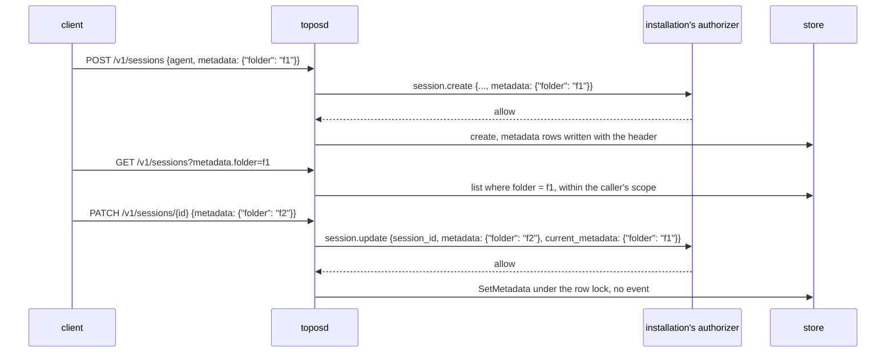

# A session's metadata in its questions and lists

## Overview

An installation often files sessions under a label of its own: a client
groups a person's conversations into folders, and an authorizer gives a
session what belongs to the folder it starts in. The core already
carries such a label: a session's `metadata`, up to `session.MaxMetadata`
entries of strings, set at create and returned on every read. Three
things keep an installation from using it:

1. **The authorizer is never told it.** The `session.create` question
   names the agent, the initiator, the repositories and the model, and
   not the metadata, so an authorizer cannot refuse a session filed under
   a label the caller may not use, or decide by the label.
2. **No list filters by it.** A client that shows one label's sessions
   pages through all of them and filters on its side.
3. **Nothing changes it.** A session filed under one label stays there
   for its life.

This spec closes the three: the create and fork questions carry
`metadata`, `GET /v1/sessions` and its summary filter by one entry, and
`PATCH /v1/sessions/{id}` takes `metadata`, a merge, asked as
`session.update` and applied without an event, as an archive is. The core
gives no key a meaning: a label is the installation's.

## Current state

- `POST /v1/sessions` takes `metadata`, a map of strings, refused past
  `session.MaxMetadata` (32) entries and checked no further
  (`internal/server/sessions.go`, the create's body check). A fork takes
  the metadata of its own body (`in.metadata = p.Metadata` in the fork
  path of the same file).
- The create's question is built in `createSession`
  (`internal/server/sessions.go`): `agent`, `agent_version`,
  `agent_owner`, `runner`, `machine`, `initiator`, `permissions`,
  `session_id`, `repositories` and `model`, and for a fork `owner`,
  `parent`, `seq` and `root`. `metadata` is not among them.
- `GET /v1/sessions` filters by `agent`, `status`, `runner`, `archived`,
  `root`, `parent` and `group` (`sessionScope` and `treeFilters`);
  `session.ListOptions` (`session/store.go`) has no member for metadata.
  `GET /v1/sessions/summary` counts under the same scope.
- `PATCH /v1/sessions/{id}` takes `model`, `policy` and `title`
  (`updateBody` in `internal/server/update.go`) and refuses an ended
  session with `conflict` before it asks anything.
- Archiving writes the header through `Archiver.SetArchived`
  (`session/store.go`, `internal/store/postgres/postgres.go`) under the
  row lock with no event, on an idle or an ended session ([[054-a-sessions-title-and-filing]]).
- The Postgres store keeps the header as JSON text in `sessions.body`
  (migration `0001_sessions`), so a filter on a metadata entry has no
  column or index to read today.

## Design



### The keys and values

A metadata entry written from this release on is checked, at create and
at a change:

| Bound | Value |
|---|---|
| a key | matches `^[A-Za-z0-9][A-Za-z0-9._-]{0,62}$`, so it can stand in a query parameter's name |
| a value | a string of at most `session.MaxMetadataValue`, 512 bytes, with no control character |
| the entries | at most `session.MaxMetadata`, 32, after a change is merged |

A key or value outside them is `invalid_request` before anything is
asked. A session created before this release keeps the metadata it has;
a change to it is checked on the merged result.

### The questions

`session.create` and `session.fork` carry `metadata`, the map the
session will hold, beside the fields they carry now, and leave it out
when the map is empty. A deny is `forbidden` and creates nothing, as
for any create. The core reads nothing back from the allow about the
metadata: it is stored as the request named it.

### The filter

`GET /v1/sessions` and `GET /v1/sessions/summary` take one filter of the
form `metadata.<key>=<value>`:

```http
GET /v1/sessions?metadata.folder=f1&archived=false&limit=50
```

- The key follows the key rule above; the value matches exactly.
- One such parameter per request. A second, a key outside the rule, or
  an empty value is `invalid_request` naming the parameter.
- It narrows the list the caller's scope already gives (the
  authorizer's `session.list` decision and the agents of the context),
  beside every other filter. With `group=tree`, the filter keeps the
  sessions it matches and the list then groups those by tree
  ([[056-editing-a-message-and-the-branches-of-a-session]]): a tree
  stands for itself when one of its sessions carries the entry.
- The authorizer's `session.list` question is unchanged: the filter
  narrows what an allow admits and widens nothing.

`session.ListOptions` gains `Metadata *MetadataEntry` (`Key`, `Value`).
Every store matches it: the memory and directory stores while they
scan, and the Postgres store through a table of its own.

### The table

Migration `0009_session_metadata`:

```sql
CREATE TABLE session_metadata (
    session_id text NOT NULL REFERENCES sessions (id) ON DELETE CASCADE,
    key        text NOT NULL,
    value      text NOT NULL,
    PRIMARY KEY (session_id, key)
);
CREATE INDEX session_metadata_entry ON session_metadata (key, value, session_id DESC);

INSERT INTO session_metadata (session_id, key, value)
SELECT s.id, m.key, m.value
FROM sessions s, jsonb_each_text(s.body::jsonb -> 'metadata') AS m(key, value)
WHERE s.body::jsonb ? 'metadata';
```

The create, a fork's copy and a change write the rows in the
transaction that writes the header, so the table and `sessions.body`
never disagree. The list joins the table on `(key, value)` and orders by
the session's id as today, so a page is one indexed read.

### The change

`PATCH /v1/sessions/{id}` takes `metadata`, a merge: a string sets the
key, `null` deletes it, and a key the body does not name is kept.

```json
{"metadata": {"folder": "f2", "pinned_from": null}}
```

- An empty object is `invalid_request`.
- The question is `session.update` with `session_id`, `metadata` (the
  change as sent, `null` included) and `current_metadata` (the value
  each named key has now, absent for a key the session does not hold),
  beside the fields a change of the model, the mode or the title adds
  when the body names those.
- An allowed change is applied by the store's new
  `Labeler.SetMetadata(ctx, id, change)` under the row lock, with no
  event, and the route answers the Session as it is after. A change that
  leaves the metadata as it was writes nothing.
- A body that names `metadata` alone is taken in every status: idle,
  running and ended. A body that names `metadata` beside `model`,
  `policy` or `title` follows those members' rule, so on an ended
  session it is `conflict` and changes nothing.
- The operator's sink receives the mutation's event of
  [[023-events-and-observability]], type `session.update`, with the
  changed keys as an attribute and no values.

### Why no event in the log

The log is the conversation and what the runner folds; a label is
where an installation files the conversation. An ended session's log
takes no more events ([[054-a-sessions-title-and-filing]]), and filing
an ended conversation is the common case. The archive set this
precedent: the header changes, the log does not.

### Decisions

| Decision | Chosen | Alternatives and why not |
|---|---|---|
| The label | the existing `metadata` | a new `labels` member: two maps of strings on one Session, and every client already reads `metadata` |
| The question names it | yes, on create, fork and change | the authorizer reading the session after the fact: a create would exist before it was refused, and a change could not be refused at all |
| The filter's form | `metadata.<key>=<value>`, one per request | `metadata=key:value`: a value may hold a colon; several filters: an intersection the core does not need, since an installation files by one key |
| Where the filter runs | a table with an index in Postgres | a JSON index on `sessions.body`: the body is text, a cast per row defeats an index, and a jsonb column means rewriting every header |
| How a change is written | the store, under the row lock, no event | a `session.metadata_changed` event: an ended log is closed, the model never reads it, and a fold gains nothing |
| The change in every status | yes, for `metadata` alone | idle only, as an archive: a person moves a conversation that is still answering, and the write touches no lease and no log |

### Roll order

1. The installation's authorizer accepts `metadata` on `session.create`
   and `session.fork`, and `metadata` with `current_metadata` on
   `session.update`, before this core sends them. An authorizer that
   checks a question's fields strictly refuses a field it does not know,
   so the core waits for it.
2. This release: the migration, the questions, the filter and the
   change. A client that sends no filter and no `metadata` in a PATCH
   sees no difference.
3. Clients file and list by a key. A client facing an older core reads
   `invalid_request` for an unknown parameter or member and hides the
   action.

## Not in this spec

What any key means, and what an authorizer decides from it: the
installation's. A filter by more than one entry, by a prefix of a value,
or by a key's absence. Metadata on an agent, which has labels of its own
([[003-manifest]]).

## Acceptance criteria

| Criterion | Test that proves it | State |
|---|---|---|
| A create's and a fork's question carry `metadata` when the session has any, and none when it has none; a deny creates nothing | `internal/server.TestTheCreateQuestionNamesMetadata`, `internal/server.TestAForkQuestionNamesMetadata` | not built |
| A key outside the rule, a value past `MaxMetadataValue` or holding a control character, and a merge past `MaxMetadata` are `invalid_request` at create and at a change, before a question | `internal/server.TestMetadataBounds` | not built |
| `GET /v1/sessions?metadata.<key>=<value>` lists only the sessions holding that entry within the caller's scope, beside the other filters and under `group=tree`; the summary counts the same set | `internal/server.TestListFiltersByOneMetadataEntry`, `internal/server.TestSummaryFiltersByMetadata` | not built |
| Two metadata filters, a malformed key and an empty value are `invalid_request` | `internal/server.TestMetadataFilterRefusals` | not built |
| Every store keeps the filter: memory, directory and Postgres | `session/storetest.TestListByMetadata` run by each store | not built |
| The migration copies existing headers' metadata into `session_metadata`, and a create, a fork and a change keep the table equal to the body | `internal/store/postgres.TestMetadataTableFollowsTheBody` (postgres tier) | not built |
| A PATCH with `metadata` merges sets and deletions, asks `session.update` with `metadata` and `current_metadata`, appends no event, and answers the Session after | `internal/server.TestPatchMergesMetadata` | not built |
| A PATCH with `metadata` alone is taken on an idle, a running and an ended session; beside `title` on an ended session it is `conflict` and changes nothing | `internal/server.TestPatchMetadataInEveryStatus` | not built |
| The sink receives the update with the changed keys and no values | `internal/server.TestMetadataChangeReachesTheSinkWithoutValues` | not built |

## Open questions

None. The core gives no key a meaning, so what a label is for, who may
use it and what follows from it are the installation's to decide.
