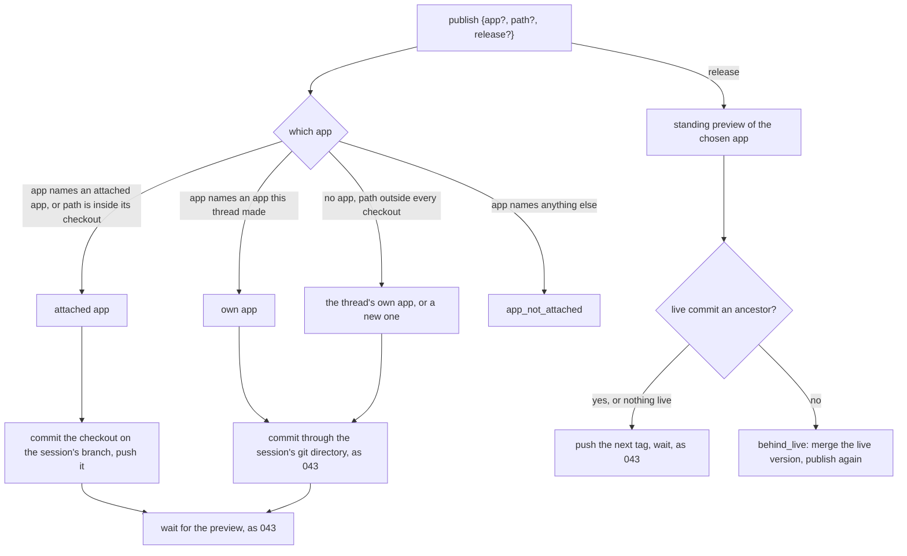

# Publishing to a chosen app

## Overview

`publish` ([[043-publishing-a-folder]]) puts a folder online as the
session's own app: the first call creates the app, each later call
publishes to the same one, and `release: true` releases the thread's
newest preview. That is all a session could do while an app was born
and kept by one session.

An allow may now attach the source of existing apps to a session, each
checked out on the session's branch at the commit the app serves
([[058-what-a-create-allow-attaches]]). A person then keeps building an
app across many sessions, and several sessions may work on the same app
at once. Three things change in the tool:

1. **The app is chosen.** `publish` takes `app`, a slug: an attached app
   or one the session made. Any other slug is refused before a request.
2. **An attached app is published from its checkout.** The tool commits
   the checkout on the session's branch and pushes that branch, so each
   publish carries the history it was built on, and a person or the
   model can merge with plain git.
3. **A release never drops another session's release.** Before it tags,
   the tool requires the app's live commit to be an ancestor of the
   commit it releases, and otherwise tells the model to merge the live
   version first.

The thread's standing preview is kept per app, so a release of one app
never takes another app's preview.

## Current state

- `Tool.Run` (`internal/publish/publish.go`) reads `path` and `release`.
  `preview` publishes through `ensureApp(c.State.App)`: the app the
  thread's last `publish` result names, or a new one named after the
  session's title.
- `push` commits the folder in a git directory of the session's own,
  `$HOME/.topos/publish/<slug>.git`, with the folder as its work tree,
  seeded from the session's branch on the app's repository when that
  branch exists, and pushes `HEAD` to `agents/<agent>/<session>`.
  `onGitHost` refuses a push URL on another host than the configured git
  host's.
- `release` takes `c.State.Standing`, the newest preview of the thread
  that is `ready` or `building` whatever its app, reads the app's
  releases, and pushes `nextTag` on that commit unless a release of it
  is listed. Nothing compares the commit with what the app serves.
- `tools.StateOf` (`harness/tools/tools.go`) folds one `App` and one
  `Standing` per thread. Spec 043 states "so a session has one app".
- The repositories an allow attaches are delivered into
  `<workdir>/<slug>` with `app` and `base` recorded
  ([[058-what-a-create-allow-attaches]]); the app host answers
  `current_deploy.commit_sha` and `latest_preview.commit_sha`.

## Design



### The input

| Field | Required | Meaning |
|---|---|---|
| `path` | no | the folder to publish, as in 043; for an attached app, its checkout or a folder inside it, default the checkout |
| `app` | no | the slug of the app to publish to or release |
| `release` | no | as in 043 |

```json
{"app": "tide-tables"}
{"app": "tide-tables", "release": true}
```

### Which app

The tool resolves the app before it makes any request:

| The call | The app |
|---|---|
| `app` is the slug of a repository resource's `app` | that attached app |
| `app` is the slug of an app a `publish` of this thread created | that app, published as 043 publishes |
| `app` is any other slug | refused: outcome `error`, `meta.publish.error.code` `app_not_attached`, no request |
| no `app`, `path` inside an attached app's checkout | that attached app |
| no `app`, `path` outside every checkout | the thread's own app as 043 finds it, created when there is none |
| `release`, no `app`, standing previews of one app | that app |
| `release`, no `app`, standing previews of several apps | refused: `app_required`, the text naming the apps that have one |

A slug outside the session's attachments and its own creations may be
an app the person owns that this session was not given; the app host
would answer it, but the session's scope was not decided for it, and a
model that guessed a slug should hear so at once rather than after a
push the git host refuses.

`app` given with a `path` outside that app's checkout is refused:
`not_in_checkout`, the text naming the checkout's directory, because
publishing an attached app means publishing its repository.

### Publishing an attached app

In the checkout, which the delivery left on the session's branch with
the session's author and the trailer hook ([[019-git]]):

1. `node_modules/` and `lost+found/` are added to `.git/info/exclude`;
   the repository's own `.gitignore` applies.
2. `git add --all` and, when anything changed, a commit
   `Publish <slug>` with the session's trailers; with nothing changed,
   the rule of 043 applies: an empty commit only when the last deploy of
   that commit failed or was canceled.
3. `git push origin HEAD:refs/heads/agents/<agent>/<session>`, after
   `onGitHost` checks `origin` against the app's `repository.push_url`
   host, as 043 checks a push URL.
4. The wait, the failure log and the result are 043's.

The session's own git directory is not used for an attached app, so a
merge, a rebase or a conflict is plain git in the checkout the model
already works in.

### Releasing

`release: true` takes the standing preview of the chosen app, the
newest of that app's previews in the thread that is `ready` or
`building`. Before the tag:

1. The tool reads the app (`GET {root}/apps/{slug}`). `current_deploy`
   `null` means nothing is live, and the tag goes ahead.
2. Otherwise, in the machine, from the checkout of an attached app or
   from the session's git directory of an own app, it fetches the live
   commit's tags and branches and runs
   `git merge-base --is-ancestor <live> <commit>`.
3. Exit 0 tags as 043 does. Exit 1 refuses the release: outcome
   `error`, `meta.publish.status` `refused`, `meta.publish.error.code`
   `behind_live`, and no tag is pushed. Any other exit is the call's
   error result with git's output, and no tag is pushed.

The text the model reads (`results/publish/behind-live-v1`), for an
attached app:

```
The release was not made: tide-tables is live at 4b1e2c0, which this
work does not include. Another session probably released it. Merge it
into tide-tables/ first:
  git -C tide-tables fetch origin --tags
  git -C tide-tables merge 4b1e2c0
Resolve any conflict, check the result, then call publish with
app "tide-tables" and, once the preview is ready, release again.
```

For an own app the same text names the session's git directory with
`--git-dir` and `--work-tree`. The person reads the refusal in the
client like any refused release ([[043-publishing-a-folder]]).

### The thread's state

`tools.State` keeps the publish results per app: `Apps` maps a slug to
the thread's last result for it and `Standing` maps a slug to its
standing preview; `App`, the thread's own app, is the last result
whose app the thread created. `session.PublishMeta` gains `attached`,
true when the app was an attached one, which is how the fold tells the
two apart. A result recorded before this release has no `attached` and
reads as the thread's own, which is what it was.

Spec 043's sentence "so a session has one app" now reads: a thread
publishes to its own app, created at its first such call, and to each
app its session's repositories attach.

### Known limit: two releases at once

The check and the tag are two steps. A second session that releases
the same app between them, a window of a few seconds, is not seen, and
the host releases the two tags in order: the later one serves, and the
work of the earlier one is not in it. The earlier one's session still
holds its commit, and its next release is refused `behind_live` until
it merges.

The host could close the window: refuse a tag whose commit does not
descend from the live commit when the tag arrives. That needs an
ancestry walk at the host on every tag and a policy on who may override
it, which belong to the app host and the installation's authorizer. The
tool already reads a refused release's reason, so a host that adds the
rule needs no change here.

### Decisions

| Decision | Chosen | Alternatives and why not |
|---|---|---|
| How the app is named | `app`, a slug, beside `path` | an app's id: the model reads slugs in the attachments block and the host's routes take slugs; the path alone: a folder outside every checkout would be ambiguous once a session has apps |
| Which slugs | attached apps and the thread's own | any slug the host answers: the session's scope was decided for its attachments, and a guessed slug would fail at the push after a wait |
| Publishing an attached app | from its checkout, on the session's branch | the session's git directory over the folder: its history starts from the session's branch, not from the live commit, so no ancestry check could pass and the model could not merge |
| Concurrent work on one app | each session on its own branch; a release refused unless the live commit is an ancestor | last release wins: one session's release silently removes another's work; a lock per app: one session would wait on another that may never release |
| Where the check runs | in the machine, with git, before the tag | at the host when the tag arrives: closes the race but needs an ancestry walk and a policy there, the alternative named above; in the runner over the git host's API: the core would learn one git host's read routes |
| A release's choice of preview | per app | the thread's newest whatever its app: a session with two apps would release the wrong one |

### Roll order

1. The app host answers `commit_sha` on `current_deploy` and
   `latest_preview` ([[058-what-a-create-allow-attaches]]). Until it
   does, the tool reads every app as having nothing live and releases
   as 043 does.
2. This release, with 058: attached apps exist only once an allow
   attaches them, so a session of an older authorizer publishes exactly
   as before.
3. Clients read `app` on each `meta.publish`, as they already do, to
   tell two apps' cards apart.

## Not in this spec

The authorizer's rules for pushing to an attached app's repository and
for releasing it; the app host's own release rules; deleting a
session's branch after its work is released; an app shared with a
person who does not own it.

## Acceptance criteria

| Criterion | Test that proves it | State |
|---|---|---|
| `app` naming an attached app publishes it; naming an app the thread made publishes that one; any other slug is `app_not_attached` with no request; a release with standing previews of several apps and no `app` is `app_required` | `internal/publish.TestWhichApp` | built |
| A `path` outside the named app's checkout is `not_in_checkout`; with no `app`, a path inside a checkout publishes that app | `internal/publish.TestWhichApp` | built |
| An attached app is committed in its checkout on the session's branch with the session's trailers and pushed to that branch; the session's git directory is not created; nothing changed pushes no new commit, as 043 | `internal/hosted.TestASessionPublishesAnAttachedApp` over the stub Cella, a stub app host and git's http backend | built |
| A release whose commit descends from the live commit tags it; one that does not is refused `behind_live` with no tag pushed and the merge commands in its text; nothing live tags at once | `internal/hosted.TestAReleaseBehindTheLiveVersionIsRefused`, `internal/publish.TestAReleaseIsCheckedAgainstTheLiveVersion` | built |
| Two sessions attached to one app each publish on their own branch; the second's release is refused until it merges the first's release, then released | `internal/hosted.TestTwoSessionsBuildOneApp` | built |
| The state keeps the last result and the standing preview per app, `attached` marks an attached app's results, and a result without `attached` reads as the thread's own | `harness/tools.TestStateOfFoldsPublishPerApp` | built |
| A model told its release was refused `behind_live` merges the live version and releases | a task of the suite ([[025-task-suite]]) against a stub app host | not built |

## Open questions

None. Whether a release that drops another's work should be allowed at
all, and who may override the check, are the app host's and the
installation's rules; the tool's check only keeps the core from doing
it unasked.

## Outcome

Built on 2026-10-07, in no release yet, and not yet run against a live
app host. Every criterion but the task of the suite has its test; the
task is not built, as for [[043-publishing-a-folder]]. What shipped
differs from the draft in these points:

- **The push goes to the attached repository, not to `origin`.** The
  checkout's `origin` is whatever a command in the machine last set, so
  the tool pushes the session's branch, and fetches and pushes tags, to
  the URL the session's header holds, which the authorizer attached,
  after `onGitHost` checks both that URL and the app's
  `repository.push_url`. The model's merge text still says `origin`,
  which the delivery set to the same URL.
- **A refusal before any request names no app.** `app_not_attached`,
  `app_required` and `not_in_checkout` answer `meta.publish` with
  `error.code` and `app` empty, so the thread's state folds no app from
  a slug the model guessed; a client reads `"app": ""` there. Every
  result of an attached app, a refused release and a failure after the
  app was read included, carries `attached`, so no attached app is ever
  folded as the thread's own.
- **The texts.** The tool's description is `tools/publish-v2`, which
  names `app` and the live-release check; the four new results are
  `results/publish/not-attached-v1`, `app-required-v1`,
  `not-in-checkout-v1` and `behind-live-v1`. The own app's
  `behind_live` text names the session's git directory and the app's
  push URL with a `<folder>` placeholder, since a result does not
  record the folder published.
- **The check's fetches.** The check fetches the commit to release when
  the repository no longer holds it, every tag by refspec (a fetch of
  `--tags` with no refspec asks for the remote's `HEAD`, which an app
  repository only sessions pushed to does not have; the 043 test's
  second release found it), and the live commit itself when no tag
  brought it. The check is skipped when nothing is live, when the live
  commit is the one released, and when the host already lists a release
  of the commit, which the tool then waits on.
- **The standing preview is per app**, in `tools.State.Standing`, a map
  by slug, and `tools.State.Apps` holds each app's last result.
  `tools.State.App` stays the thread's own app.
- **Where an attached app's checkout starts.** With nothing live, a
  checkout starts at the app's newest ready preview, which may be
  another session's unreleased work; that is the delivery of
  [[058-what-a-create-allow-attaches]], and the two-session test opens
  both machines before either publishes to show the refusal and the
  merge.

