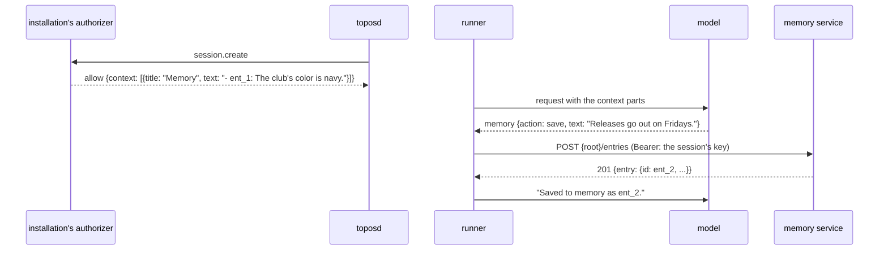

# The memory tool

## Overview

A person who works with an agent over many sessions tells it the same
things again: a preference, a name, a decision taken last week. An
installation can keep such facts as short entries, scoped to whatever
the installation groups sessions by, and give a session the entries
of its group when it starts ([[058-what-a-create-allow-attaches]]).
What the agent lacks is a way to add to them: to save a fact it learned,
to correct one, and to forget one it was told to forget.

This spec adds one opt-in tool, `memory`, that sends each such change
to a memory service the installation configures, with the session's own
key, the way `web_search` sends a query to its search service
([[047-web-search]]). The core defines the contract and names no
service. Which entries a session reads and writes is the service's
answer, decided from the key that calls it: the core sends no scope.

## Current state

- No tool reaches a memory service, and no variable names one.
- Spec 020 ([[020-memory-stores]]), drafted and not built, describes
  memory stores: documents in a directory or a storage service, synced
  by the runner into a directory of the machine and written with the
  file tools, `memory_sync` its one tool, `TOPOS_MEMORY_BACKEND`,
  `TOPOS_MEMORY_DIR` and its storage backend's URL its variables, and
  `context/memory-v1` its context line. `harness/request.go` renders a
  `PartMemory` with that template; nothing produces one yet.
- `web_search` (`harness/tools/websearch.go`, `harness/search`,
  `internal/websearch`) is the pattern this spec follows: an opt-in
  built-in in `tools.OptIn()`, a contract package that dials nothing,
  toposd's HTTP client of it, and a credential asked at each call: the
  session's own model key when the installation mints session keys
  (`TOPOS_SESSION_KEYS_URL`), else `TOPOS_SEARCH_KEY`. `internal/hosted`
  adds it to the registry when the agent names it.
- An allow of `session.create` may carry `context` parts, which the
  model reads after the instructions for the session's life
  ([[058-what-a-create-allow-attaches]]).

## Design



### Relation to memory stores

Spec 020's stores and this tool are two shapes, and an installation may
offer either or both. A store holds documents the agent reads and
writes as files in its machine, synced by the runner with version
preconditions; it suits notes, references and long material. An entry
is one short statement a service keeps, read at the session's start and
changed one at a time by a call; it suits facts about the person and the
work. The names do not overlap: the tools are `memory_sync` and
`memory`, the variables `TOPOS_MEMORY_BACKEND`, `TOPOS_MEMORY_DIR` and
020's backend URL against `TOPOS_MEMORY_SERVICE_URL` and
`TOPOS_MEMORY_SERVICE_KEY`, the templates `context/memory-v1` against
`tools/memory-v1` and `results/memory/`. A later spec may build 020's
documents over a service; this one does not wait for it.

### The tool

| Name | Parallel | Effect | Input | Limits |
|---|---|---|---|---|
| `memory` | no | `write` | `action`, `id`, `text` | the bounds below |

| Field | Required | Meaning |
|---|---|---|
| `action` | yes | `save` a new entry, `update` an entry's text, `forget` an entry, or `list` the entries as the service holds them now |
| `id` | for `update` and `forget` | the entry's id, as the context or a `list` shows it |
| `text` | for `save` and `update` | the entry, one statement, 1 to `MaxEntryLength` characters |

```json
{"action": "save", "text": "Releases of the tide tables go out on Fridays."}
{"action": "update", "id": "ent_01JA…", "text": "Releases go out on Thursdays from November."}
{"action": "forget", "id": "ent_01JA…"}
```

| Constant | Value | Bounds | Why this value |
|---|---|---|---|
| `MaxEntryLength` | 2000 characters | `text` | the contract's ceiling; a service bounds entries lower with a refusal whose sentence the model passes on |
| `MaxListed` | 200 | the entries a `list` result shows | a list past it is cut with a line saying so |
| `Timeout` | 15 seconds | one call | a service writes one row |
| `MaxResponseBody` | 1 MiB | one answer | |

The bounds are constants of `harness/memory`; the schema and the
description are rendered from them.

The description tells the model what memory is for and what it is not:
save a lasting fact the person stated or a decision taken, never a
secret, a credential or a passing detail of the task; the entries this
session started with are in its context under the title the
installation gave them, and `list` reads the current ones; forget what
the person asks to be forgotten.

### The contract

Under `TOPOS_MEMORY_SERVICE_URL`, `{root}`:

| Request | Answer |
|---|---|
| `GET {root}/entries` | `200 {"entries": [{"id", "text", "updated_at"}]}`, newest first |
| `POST {root}/entries` with `{"text"}` | `201 {"entry": {"id", "text", "updated_at"}}` |
| `PATCH {root}/entries/{id}` with `{"text"}` | `200 {"entry": {...}}` |
| `DELETE {root}/entries/{id}` | `204` |

```http
POST <TOPOS_MEMORY_SERVICE_URL>/entries
Authorization: Bearer <credential>
Content-Type: application/json

{"text": "Releases of the tide tables go out on Fridays."}
```

- An `id` is the service's, opaque to the core, at most 128 characters
  of `[A-Za-z0-9_-]`; the core refuses to send another.
- A refusal is a 4xx with `{"error": {"code", "message", "details"}}`.
  `message` is one sentence for the person whose session called, and
  the model reads it as the result; `code` goes to the result's meta as
  `refusal` and is not shown to the model. A 404 on `update` or `forget`
  is a refusal like any other: the entry is gone.
- A 4xx without the envelope, a 5xx, a body that does not decode or
  passes `MaxResponseBody`, and a timeout are failures:
  "Memory could not be reached: <detail>."
- Unknown members are ignored.
- The service decides everything the core does not: which entries the
  credential reaches, who may write them, how many there may be, how
  long each may be, and how long they are kept. A service that scopes
  entries by a group of sessions never lets one session's key reach
  another group's entries; the core cannot check this and sends no
  group.

### The credential

As [[047-web-search]]'s, asked at each call:

| The installation | The credential |
|---|---|
| mints session keys (`TOPOS_SESSION_KEYS_URL`) | the session's own key for the runner's workload, from the drive's token source |
| mints none, `TOPOS_MEMORY_SERVICE_KEY` set | `TOPOS_MEMORY_SERVICE_KEY` |
| mints none, no key set | none, for a service that admits the installation by its network alone |

[[018-credentials-and-secrets]] gains the third address the session's
key goes to: the model URL, the search URL and the memory service URL,
each the operator's setting and none an agent's choice. The sandbox's
key is never sent: the call is the runner's. `TOPOS_MEMORY_SERVICE_KEY`
is refused beside `TOPOS_SESSION_KEYS_URL`, as `TOPOS_SEARCH_KEY` is.

### Entries at the start

The tool does not read the entries when a session starts. An
installation that keeps entries for a session's group puts them in a
`context` part of its allow ([[058-what-a-create-allow-attaches]]),
each with its id, so the model can `update` or `forget` one without a
`list` first and the session's prompt prefix stays fixed for its life.
A change the session makes is in its own results, which the model reads;
another session's change made meanwhile is seen through `list`.

### The decision on a call

`memory` changes nothing in the machine and nothing the agent did not
state in the call, and the person can read and remove every entry
through the installation. The risk score gives it its own feature,
`memory`, at 0.1, as `memory_sync` has; the verdict allows it in
`confirm` and `progressive` with the reason "a memory entry the person
can review", and `plan` blocks it, as every write. An installation that
wants each change confirmed names `memory` in `always_confirm`, which
its authorizer can carry on the session's create
([[012-permissions-and-approvals]]).

### The result

| Action | Text the model reads | `meta.memory` |
|---|---|---|
| `save` | "Saved to memory as <id>." | `{"action": "save", "id"}` |
| `update` | "Updated <id>." | `{"action": "update", "id"}` |
| `forget` | "Forgot <id>." | `{"action": "forget", "id"}` |
| `list` | the entries, one per line with their ids, or "Nothing is remembered." | `{"action": "list", "count"}` |
| a refusal | the service's `message` | `{"action", "id"?, "refusal": code}` |

`meta.memory` is `MemoryResultMeta` in the API document, so a client can
show that memory changed. The entry's text is in the call's input, in
the session's log, and leaves with the session's deletion; the entry
itself is the service's and stays until it is forgotten there.

### Where it is offered

- `harness/tools` gains `NameMemory` and `Memory(Rememberer)`, and
  `OptIn()` names it beside `web_search`: an agent holds it only by
  naming it, so the digest of an agent that names no tools is unchanged.
- `internal/hosted` and `topos run` add it to the registry when the
  agent names it and `TOPOS_MEMORY_SERVICE_URL` is set, as `publish` is
  offered only on an installation with an app host; a spawned thread
  holds it when its agent names it.
- The manifest takes `memory` by its name alone.
- The task suite offers it to a task that names it, with a fixed memory
  service, and its instruction test is `test/tasks/instructions/memory`.

### Configuration

| Variable | Read by | Default | Meaning |
|---|---|---|---|
| `TOPOS_MEMORY_SERVICE_URL` | `serve`, `runner`, `topos run` | unset | the memory service's root: an absolute http or https URL; malformed stops the start; unset, no session is offered `memory` |
| `TOPOS_MEMORY_SERVICE_KEY` | `serve`, `runner`, `topos run` | unset | the bearer when the installation mints no session keys; needs the URL; refused beside `TOPOS_SESSION_KEYS_URL` |

Both join spec 002's table and the configuration page.

### Decisions

| Decision | Chosen | Alternatives and why not |
|---|---|---|
| The shape | entries a service keeps, changed one call at a time | 020's stores: documents synced into a machine with version preconditions, unbuilt, and a sync for one sentence; a file the agent edits in its working directory: lost with the machine, and the person cannot review it |
| The service | a contract this spec defines | a client of one product: a public core would carry one installation's API |
| The scope | the service's, from the credential | a group id in each call: the core would carry a label it cannot verify, and a model could name another group's |
| The credential | the session's own key, else a static key | a session token for a new audience: an installation without an identity provider would have none, as 047 found |
| Entries at the start | the allow's `context` | a read by the runner at the first request: one more call before the first answer, and the entries would need a log event so that every runner renders the same prompt |
| The verdict | allowed in `confirm`, blocked in `plan`, confirmable through `always_confirm` | asked in `confirm` as an external call: a person would answer a prompt for every fact the agent notes, and the entry is theirs to review and remove anyway |
| The name | `memory` | `remember`: forgetting and updating are the same tool's; `memory_entries`: longer, and the model reads the tool's name |

### Roll order

1. The memory service and the installation's authorizer: the service
   admits a session's key and decides each change; the authorizer puts
   the session's entries in its allow's `context`. Neither needs the
   core to have the tool.
2. This release: the tool, the contract package, the client, the
   variables.
3. The installation sets `TOPOS_MEMORY_SERVICE_URL`, and its agents
   name `memory`.

## Not in this spec

What an entry may say and how many a group holds: the service's. The
person's own reading and editing of entries, which the installation
serves. Searching entries by meaning. Spec 020's stores.

## Acceptance criteria

| Criterion | Test that proves it | State |
|---|---|---|
| The tool's schema and description are rendered from its constants; `save` and `update` without `text`, `update` and `forget` without `id`, an id outside the rule and a text past `MaxEntryLength` are refused before a request | `harness/memory.TestTheBounds`, `harness/tools.TestMemoryInput` | not built |
| The client sends each action as the contract says with the credential its function answers, and reads entries, refusals, failures, a body past the bound and a timeout as the contract says | `internal/memoryservice.TestTheClient`, `internal/memoryservice.TestTheClientsFailures` | not built |
| A hosted session calls with its own key, asked at each call; an installation without session keys sends `TOPOS_MEMORY_SERVICE_KEY`; the sandbox's key is never sent | `internal/hosted.TestMemoryCredential` | not built |
| `TOPOS_MEMORY_SERVICE_URL` is checked at start, `TOPOS_MEMORY_SERVICE_KEY` is refused without it and beside `TOPOS_SESSION_KEYS_URL`, and both are in spec 002's table | `internal/config.TestMemoryServiceVariables`, `internal/config.TestConfigurationTableMatchesTheSpec` | not built |
| `memory` is offered only when the agent names it and the URL is set; the default set and an agent's digest are unchanged; the manifest takes it by name | `internal/hosted.TestMemoryIsOfferedWhenConfigured`, `manifest.TestMemoryIsAKnownToolName` | not built |
| A call scores 0.1 with the feature `memory`, is allowed in `confirm` and `progressive`, blocked in `plan`, and asked when `always_confirm` names it | `harness.TestTheMemoryVerdict` | not built |
| Each result carries `meta.memory`, a refusal its `refusal` code, and the text the model reads is the table's | `harness/tools.TestMemoryResults` | not built |
| A model told a lasting fact saves it, and one asked to forget an entry in its context forgets that id | a task of the suite ([[025-task-suite]]) against a fixed memory service | not built |

## Open questions

None. What is remembered, for whom and for how long are the memory
service's and the installation's decisions; the core fixes only the
contract, the credential and how a call is decided in the session.
