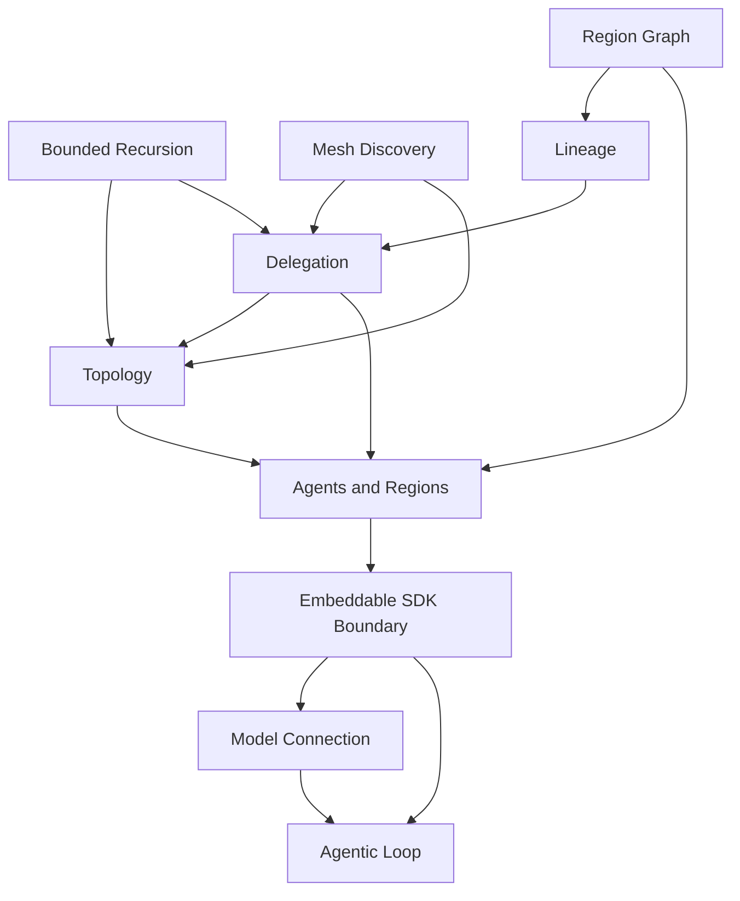

# Topos Design Specs

These are retrospective design specs for the Topos runtime as it exists today.
Topos is an embeddable Go agent runtime: a host application imports the root
`topos` package, defines agents, composes them into regions, and runs a single
region or a graph of regions locally and in-process. The specs here document the
public capabilities the runtime ships, so a developer can see the whole shape
before reading code.

All specs are `status: complete` and end with an Outcome section pointing at the
packages that implement them.

## Big picture

The supported surface is the root `topos` package. A host builds a `Runner` from
`Options`, hands it a `Region` (an entry agent plus peers) and a task string, and
gets back a `RunResult`: the agent's final text and a deterministic lineage graph
of everything that ran. To compose several regions into one run, a host hands
`Runner.RunGraph` a `Graph` of regions wired by data-flow edges instead.

Underneath the root package sits an engine made of public but advanced subpackages:

- A native agentic loop (`runtime/loop`) that drives one agent's turns: prompt
  the model, stream the reply, run any tool calls, repeat until the model is done.
- A provider-agnostic model seam (`models`) with adapters, selected by the host
  through `ModelOptions`. The model connection can go through Lux, the model
  gateway, so provider secrets stay out of the host application.
- A tool registry (`harness/tools`) whose one built-in is `bash`. When an agent
  is allowed to hand work off, a `delegate` tool is injected into its registry.
- A spawner (`harness`) that derives a sub-agent with attenuated authority (a
  strict subset of its parent's tools and scopes) and enforces a recursion bound.
- A sandbox abstraction (`sandbox`) with a local, temp-directory implementation
  (`sandbox/local`) so a run needs no external services.

Two autonomy modes decide how a region routes work. `Pinned` runs a deterministic
chain (entry, then each peer in order). `Dynamic` gives the entry agent a directory
of peers and a `delegate` tool, and lets the model choose whom to hand off to. Two
topologies decide who may delegate: `OrchestratorWorker` (default, only the entry
delegates) and `Mesh` (any agent may delegate again, bounded by `MaxHandoffDepth`).

## How to read these specs

Start with the embeddable SDK boundary, then the agent and region model, then the
delegation and topology mechanics, then the supporting engine specs.

- [Embeddable SDK Boundary](runtime/embeddable-sdk.md): the root package surface a
  host depends on.
- [Agents and Regions](runtime/agents-and-regions.md): `AgentSpec`, `Region`, and
  the `Pinned` vs `Dynamic` autonomy modes.
- [Region Graph](runtime/region-graph.md): composing several regions into one run
  with `Graph` and `Runner.RunGraph`.
- [Topology](runtime/topology.md): `OrchestratorWorker` vs `Mesh`.
- [Delegation as Agents-as-Tools](runtime/delegation.md): the `delegate` tool and
  attenuated authority.
- [Bounded Recursion](runtime/bounded-recursion.md): `MaxHandoffDepth` and the
  recursion gate.
- [Mesh Discovery](runtime/mesh-discovery.md): the peer directory injected into a
  dynamic agent's prompt.
- [Deterministic Lineage](runtime/lineage.md): the renderable run graph.
- [Model Connection](runtime/model-connection.md): `ModelOptions` and the model
  gateway.
- [Agentic Loop](runtime/agentic-loop.md): the turn driver, tool registry, model
  seam, and sandbox interface.
- [Cella Sandbox Provider](runtime/sandbox-cella.md): backing the sandbox
  interface with hosted Cella compute.
- [Sandbox Credential Delivery](runtime/sandbox-credentials.md): delivering
  vault secrets into a sandbox without plaintext.

## Dependency view

