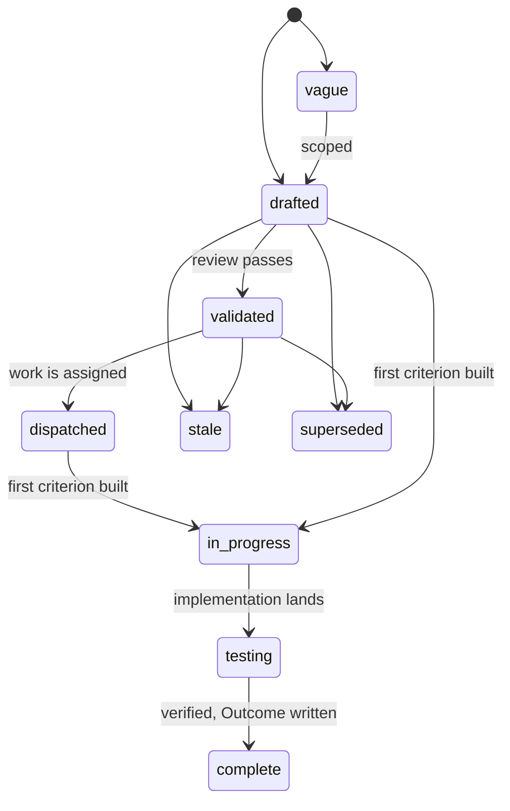
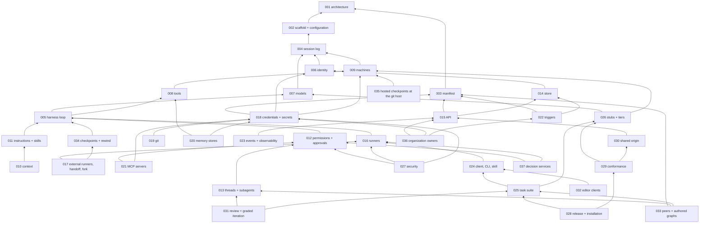

# Specs

Design specs for Topos, an open source agent core: agent definitions
and the sessions people have with them, the loop that runs an agent,
and the movement of a session between the machines a person uses. It is
built from three parts over one session schema: the harness, a library
that runs one agent's loop; the session log, the append-only record
every part reads and writes; and the runner, the process that holds a
session's lease and drives the harness. One spec covers one component.
Each states the problem, the design with enough precision to build
from, and acceptance criteria that are testable statements. Spec 001
fixes the architecture and the invariants every other spec assumes;
read it first. Spec 004 is the schema everything else reads and writes,
and spec 005 is the loop. Spec 002 is the configuration reference:
every `TOPOS_*` variable an operator sets is in its table, with the
spec that owns its behavior.

## Layout

Flat files `specs/NNN-name.md` in one number space with `track: core`
in the frontmatter. Numbers are stable identifiers and are never
reused; the specs of the v0.7.0 runtime this core replaces are kept
under `docs/history/specs/` and are cited as "v0.7.0 spec NNN". Open
specs sit here and are the work queue. A terminal spec moves to
`specs/.archive/` keeping its number, so `depends_on` paths keep
resolving.

## Lifecycle

```mermaid
stateDiagram-v2
  [*] --> vague
  [*] --> drafted
  vague --> drafted: scoped
  drafted --> validated: review passes
  validated --> dispatched: work is assigned
  dispatched --> in_progress: first criterion built
  drafted --> in_progress: first criterion built
  in_progress --> testing: implementation lands
  testing --> complete: verified, Outcome written
  drafted --> stale
  validated --> stale
  drafted --> superseded
  validated --> superseded
```

`in_progress` is written `in-progress` in the frontmatter. A spec's
status follows its own acceptance criteria: it is `in-progress` once
one of them is built, and it moves to `complete` when every one has a
passing test in the tree or a recorded run and its Outcome section
records every divergence. `depends_on` records the order the design
builds in, and review holds work to it; a dependency's status does not
set a spec's own. `stale` marks a spec the code has moved past;
`superseded` one whose work moved to another spec.

## Index

| # | Spec | Effort | Status | Builds on |
|---|---|---|---|---|
| [001](.archive/001-architecture.md) | Architecture: three parts over one session schema, the packages, extension points, invariants | medium | complete | - |
| [002](.archive/002-scaffold-and-configuration.md) | Scaffold and configuration reference: layout, the toposd roles, listeners, every TOPOS_* variable | small | complete | 001 |
| [003](.archive/003-manifest.md) | manifest/v1: the Agent, Trigger, MemoryStore and Connection kinds, references, versioning, one resolver | large | complete | 001 |
| [004](.archive/004-session-log.md) | The session log: schema v1, event types, status and stop reasons, the fold, the directory store | large | complete | 001, 002 |
| [005](005-harness-loop.md) | The harness loop: turns and steps, stops, output limits, retries, interrupt, validation, parallel calls | large | in-progress | 001, 004, 007, 008 |
| [006](.archive/006-identity.md) | Identity: subjects, verification, the authorizer question, the action vocabulary, the owner policy, the local issuer | medium | complete | 001, 002, 004 |
| [007](.archive/007-models.md) | Models: the connection, the IR in the log, llmdialect's codecs, raw capture, cost and the budget | large | complete | 001, 002, 004 |
| [008](008-tools.md) | Tools: the built-in set, schemas and descriptions, paths, output caps and spill files, the repeat rule | large | in-progress | 001, 004, 009 |
| [009](.archive/009-machines.md) | Machines: the Machine interface, the host directory and its worktrees, the Cella sandbox | large | complete | 001, 002, 004 |
| [010](010-context.md) | Context: the order of the prompt's parts, cache breakpoints, token accounting, clearing, compaction | medium | in-progress | 004, 005, 007, 011 |
| [011](011-instructions-and-skills.md) | Instructions and skills: the versioned harness prompt, the context block, project instruction files, Agent Skills | medium | in-progress | 004, 005, 009 |
| [012](012-permissions-and-approvals.md) | Permissions, approvals and hooks: the boundary, the layers, the risk score and verdict, the modes | large | in-progress | 001, 004, 005, 008, 009 |
| [013](013-threads-and-subagents.md) | Threads, subagents and the advisor: the session's graph, spawn and message, worktree isolation, narrowing, depth | large | in-progress | 001, 004, 005, 008, 009, 012 |
| [014](.archive/014-store.md) | The server's store: the Postgres schema, toposd on the directory store, the blob store, retention and deletion | medium | complete | 002, 004, 006 |
| [015](015-api.md) | The API: every route under /v1, streaming, errors, paging, idempotency, the OpenAPI document | large | in-progress | 003, 004, 006, 014 |
| [016](016-runners.md) | Runners: driving a session, recovery of a step without results, the queue, claim, renew and release | large | in-progress | 001, 002, 004, 005, 008, 009 |
| [017](017-external-runners-handoff-fork.md) | External runners, handoff and fork: the append route, the writer rule, the inbox, moving a session's writer | large | in-progress | 004, 016, 034 |
| [018](018-credentials-and-secrets.md) | Credentials, connections and secrets: write-only credentials, the agent's identity and its session tokens, injection outside the machine, scrubbing, named secrets, the input check, redaction, session scope | large | in-progress | 001, 002, 003, 004, 006, 009 |
| [019](019-git.md) | Git in a session: repositories as inputs, plain git in the sandbox, the token at the egress gateway, ref rules, attribution, the git cache | medium | in-progress | 001, 002, 004, 009, 018 |
| [020](020-memory-stores.md) | Memory stores: the resource, attachment, the directory and Arca backends, sync into the machine, preconditions and conflicts | medium | drafted | 002, 003, 004, 008, 009, 018 |
| [021](021-mcp-servers.md) | MCP servers: stdio on the host and in the sandbox, streamable HTTP anywhere, tool naming, credentials | medium | drafted | 003, 008, 009, 012, 018 |
| [022](.archive/022-triggers.md) | Triggers: schedules and delivered events that start or continue sessions, filters, the message template, the session policy, the limits | medium | complete | 003, 004, 006, 014 |
| [023](023-events-and-observability.md) | Events and observability: the content-free sink, spans derived from the log, metrics | medium | drafted | 002, 004, 006, 014, 015 |
| [024](024-client-cli-skill.md) | The client, the topos command and the agent skill: the API client, print mode, the supported import set | medium | in-progress | 002, 004, 005, 016 |
| [025](025-task-suite.md) | The task suite and the release bar: tasks and checkers, the pinned model, the threshold, spend, replays, IR against SDK | large | in-progress | 005, 007, 008, 024, 026 |
| [026](026-stubs-and-tiers.md) | Stubs and test tiers: the scripted model, the stub Lux, authorizer, issuer, sink and Cella, the tiers and their tags | medium | in-progress | 002, 004, 007, 009 |
| [027](027-security.md) | Security and threat model: assets, boundaries, adversaries, and the test or invariant that holds each threat | medium | drafted | 001, 009, 012, 016, 018 |
| [028](028-release-and-installation.md) | Release, installation and running on your own: images, archives, attestations, the compose file, toposd check | medium | in-progress | 002, 006, 025, 026, 029 |
| [029](029-conformance.md) | Conformance suite: the API contract as an importable test package against any toposd | medium | drafted | 004, 006, 015, 026, 030 |
| [030](030-shared-origin.md) | Serving behind a shared origin: the base path, the public URL, trusted proxies, every URL toposd writes | small | in-progress | 002, 006, 015 |
| [031](031-review-and-graded-iteration.md) | Review and graded iteration: critic threads over an artifact, a rubric and a grader thread | large | vague | 013, 025 |
| [032](032-editor-clients.md) | Editor clients: serving a session to editors over the Agent Client Protocol | medium | vague | 004, 016, 024 |
| [033](033-peers-and-authored-graphs.md) | Peers and authored graphs: declared message edges between siblings, and graphs declared up front | large | vague | 003, 013, 025 |
| [034](034-checkpoints-and-rewind.md) | Checkpoints and rewind: each turn's working directory committed, the session repository, rewind, what fork and handoff restore | medium | in-progress | 004, 005, 009 |
| [035](.archive/035-hosted-checkpoints-at-the-git-host.md) | Hosted checkpoints at the git host: a hosted session keeps its checkpoints at its private repository, and a fork restores its files after the sandbox is gone | medium | complete | 004, 009 |
| [036](.archive/036-organization-owners.md) | Organization owners: an agent belongs to the context its first apply is made in, names and lists are the caller's context's | medium | complete | 006, 014, 015, 018, 022 |
| [037](.archive/037-decision-services.md) | Decision services: a decider seam, decisions recorded with their review probability, answers forwarded | medium | complete | 004, 005, 012, 016 |

## Dependency graph

Arrows point from a spec to the specs it builds on. The picture is the
transitive reduction of the `depends_on` edges: an arrow is drawn only
where no other path already carries it. The Builds on column above
carries each spec's literal `depends_on`.

```mermaid
flowchart BT
  S001[001 architecture]
  S002[002 scaffold + configuration]
  S003[003 manifest]
  S004[004 session log]
  S005[005 harness loop]
  S006[006 identity]
  S007[007 models]
  S008[008 tools]
  S009[009 machines]
  S010[010 context]
  S011[011 instructions + skills]
  S012[012 permissions + approvals]
  S013[013 threads + subagents]
  S014[014 store]
  S015[015 API]
  S016[016 runners]
  S017[017 external runners, handoff, fork]
  S018[018 credentials + secrets]
  S019[019 git]
  S020[020 memory stores]
  S021[021 MCP servers]
  S022[022 triggers]
  S023[023 events + observability]
  S024[024 client, CLI, skill]
  S025[025 task suite]
  S026[026 stubs + tiers]
  S027[027 security]
  S028[028 release + installation]
  S029[029 conformance]
  S030[030 shared origin]
  S031[031 review + graded iteration]
  S032[032 editor clients]
  S033[033 peers + authored graphs]
  S034[034 checkpoints + rewind]
  S035[035 hosted checkpoints at the git host]
  S036[036 organization owners]
  S037[037 decision services]
  S002 --> S001
  S003 --> S001
  S004 --> S002
  S005 --> S007
  S005 --> S008
  S006 --> S004
  S007 --> S004
  S008 --> S009
  S009 --> S004
  S010 --> S011
  S011 --> S005
  S012 --> S005
  S013 --> S012
  S014 --> S006
  S015 --> S003
  S015 --> S014
  S016 --> S005
  S017 --> S016
  S017 --> S034
  S018 --> S003
  S018 --> S006
  S018 --> S009
  S019 --> S018
  S020 --> S008
  S020 --> S018
  S021 --> S012
  S021 --> S018
  S022 --> S003
  S022 --> S014
  S023 --> S015
  S024 --> S016
  S025 --> S024
  S025 --> S026
  S026 --> S007
  S026 --> S009
  S027 --> S012
  S027 --> S016
  S027 --> S018
  S028 --> S025
  S028 --> S029
  S029 --> S026
  S029 --> S030
  S030 --> S015
  S031 --> S013
  S031 --> S025
  S032 --> S024
  S033 --> S003
  S033 --> S013
  S033 --> S025
  S034 --> S005
  S035 --> S009
  S036 --> S015
  S036 --> S018
  S036 --> S022
  S037 --> S012
  S037 --> S016
```

## Build order

Each phase ends in a test or a release job, not a statement.

| Phase | Specs | Exit criterion |
|---|---|---|
| 0 | 001, 002 | the scaffold's first green run of the family gate, with `TestPackagesSitInTheirTrees`, `TestRootPackagesDialNothing` and `TestNoLatereCoordinatesInReleasedArtifacts` passing in `internal/arch` |
| 1: a harness that finishes tasks | 003, 004, 005, 007, 008, 009 (host), 010, 011, 012, 013 (persistent subagents and the orchestrator), 016 (in process), 017 (local fork), 024 (local), 025, 026, 034 (host) | the release bar job of 025 passes against a real model through Lux, run by `topos` on a person's machine with no server, and the tag that closes the phase carries the pass rate in its release notes |
| 2: the server | 006, 014, 015, 016 (server), 022, 023, 024 (client), 027, 028, 029, 030 | a self-hosted `toposd` against the local issuer and the owner policy runs the suite's tasks as server sessions on the host machine, and the release job's conformance suite passes against the released image |
| 3: hosted sessions on Cella | 009 (Cella), 018, 019, 020, 021, 034 (sandbox), 035 | the Cella tier's `TestCloudSessionPushesWithNoCredentialInSandbox`, `TestMemoryFollowsTheAgent` and `TestCellaMachineOnNamedEnvironment` pass: a hosted session pushes to a private repository with no credential in the sandbox, reads a memory store another session wrote, and runs on an Environment whose worker is outside the cluster |
| 4: external runners and handoff | 017 | the e2e tier's `TestExternalRunnerWithClientOnly` and `TestHandoffRoundTrip` pass: a program using only `client` and a key runs a session as an external runner, and one session moves laptop to cloud to laptop with an identical fold |
| 5 | 031, 032, 033, 037 | each is drafted against a caller when one exists, and then carries its own tests |

Phases run in order; specs inside a phase may run in parallel where
their `depends_on` allows. A spec that spans phases (009, 013, 016,
017, 024, 034) is dispatched once and its acceptance rows are marked by
the phase that proves them.

As of 2026-10-02 (v0.11.1), phase 0 is closed and phases 1 to 3 are
built in large part with none closed. Phase 1 is open because no
release has measured the task suite's bar against a pinned model
(025). Phase 2 is open because the conformance suite (029) and the
release job that runs it (028) are not built. Phase 3 is open because
memory stores (020) are not built and the Cella tier's three tests are
not written. Phase 4 has fork and none of the external runner or
handoff. Of phase 5, 037 is complete.

Work ran ahead of this order, so many specs are `in-progress` while
specs they build on are open; each Outcome section names what shipped
and in which release.

## Decisions across specs

| Decision | Where | Why |
|---|---|---|
| three parts over one session schema: the harness, the session log, the runner; the same three in the CLI, in an embedding application and in the server | 001 | a session written by a runner on a laptop is continued byte for byte by a runner in a cluster |
| one v1 schema, JSON-tagged, owned by `session`, for local, external and hosted sessions, with the fold from events to transcript defined once | 004 | resume, sync, handoff and memory need one substrate; two folds are two meanings |
| the log stores llmdialect's IR encoded as the Lux wire JSON, with every raw response body and a hash of every request beside it; each request is encoded by llmdialect's codec for the model's family, and Topos writes no adapter | 004, 007 | thinking signatures, redacted thinking and cache hints survive replay, and a replay proves it sent the same bytes |
| the log is append-only; redaction replaces one event's content with a tombstone and forces a compaction past it | 004, 010, 018 | a secret pasted by mistake can be removed without editing history the provider has bound thinking to |
| a step is committed by its results; a call with no result is never run again and is closed as of unknown effect, except memory sync, which carries preconditions | 005, 008, 016 | agents work through `bash`, whose effects are unknown by construction, so a per-tool effect classification would decide almost nothing |
| nothing stops silently: no step cap, an output cap whose stop is sent again at the catalog's output limit, retries with backoff, and every stop the model did not choose carries a named stop reason | 004, 005 | the runtime this replaces stopped at fixed limits and reported success; a request that asks the whole output limit reserves a small budget away |
| a server role refuses to start with no model connection or with the scripted model | 007, 026 | a silent fake model passed four months of green builds |
| one pinned model's task-suite pass rate gates every release; the threshold is the phase-1 baseline less the measured noise | 025 | agent behavior is proven by tasks finished, not lines covered |
| hosted runners are their own processes outside any sandbox; durability is the log and the lease (60 s, renewed every 15 s) | 016 | credentials stay out of the workload that runs agent-written code, and a failed runner's sessions resume within the lease |
| one writer per session; a second writer forks and nothing merges | 016, 017 | two writers' interleaved events have no meaning a fold could give them |
| an external runner appends through a documented route; messages sent to its session wait in an inbox it appends | 017 | the server cannot number an event without racing an offline writer |
| handoff and fork move through per-turn checkpoints, which exist with or without git | 017, 034 | a session with no repository rewinds, forks and hands off like one with |
| isolation and history are two things: a worktree per concurrent writer, a checkpoint chain per working directory | 009, 013, 034 | parallel sessions and threads never share a working directory, and each directory's history is kept apart from the agent's own |
| policy sits at the boundary an effect crosses, not on a command's text: the Cella sandbox, or the host's operating-system sandbox | 012 | pipes, subshells and scripts defeat any rule written against a string |
| approvals in layers, none trusted alone: hard boundaries, the organization's lists, a recorded risk score, and a verdict of allow, flag, ask or block, where ask never silently denies; modes `plan`, `confirm`, `progressive` | 012 | an agent that is refused routes around the refusal, and every decision is recorded with its score |
| authority only narrows: along spawn edges, through hooks and modes, and in the session scope; a message carries data and never authority | 012, 013, 018 | a subagent of a subagent holds a subset of a subset |
| a decision service suggests and the harness decides; every decision is recorded with the probability, fixed before the call ran, that a person sees it | 037 | an answer can be weighted, and an error rate estimated, only when that probability is known |
| a session's agents form a graph of threads, built in stages each gated by suite tasks | 013, 033 | one agent must work before several do; every stage runs on the same threads and messages |
| no credential enters a machine or a log; the runner or Cella's egress gateway injects it per call, and the runner scrubs the values it holds from tool output | 018, 019 | a sandbox runs code the agent wrote |
| an organization's agent acts with its own agent identity, a personal agent as the person narrowed to the agent; connections are chosen per connection | 018 | the shape agent platforms converged on; a session never acts with the server's own identity |
| toposd verifies and asks: the installation's authorizer decides, an unavailable one is a refusal, and the owner policy applies only when none is configured | 006 | the core decides nothing about a person |
| git is optional and plain inside the sandbox; the git host's ref rules keep an agent on its own branches | 019 | the boundary is at the git host, so no push tool is needed |
| memory stores are an API resource whose bytes live in a directory or under Arca's files plane, synced by the runner into the machine | 020 | the model reads and writes memory with the file tools, and no machine holds a storage credential |
| a trigger fires on a schedule or on an event delivered to its fire route, and the core keeps no listener, verifies no provider's signature and polls nothing | 022 | the core is not an event bus: whatever produces an installation's events delivers them, and a filter, a template and a session policy are all the core adds |
| every mutation emits one content-free event to the operator's sink | 023 | usage and audit need events; content in a sink is a second copy of every secret |
| manifests are declarative and never hold a secret; one resolver serves the CLI and the server | 003 | everything a console does is scriptable, and a file in a repository is not a vault |
| no interactive terminal in the core; `topos` is a scripting and test client | 024 | the interactive client is built on `client` and `runner` outside this module |
| Apache-2.0, a public repository, and no Latere coordinate in the tree outside the API group `topos.latere.ai/v1` | 001, 002, 028 | the sibling open cores carry the same license and the same rule |

## Conventions

- Frontmatter: `title`, `status`, `track`, `depends_on`, `affects`,
  `effort`, `created`, `updated`, `author`. Every field is required and
  the gate checks them. `depends_on` lists bare file names.
- Sections: `Overview`, `Current state`, `Design`, `Not in this spec`,
  `Acceptance criteria`, at every status; `Outcome` once complete.
- Acceptance criteria are a table `| Criterion | Test that proves it |
  State |`, each row a testable statement naming the test that proves
  it.
- Cross-references are `[[NNN-name]]` wikilinks; the gate resolves
  them.
- Every name (a variable, a route, an event type, a stop reason, an id
  prefix, an error code, a manifest field, a metric) is defined in
  exactly one spec, in a table; another spec that uses it links the
  owner.
- The session log is snake_case JSON; manifests are camelCase; the two
  never mix in one object.
- A borrowed idea cites its source: "v0.7.0 spec NNN" for the runtime
  this core replaces, "the retired hosted service" for the control
  plane that preceded it.
- Diagrams are Mermaid. Tables carry exact values.
- No em dashes. American spelling. Wording is for a reader outside the
  project: `Environment`, `sandbox`, `workspace`, `worker` and `pool`
  are Cella's words in Cella's meaning, `worktree` is git's, and
  region, autonomy, topology, mesh, peer card and directory in their
  v0.7.0 sense are retired.
