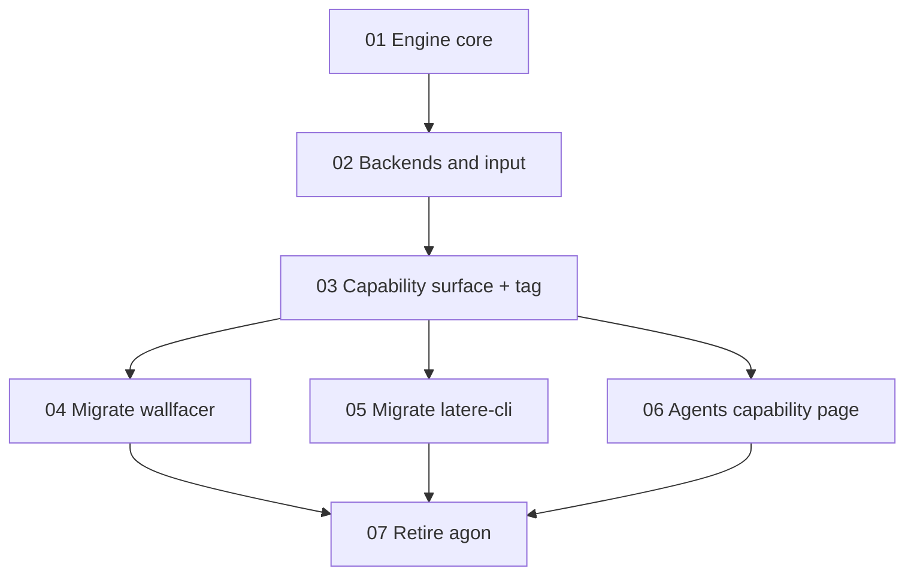
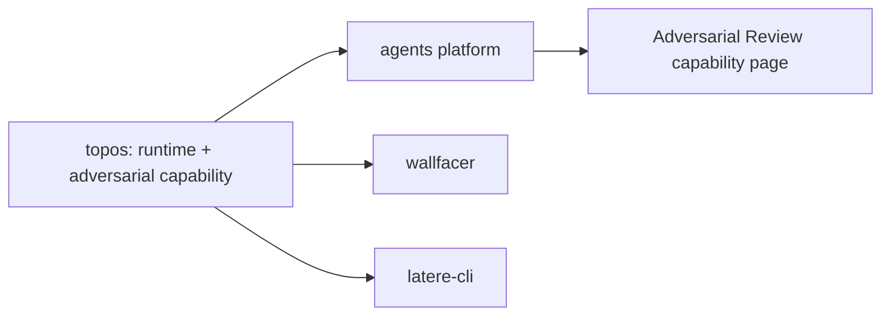

# Adversarial Review as a Topos Capability

## Goal

Make Topos the single home for adversarial review, and remove `agon` from the
Latere landscape entirely. Today adversarial review ships as a standalone module
(`latere.ai/x/agon`) with its own repo, brand, and site (`agon.latere.ai`). That
module already depends on Topos for its native critic backend, so the current
dependency arrow points the wrong way: a specialization of the Topos runtime sits
above it and imports it.

This program inverts that arrow. The engine, protocol, interfaces, and backends
move into Topos under an `adversarial/` capability namespace. Every consumer
(wallfacer, latere-cli, and the agents platform) then imports the capability from
Topos and drops its `agon` dependency. When the program completes, no repository,
module, site, or identifier named `agon` remains.

The endpoint is verifiable, not aspirational. The retirement spec
([07 Retire agon](07-retire-agon.md)) defines the teardown as a set of grep and
deploy checks that must all come back empty.

## Why Topos is the right host

Adversarial review is not a peer of the runtime; it is a use of it. A proposer
agent and one or more critic agents cross-examine a diff over bounded rounds, with
per-fork lineage. That is a Topos topology: multi-agent spawning with attenuated
authority and a deterministic lineage graph, which is exactly what Topos already
provides. Folding the capability in does three things at once:

- **Corrects the dependency.** `agon -> topos` becomes internal to Topos. No cycle,
  no cross-module version pinning between the two.
- **Collapses the maintenance surface.** Consumers pin one module (Topos) instead
  of pinning `agon` and transitively Topos. One release cadence, not two.
- **Puts the capability in the platform's own vocabulary.** Adversarial review
  becomes a Topos capability with a thin, named surface, and its product story
  moves onto the agents platform as a capability page rather than a standalone
  site.

This is a migration, not a rewrite. The working debate engine (forks, rounds,
attack ledger, concession handling) moves in as-is and is wrapped thinly as a
capability. Reimplementing the debate loop on top of Topos regions is explicitly
out of scope; it is a separate, riskier effort that this program does not attempt.

## Naming

The capability is **Adversarial Review**. The removal of `agon` is a total scrub:
no user-facing surface, on-disk path, or internal identifier keeps the word.

| Surface                       | Before                         | After                                  |
| ----------------------------- | ------------------------------ | -------------------------------------- |
| Go package                    | `pkg/adversarial`              | `adversarial` (unchanged name, new home) |
| Import path                   | `latere.ai/x/agon/pkg/...`     | `latere.ai/x/topos/adversarial/...`    |
| CLI command                   | `latere agon`                  | `latere review`                        |
| Agents capability page        | `agon.latere.ai`               | "Adversarial Review" page in agents    |
| On-disk session artifacts     | `.agon/sessions/<id>/`         | `.topos/review/sessions/<id>/`         |
| wallfacer runtime gate        | `AgonEnabled` / `SetAgon`      | `ReviewEnabled` / `SetReview`          |
| wallfacer verifier ctor       | `NewAgonVerifier`              | `NewReviewVerifier`                    |
| wallfacer config key          | `"agon"`                       | `"review"`                             |

The Go package keeps the name `adversarial` (it is already named that today and
carries no `agon` string). The word `agon` disappears from command names, config
keys, on-disk paths, exported symbols, and comments.

Two of these renames touch a wire or on-disk contract and need a compatibility
call inside their spec, not here: the wallfacer `"agon"` config key
([04](04-migrate-wallfacer.md)) and the `.agon/sessions/` directory a running
deployment may already hold ([04](04-migrate-wallfacer.md),
[05](05-migrate-latere-cli.md)).

## Target layout

Everything lands under a single `adversarial/` tree in the Topos module, kept
deliberately separate from the core runtime packages (`runtime/`, `models/`,
`harness/`, `sandbox/`) so the provider-agnostic core stays clean. The Claude-CLI
and transcript pieces are Claude-Code-specific and live in clearly namespaced
subpackages, never in the core.

```
topos/adversarial/
  adversarial.go        engine API: Proposer, Critic, Verifier, Summary, CriticInput
  engine.go             the multi-fork debate orchestrator
  assemble.go           prompt assembly
  review.go             thin capability entrypoint (adversarial.Review)   [03]
  internal/             debate internals, importable only within adversarial/
    agent/ critic/ ledger/ round/ state/ summary/
  claude/               Claude-CLI proposer + critic backend (subprocess fork)
  critic/               Topos-native critic (was pkg/adversarial/topos)
  input/                Claude transcript locator + working-tree diff
```

The `internal/` packages move under `adversarial/internal/`, which Go visibility
restricts to importers under `adversarial/`. That keeps the debate internals
private to the capability exactly as they are private to `agon` today.

Naming note: the native critic backend is `latere.ai/x/agon/pkg/adversarial/topos`
today. Inside the Topos module that path would read `topos/adversarial/topos`,
which is confusing, so it is renamed to `adversarial/critic`.

## Consumer usage today

The boundary below is what the consumers actually import, verified by grep. It
determines what must move and what may stay behind.

| Package                        | wallfacer | latere-cli | agents |
| ------------------------------ | :-------: | :--------: | :----: |
| `pkg/adversarial` (engine)     | yes       | yes        | no     |
| `pkg/adversarial/claude`       | yes       | yes        | no     |
| `pkg/adversarial/input`        | no        | yes        | no     |
| `pkg/adversarial/topos` critic | no        | yes        | no     |

wallfacer uses the engine plus the Claude proposer, and supplies its own critic
(`wallfacer/internal/adversarial/harness_critic.go`) rather than the native one.
latere-cli uses the whole stack for the `latere agon` command. The agents platform
imports none of it yet; it is the future host of the capability page. Because the
Claude backend has two consumers, it moves into Topos rather than down into any one
consumer.

## Migration DAG and release ordering

Topos must ship the capability and cut a tag before any consumer can bump off
`agon` (wallfacer pins `agon v0.1.2`, latere-cli pins `agon v0.1.3`). The order
below respects that.



1. [01 Engine core](01-engine-core.md). Move the backend-agnostic engine,
   protocol, interfaces, `Summary`, and `internal/*` into `adversarial/`. No
   backends. Topos builds; ported engine tests pass; `adversarial/` imports no
   `x/agon`.
2. [02 Backends and input](02-backends-and-input.md). Move the Claude backend,
   the native critic (renamed to `adversarial/critic`), and `input` into
   `adversarial/{claude,critic,input}`. Backends wire to the core; tests pass.
3. [03 Capability surface](03-capability-surface.md). Add the thin
   `adversarial.Review` entrypoint and wire the capability into `specs/README.md`.
   Cut the Topos release tag that carries the capability. This tag unblocks 04-06.
4. [04 Migrate wallfacer](04-migrate-wallfacer.md). Repoint imports to Topos, bump
   Topos, drop `x/agon`, apply the total-scrub renames (`ReviewEnabled`,
   `NewReviewVerifier`, config key, `.topos/review/`).
5. [05 Migrate latere-cli](05-migrate-latere-cli.md). Repoint imports, rename the
   command to `latere review`, drop `x/agon`, rename the on-disk directory.
6. [06 Agents capability page](06-agents-capability-page.md). Add the "Adversarial
   Review" capability page in the agents platform, backed by
   `topos/adversarial`. This is where the standalone story is replaced.
7. [07 Retire agon](07-retire-agon.md). Tear down `agon-web` and `agon.latere.ai`,
   archive the `latere.ai/x/agon` repository, and verify no trace remains.

Steps 04, 05, and 06 are independent of each other once 03 tags; they may proceed
in parallel. Step 07 is the barrier: it may only run after 04, 05, and 06 land,
because it archives the repo the earlier steps migrate away from.

## Definition of done

The program is complete when all of the following hold. These are the acceptance
checks [07](07-retire-agon.md) automates.

- `grep -rl "latere.ai/x/agon" ../*/go.mod` returns nothing across every Latere
  repo.
- `grep -rniw agon ../{topos,wallfacer,latere-cli,agents}` returns nothing in
  source, config, docs, or deploy manifests (total scrub).
- `agon.latere.ai` no longer serves; its Terraform and `agon-web` deployment are
  removed.
- The `latere.ai/x/agon` repository is archived.
- Adversarial review still works end to end: `latere review` runs locally, and
  wallfacer's post-run verification runs, both against `topos/adversarial`.

## Diagram

End-state dependency shape. Topos owns the capability; the three consumers import
it from Topos and nothing imports `agon`.



## Outcome

To be written as the child specs land. This overview is the contract for the
program: the target layout, the naming decision, the DAG, and the verifiable
teardown that defines when `agon` is gone.
