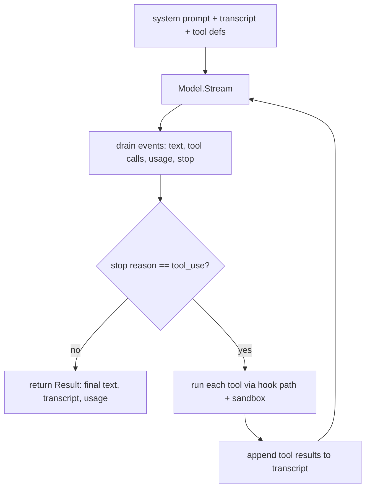

# Agentic Loop

## Goal

Drive one agent's turn cycle: prompt the model, stream the reply, run any tool
calls the model asks for, and repeat until the model is done. This is the engine
the rest of the runtime composes; a region run is one or more loops.

## Design

The loop (`runtime/loop`) takes a model, a sandbox, a tool registry, a hook bus,
and an initial prompt, then runs until the model ends its turn, the context is
cancelled, or a turn cap is reached. Each iteration:

1. Builds a request from the system prompt, the running transcript, and the
   registry's tool definitions.
2. Calls the model and drains its stream, accumulating assistant text, completed
   tool calls, token usage, and the stop reason.
3. If the model stopped to use tools, runs each tool call and appends the results
   as a tool-role message, then loops. Otherwise it stops.

A turn cap is a safety net against a runaway or broken model. If a model rejects
tools, the loop detects that and retries the turn without tools, so a tool-less
model still produces text.

Four seams keep the loop provider-agnostic and composable:

- Model seam (`models`): a single `Model` interface that streams normalized
  events. Adapters absorb each provider's wire shape, so the loop never sees
  provider specifics. This is the seam `ModelOptions` selects a backing for.
- Tool registry (`harness/tools`): a name-indexed set of tools. Each tool exposes
  a definition for the model and an `Invoke` that runs against the sandbox. The
  one built-in is `bash`; the `delegate` tool is injected per agent when delegation
  is allowed.
- Sandbox (`sandbox`): a `SandboxProvider` interface for creating environments and
  running commands or file operations. The local implementation (`sandbox/local`)
  maps each sandbox to a temp directory and runs commands with the standard
  library, so a run needs no external services.
- Hook bus (`harness/hooks`): tool calls pass through a three-phase path (validate,
  permission, execute and post) that emits lifecycle events. It is an extension
  point and is allow-by-default today, useful for observing and shaping the run.

The loop also emits session lifecycle events (start, prompt submitted, stop, end)
so a caller can observe progress.

## Diagram

## Outcome

Shipped in `runtime/loop` (`Run`, `Config`, `Result`, the turn cap, and the
tools-unsupported fallback). The seams are `models` (the `Model` interface, adapter
in `models/anthropic`, deterministic `models/fake`), `harness/tools` (the `Tool`
interface, `Registry`, and the `bash` built-in), `sandbox` (the `SandboxProvider`
interface) with the temp-directory `sandbox/local` implementation, and the
three-phase tool path in `harness/hooks`.
