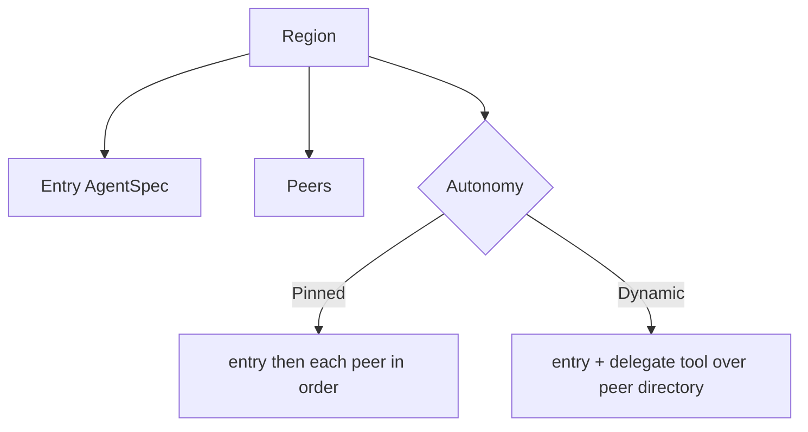

# Agents and Regions

## Goal

Let a host describe agents declaratively, group them into one unit of work, and
choose whether that unit runs as a fixed sequence or lets the model decide who
does what.

## Design

An `AgentSpec` is a declarative agent: a `Name` (its identity in the region and
the label it spawns under), a short `Role`, a `Description` (a when-to-use line
published for discovery), a `SystemPrompt`, the `Tools` it may use, and the
`Scopes` it holds. Nothing about an agent is executable on its own; the runner
turns a spec into a running loop.

A `Region` is one unit of work with a single autonomy mode. It has an `Entry`
agent that starts the work and a list of `Peers`. What `Peers` means depends on
the autonomy mode:

- `Pinned` is a deterministic chain. The runner runs the entry agent, then each
  peer in order, each as its own loop against the shared run sandbox. The final
  text of the last step is the run's result. This is the shape a static, fixed
  flow compiles to (for example: implement, then test, then commit).
- `Dynamic` gives the entry agent a `delegate` tool over a directory built from
  the peers, and lets the model decide whom to hand off to. The peers become a
  discoverable set rather than an ordered list. Who the entry may actually message
  stays capability-gated by the delegate tool (a name not in the set is refused).

`Region.Topology` applies only to dynamic regions and decides who may delegate
(see the topology spec); it defaults to orchestrator-worker. A region runs one
autonomy mode at a time. Several regions — pinned and dynamic, mixed — compose into
one run through a graph wired by data-flow edges (see the region-graph spec).

The host reads back the discoverable peers with `Region.Directory()`, which
returns peer cards (name, role, description) and never an agent's permissions.

## Diagram

## Outcome

Shipped in `topos.go`: `AgentSpec`, `PeerCard`, `Region`, the `Autonomy` type with
`Pinned` and `Dynamic`, and the `runPinned` / `runDynamic` dispatch in `runRegion`
(the per-region unit shared by `Run` and `RunGraph`). The directory read-back is
`Region.Directory()` in `directory.go`.
