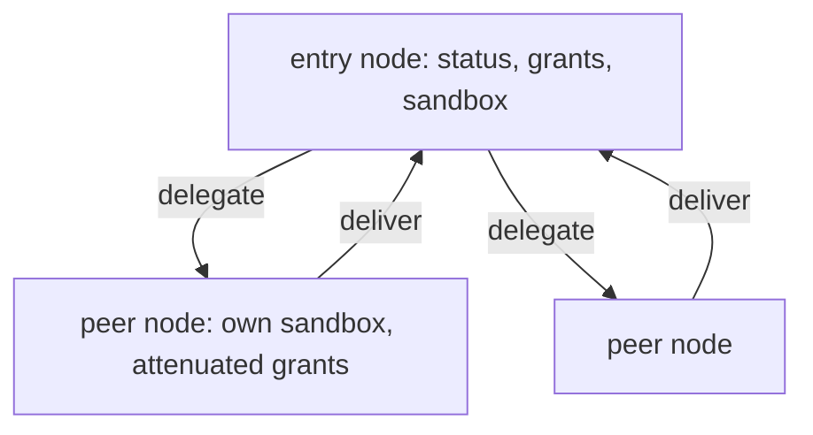

# Deterministic Lineage

## Goal

Every run should produce a graph of what actually happened: who ran, who delegated
to whom, what each agent was granted, and where it ran. The graph should be stable
enough to render live and to diff across runs.

## Design

`Run` returns a `Lineage` alongside the final text. The lineage is a small graph:

- A `LineageNode` per agent: a stable `ID`, the agent's `Name` and `Role`, a
  `Status` (`running`, `done`, or `failed`), the tool families actually `Grants`-ed
  after attenuation (so the graph shows real authority, not what was requested),
  and the `Sandbox` it ran in (a delegated peer gets its own).
- A `LineageEdge` per relationship, tagged by `Kind`: `next` for one step of a
  pinned chain, `delegate` from a caller to the peer it spawned, and `deliver` from
  a peer back to its caller when it returns a result.

Ids are deterministic and derive from the run's session id. The entry node is
`<session>/<name>`; a delegated child is `<session>/sub/<label>`, where the label is
path-prefixed so the same peer reused at different points in the tree gets a unique
id. Because ids are reconstructable from session and label rather than a registry,
a consumer can diff two runs node by node, and a live view can keep stable ids
across reconnects.

Status is updated as the run proceeds: a node starts `running`, flips to `done` on
success or `failed` on error. On failure, `Run` still returns the partial lineage,
so a caller sees exactly how far the run got and which node failed.

In a pinned region the graph is a straight line of `next` edges. In a dynamic
region it is a tree rooted at the entry, with `delegate` and `deliver` edges to and
from each spawned peer.

## Diagram

## Outcome

Shipped in `topos.go`: `Lineage`, `LineageNode`, `LineageEdge`, and `RunResult`.
`runDynamic` builds the entry node and the tree, `delegateTool.appendChild` records
each peer node plus its `delegate` and `deliver` edges, `runPinned` records the
`next` chain, and `setStatus` advances node status. Child ids come from the
deterministic `subAgentID` scheme in `harness/subagent.go`.
