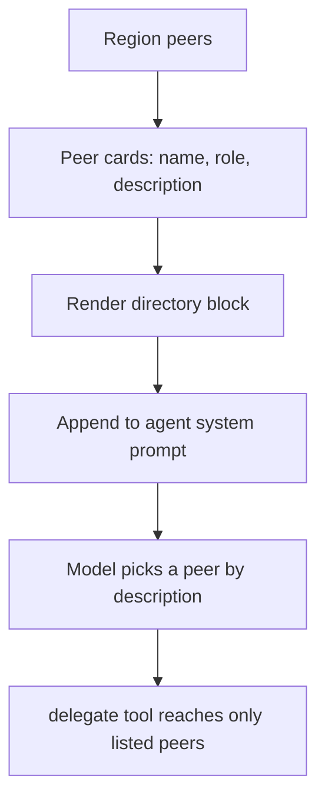

# Mesh Discovery

## Goal

A dynamic agent has to know which peers exist and what each is good for before it
can choose one. Give the model a description-driven directory so it picks peers by
purpose, not by guessing names.

## Design

Each region peer publishes a card: its name, role, and a when-to-use description.
The card deliberately omits permissions; it is only enough to decide whether to
hand a subtask off.

When the runner gives an agent the `delegate` tool, it also renders the peer
directory and appends it to that agent's system prompt. The rendered block lists
each peer as a bullet (name, role, description) and instructs the model to pick the
peer whose description best fits the subtask, or to do the work itself if none fit.
The agent's own system prompt is preserved; the directory is composed after it.

Discovery and permission are separate concerns. The directory describes the peer
set so the model can choose well; the delegate tool still enforces who may actually
be reached (an unknown name is refused). A host can also read the same cards
programmatically with `Region.Directory()`, for example to render a picker, without
exposing any agent's tools or scopes.

## Diagram

## Outcome

Shipped in `directory.go`: `Region.Directory()`, `renderDirectory`, and
`composeSystem`. The `topos.go` `runAgent` injects the rendered directory into the
system prompt exactly when it registers the delegate tool, and `PeerCard` carries
only name, role, and description.
